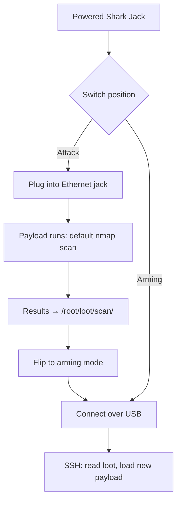

# Shark Jack — The Complete Guide

> **一句話定位**：Shark Jack 是一台口袋大小的網路偵察機——往人家的乙太網路孔一插，60 秒內告訴你這個網段有誰、開了些什麼服務。充一次電能跑 10–15 分鐘，最適合掛在鑰匙圈上的臨時稽核。

The Shark Jack packs a full Linux computer and an nmap scanner into something that hangs off a keychain. It espouses Hak5's "hotplug attack, meet LAN" philosophy: physical access to a live Ethernet port is all it takes to gain a foothold of intelligence.

Out of the box it's already dangerous — flip the switch to **attack mode** and it runs a pre-installed nmap scan, saving the results to loot. Flip back to **arming mode** and you SSH in to grab the findings or load custom payloads.

> **⚠️ Authorised testing only.** Jacking into a network you don't own is illegal. Practice on your own switch/lab network.

---

## Specs at a glance

| Item | Specification |
|---|---|
| Attack interface | Fast Ethernet (RJ45) — plugs directly into a network |
| Power | Built-in battery (10–15 min runtime per charge) via USB |
| OS | Linux with root shell; runs DuckyScript payloads powered by Bash |
| Payload default | nmap scan → saves results to `/root/loot/` |
| Arming access | SSH at `172.16.24.1` (static IP in arming mode) |
| Default credentials | `root` / `hak5shark` |
| Feedback | Multi-color RGB LED |
| Switches | Flip switch: attack mode vs arming mode |
| Official docs | https://docs.hak5.org/shark-jack |

## Anatomy

| Part | Purpose |
|---|---|
| RJ45 Ethernet jack | The attack interface — into the target network |
| USB port | Power/charging + connectivity |
| Flip switch | Attack mode (run payload) ↔ Arming mode (SSH/config) |
| RGB LED | Boot / charge / mode / error status |
| Keychain loop | Carry it everywhere |

---

## Modes of operation

| Mode | What happens | How to reach |
|---|---|---|
| **Attack mode** | Runs the selected payload (default: nmap scan) | Flip switch, plug into Ethernet |
| **Arming mode** | SSH server at `172.16.24.1`; load payloads, read loot | Flip switch, connect over USB |



---

## Quickstart — first recon in 60 seconds

### Step 1 — Attack
1. Fully charge the Shark Jack.
2. Flip the switch to **attack mode**.
3. Plug it into any live Ethernet jack in **your lab**.
4. Wait ~60 seconds. The LED tells you what's happening (see [Troubleshooting](/hak5/troubleshooting-index/)).

### Step 2 — Arming & loot retrieval
1. Flip the switch to **arming mode**, unplug from the network, connect to your computer over USB.
2. Your computer's Ethernet must be on the Shark's subnet:

```bash
ip addr add 172.16.24.2/24 dev eth0     # your NIC joins 172.16.24.0/24
ssh root@172.16.24.1                     # password: hak5shark
```

Expected output:

```text
root@172.16.24.1's password:
Welcome to Shark Jack
# ls /root/loot/
scan
# ls /root/loot/scan/
2026-08-21-1430-network-scan.txt
# cat /root/loot/scan/2026-08-21-1430-network-scan.txt
Nmap scan report for 192.168.1.10
Host is up (0.0034s latency).
PORT     STATE    SERVICE
22/tcp   open     ssh
80/tcp   open     http
443/tcp  open     https
```

That's your first recon: hosts, open ports, services — enough to plan a follow-up (or report to your blue team).

---

## Custom payloads

The default scan is a template. Replace it with your own Bash payload:

1. SSH in (arming mode) as above.
2. Edit `/root/payload/payload.sh` (this is what runs in attack mode).

```bash
#!/bin/bash
# Arming-mode file: /root/payload/payload.sh
NETMODE DHCP_CLIENT
LED R
sleep 5
nmap -sV -p- --open ${SUBNET}.0/24 -oN /root/loot/full-scan.txt
LED G
```

> The `${SUBNET}` placeholder and `NETMODE` helpers come from Hak5's payload framework — your payload sets whether the Shark is a DHCP client, server, etc. Full reference in the payload docs.

3. Or pull ready-made payloads from the community repo (`UPDATE_PAYLOADS`, see [Firmware & Downloads](/hak5/firmware-downloads/)).

---

## LED reference

| LED | Meaning |
|---|---|
| Green (blinking) | Booting |
| Blue (blinking) | Charging |
| Blue (solid) | Fully charged |
| Yellow (blinking) | Arming mode — SSH server running |
| Red (blinking) | Error — no payload found |
| (payload-defined) | Your own `LED` colours while a payload runs |

---

## Advanced

| Capability | How |
|---|---|
| `NETMODE` choices | `DHCP_CLIENT` (get an IP), `DHCP_SERVER` (hand out IPs), `BRIDGE`, `OFF` — depends on the engagement |
| SMB/HTTP exfiltration | Payloads can push loot off-box over the network |
| Automated scans | Schedule scans; loot accumulates across deployments |
| Remote payload library | `UPDATE_PAYLOADS` syncs from the community repo |
| Root Linux tools | `nmap`, `tcpdump`, `curl`, scripting — full Bash |

---

## Troubleshooting

| Symptom | Cause | Fix |
|---|---|---|
| Red blinking LED | No payload found | Re-arm; place `payload.sh` in `/root/payload/` |
| Can't SSH | Your NIC not on `172.16.24.0/24` | `ip addr add 172.16.24.2/24 dev eth0` (or equivalent) |
| Battery dies mid-scan | 10–15 min runtime | Charge fully first; use the Cable edition for long runs |
| Scan too slow / huge output | `-p-` full ports | Use a targeted port list for recon speed |
| DHCP mode fails | No upstream DHCP server | Use `NETMODE DHCP_CLIENT` with a server present, or static |

---

## Related resources

- [Shark Jack Cable](/hak5/products/shark-jack-cable/) — same box, USB-C power + serial console, runs longer
- [Packet Squirrel Mark II](/hak5/products/packet-squirrel-mark-ii/) — inline Ethernet manipulation
- [Plunder Bug LAN Tap](/hak5/products/plunder-bug-lan-tap/) — passive/active sniffing
- [Firmware & Downloads](/hak5/firmware-downloads/) — shark payload repo & firmware
- [Troubleshooting Index](/hak5/troubleshooting-index/)
- [Hak5 overview](/hak5/)
