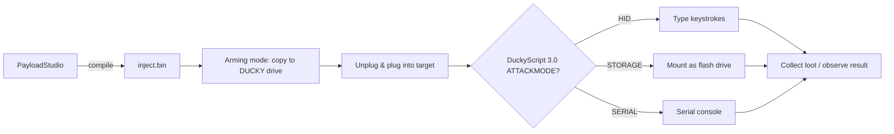

# USB Rubber Ducky — The Complete Guide

> **一句話定位**：USB Rubber Ducky 是一支「會自己打鍵盤」的隨身碟 — 插入 USB 孔後，它以每秒數百次的速度把預錄好的按鍵輸進電腦，10 秒內做完一個人工要花五分鐘的動作。這是所有 Hak5 裝置裡最適合初學者入門的機器。

When you plug in any USB keyboard, the computer trusts it instantly — no password, no "are you sure?" prompt. The USB Rubber Ducky exploits exactly that trust. It presents itself to the OS as a regular keyboard (a **HID device**, Human Interface Device), then replays a script of keystrokes so fast that a human could never keep up.

The Ducky does **one thing, extremely well**: keystroke injection. It doesn't need exploit code or vulnerabilities — it just *types*. That makes it the perfect teaching tool for HID attacks, and the foundation for every other Hak5 payload device.

> **⚠️ Authorised testing only.** Use the Ducky on your own computer, your own machines in a lab, or with explicit permission. Injecting keystrokes into someone else's computer is illegal (Taiwan: 刑法第 358–363 條).

---

## Specs at a glance

| Item | Specification |
|---|---|
| Purpose | Keystroke injection (HID attack) |
| Languages | DuckyScript 1.0 (classic) and 3.0 (full language) |
| Script storage | MicroSD card (comes included; keep the small one for fastest boot) |
| Output | Compiled `inject.bin` on the `DUCKY` drive |
| Injection modes | HID, Storage, Serial, Ethernet (various attack modes) |
| Interface | USB-A (plug it into any USB host) |
| Feedback | Single button (default: exits to arming/storage mode) |
| Encoder | PayloadStudio (official, browser-based) — the only supported compiler |
| Official docs | https://docs.hak5.org/hak5-usb-rubber-ducky |

## Anatomy

| Part | Purpose |
|---|---|
| USB-A plug | The "keyboard" side — goes into the target |
| MicroSD slot | Holds `inject.bin` and payload scripts |
| The button | During/after a payload, defaults to returning to storage (arming) mode |
| Flippable USB-A head | Both orientations (standard & reversed connector) |

---

## DuckyScript — the language

DuckyScript is deceptively simple. Classic scripts are just `STRING` (type this) + `DELAY` (wait). Version 3.0 adds real programming power: `if`/`else`, `while` loops, functions, and `ATTACKMODE` control.

### The "Hello, World!" payload

```text
REM This is a comment — type into whatever application is focused
DELAY 1000
STRING Hello from my USB Rubber Ducky!
ENTER
```

What happens: the Ducky waits 1 second, then types `Hello from my USB Rubber Ducky!` and presses Enter into whatever window is active.

### Control-flow example (DuckyScript 3.0)

```text
ATTACKMODE HID
DELAY 1000
GUI r
DELAY 500
STRING notepad
ENTER
DELAY 800
REM Only type if the window title changed (keystroke reflection)
VAR $os = GET_SYSTEM_ID
IF ($os == "WINDOWS") THEN
    STRING Running on Windows!
    ENTER
ELSE
    STRING Running on something else.
    ENTER
END_IF
```

> **You might be asking:** *"Isn't 'type into whatever is focused' fragile?"* Yes — which is why real payloads *open an application first* (here, `GUI r` → `notepad`), then type. Always control your own focus before injecting.

---

## Quickstart — your first payload, 5 minutes

### Step 1 — Write the payload in PayloadStudio
1. Open https://payloadstudio.hak5.org (Community edition is free).
2. Paste the Hello World script above.
3. Select your **target keyboard layout** (default US). **This matters** — inject with the wrong layout and keys come out garbled.
4. Click **Generate Payload**. PayloadStudio compiles it to `inject.bin`.

### Step 2 — Arm the Ducky
Plug the Ducky into your computer. It mounts as a flash drive called **`DUCKY`** — this is arming mode.

### Step 3 — Copy the payload
Copy `inject.bin` to the **root** of the `DUCKY` drive, replacing the existing file. Eject safely, unplug.

### Step 4 — Deploy
1. Open **Notepad** on your target machine (your own laptop, in your lab).
2. Plug in the Ducky.
3. Watch — it types `Hello from my USB Rubber Ducky!` and presses Enter.

```bash
# On Linux, verify the Ducky enumerates as a keyboard when armed:
lsusb | grep -i ducky
# Expected: Bus 001 Device 00X: ID .... Hak5 LLC USB Rubber Ducky
```

---

## The attack modes (ATTACKMODE)

The Ducky can present as more than a keyboard. `ATTACKMODE` chooses the device personality:

| ATTACKMODE | The Ducky pretends to be | Used for |
|---|---|---|
| `HID` | Keyboard | Keystroke injection (default if none specified) |
| `HID STORAGE` | Keyboard + flash drive | Inject *and* stay accessible as storage |
| `STORAGE` | Flash drive | Arming / file transfer only |
| `SERIAL` | Serial device | Talk to a serial console |
| `HID SERIAL` | Keyboard + serial | Inject into a serial-connected box |

A common pattern — inject, then drop into storage so you can grab loot:

```text
ATTACKMODE HID STORAGE
DELAY 2000
...payload keystrokes...
ATTACKMODE STORAGE
```



---

## Keyboard layouts — the classic gotcha

The Ducky doesn't type "the letter A" — it presses the *physical key* for A on a US keyboard, then reproduces that keypress. Type on a German or French keyboard with a US-layout payload and you get completely different characters.

**Rule:** compile with the keyboard layout of the *target machine*, not your own. Set it in PayloadStudio before generating.

| Symptom | Cause |
|---|---|
| `@` becomes `"` | Payload compiled US, target is UK/German |
| Numbers turn into symbols | Layout mismatch on the shifted row |
| Nothing types at all | Missing `DELAY` (OS HID stack not ready) or wrong attack mode |

---

## Advanced

| Technique | How |
|---|---|
| Keystroke reflection | Read target state/window title and branch (`IF` with system queries) |
| Mouse injection | Move the cursor / click — useful for GUI-only targets |
| Jitter & randomization | Add human-like delays to evade keystroke-timing detection |
| Payload libraries | Drop in scripts from the community repo (see [Firmware & Downloads](/hak5/firmware-downloads/)) |
| Combined HID+Ethernet | On compatible firmware, act as keyboard + attacker's own network interface |
| Recovery | Press & hold the button to re-enter storage mode from a runaway payload |

> **Pro tip for labs:** always test a new payload against your *own* disposable VM first. A typo in a real-world payload types garbage into a real machine — and a rogue `ATTACKMODE ETHERNET` on an unsupported host can brick the session. Practice in a sandbox.

---

## Troubleshooting

| Symptom | Cause | Fix |
|---|---|---|
| Nothing appears on screen | No `DELAY` at start; OS USB stack not ready | Add `DELAY 1000` as the first line |
| Wrong characters typed | Keyboard layout mismatch | Recompile with target's layout in PayloadStudio |
| Payload ran once but not again | Old `inject.bin` overwrote yours | Copy your `.bin` to drive root again |
| Can't get back to arming mode | Payload overrode the button default | Press button; if no `BUTTON_DEF`, default behaviour returns you to storage. See docs |
| Button does unexpected things | Payload uses `BUTTON_DEF` | Check your payload; example scripts may remap the button |
| Firmware-flash warnings | Third-party firmware | **Never flash** — the Ducky is architectured to not need it; flashing voids warranty and can brick the device |

> **Critical warning:** Do NOT flash the USB Rubber Ducky. It ships designed around PayloadStudio so you never need to. Legacy/third-party firmware can render it permanently unrecoverable. Always use official updates only — see [Firmware & Downloads](/hak5/firmware-downloads/).

---

## Related resources

- [Bash Bunny Mark II](/hak5/products/bash-bunny-mark-ii/) — the multi-vector sibling (keyboard + Ethernet + more)
- [Key Croc](/hak5/products/key-croc/) — DuckyScript 2.0 in interpreted form, plus keylogging
- [WiFi Pineapple Pager](/hak5/products/wifi-pineapple-pager/) — DuckyScript 3.0 on a wireless handheld
- [O.MG Cable](/hak5/products/omg-cable/) — DuckyScript over WiFi, from a cable
- [Firmware & Downloads](/hak5/firmware-downloads/) — PayloadStudio and the payload repos
- [Troubleshooting Index](/hak5/troubleshooting-index/)
- [Hak5 overview](/hak5/)
