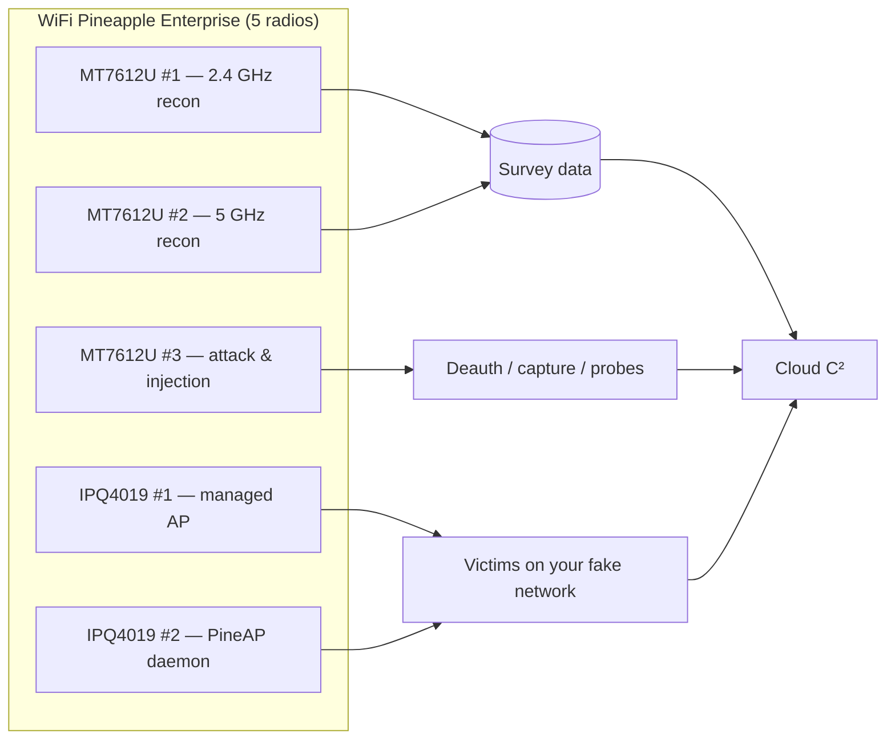
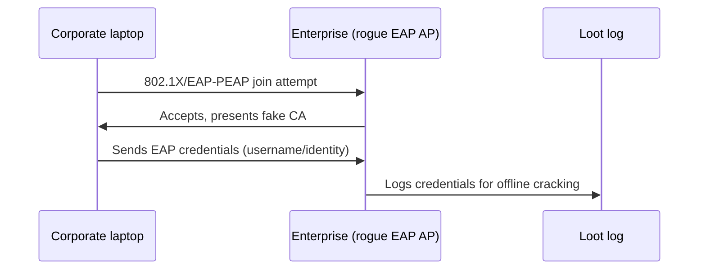

# WiFi Pineapple Enterprise — The Complete Guide

> **一句話定位**：WiFi Pineapple Enterprise 是 Pineapple 家族的重型砲台 — 一台 1U 機架式主機、五組雙頻無線電、雙 Gigabit 網路埠，專門做長時間、大範圍的企業無線稽核。給進階研究生、實驗室、紅隊與需要 24/7 部署的人。

The Mark VII taught you rogue-AP basics. The **Enterprise** is what you get when "one radio per job" isn't enough: five dual-band radios (2.4 + 5 GHz) let you run attack, monitor, and serving roles *simultaneously* without juggling interfaces. It's the Pineapple for a serious lab, a campus security course, or a red-team operation that needs to audit an entire airspace at once.

If you're a student: you don't *need* one to learn — a [Mark VII](/hak5/products/wifi-pineapple-mark-vii/) teaches the same PineAP concepts. But if your lab needs to simulate a corporate deployment — including **WPA2-Enterprise** rogue APs — this is the box.

> **⚠️ Authorised testing only.** A 5-radio rogue AP is an extremely powerful tool. Use it exclusively on networks you own or have explicit written authorisation to test.

---

## Specs at a glance

| Item | Specification |
|---|---|
| SoC | Quad-core ARM Cortex-A7 @ 717 MHz |
| Radios | 5× dual-band: 2× Qualcomm IPQ4019 (2.4/5 GHz) + 3× MediaTek MT7612U (2.4/5 GHz) |
| Standards | 802.11ac Wave 2 (a/b/g/n/ac/p), MU-MIMO, TxBF |
| Peak radio speed | IPQ4019: 1.733 Gbps ・ MT7612U: 866 Mbps |
| Memory / Storage | 1 GB DDR3L RAM / 4 GB eMMC |
| Ethernet | 2× Gigabit RJ45 (802.3ab) + USB-C 3.0 (ASIX Ethernet) |
| Antennas | 8× high-gain RP-SMA (4× 2:2 MIMO pairs) |
| Power | AC 100–240 V (wall power, no battery) |
| Form factor | 160 × 244 × 41 mm (1U rack-mount) |
| Operating temp | −25 °C to +50 °C |
| Official docs | https://docs.hak5.org/wifi-pineapple-enterprise |

## Anatomy

| Part | Purpose |
|---|---|
| 8× RP-SMA antenna ports | Four 2:2 MIMO radio pairs |
| 2× Gigabit RJ45 | WAN/uplink + management or additional LAN segment |
| USB-C 3.0 port | Ethernet console/management interface (ASIX chipset) |
| 4× RGB LEDs | Per-radio and status feedback |
| AC inlet | 100–240 V power |

---

## Why five radios? A role table

| Radio | Typical role in an engagement |
|---|---|
| IPQ4019 Radio 0 | Serving your *own* managed AP (legit-looking) |
| IPQ4019 Radio 1 | PineAP daemon — luring and managing victims |
| MT7612U #1 | Continuous Recon (2.4 GHz sweep) |
| MT7612U #2 | Continuous Recon (5 GHz sweep) |
| MT7612U #3 | Attack interface — deauth, injection, on-demand scans |

With the Mark VII you must time-share one radio between jobs; the Enterprise assigns a radio to each job so nothing interrupts anything else.



---

## Quickstart — first deployment

### Step 1 — Rack it, antenna it, power it
Mount in a 1U slot (or sit it on a shelf), screw on the 8 antennas, and connect AC power. The LEDs will cycle during boot.

### Step 2 — Management access
Two options:
- **Wi-Fi:** join the Pineapple's default AP (SSID `PineAP`, passphrase `pineapplesareyummy`).
- **Wired:** plug a laptop into a Gigabit port; DHCP hands you an address; browse to `http://172.16.42.1:1471`.

Set your admin password immediately (Settings → Password).

### Step 3 — Uplink
Connect Gigabit port 1 to your lab's switch/router for Internet. Verify uplink in the dashboard (Settings → Network).

### Step 4 — Verify all radios
In **Settings**, check that all 5 radios show up and can be assigned roles. Expected: radio interfaces `wlan0`–`wlan4` present, each capable of monitor mode.

```text
$ ssh root@172.16.42.1
# iw dev | grep Interface
Interface wlan0 (managed)
Interface wlan1 (managed)
Interface wlan2 (managed)
Interface wlan3 (managed)
Interface wlan4 (managed)
```

---

## The headline feature: WPA2-Enterprise rogue AP

The Enterprise ships with a built-in **Enterprise (WPA-EAP) rogue AP** tab — the attack that simulates a corporate 802.1X network:

1. Open **Settings → Enterprise**.
2. Fill in the RADIUS/EAP configuration; the UI **generates the certificates** for you.
3. Set the SSID to a corporate-looking name (test lab only!).
4. Broadcast. Clients that join present their credentials to *your* RADIUS server — harvested in loot for offline analysis.



> **Ethical reality-check:** this is a *lab* skill. Practise it on your own test domain credentials. Credential-harvesting on a real organisation is a serious crime in every jurisdiction.

---

## Advanced

| Capability | Notes |
|---|---|
| Multi-target engagements | Assign MT7612U radios to different channel sets; attack 2.4 + 5 GHz victims simultaneously |
| Long-term deployments | AC power + 4 GB eMMC + Gigabit uplink = days-long captures |
| Cloud C² management | Remote management, loot offload, and scheduled payloads (https://cloudc2.io) |
| Packet capture at scale | Capture to eMMC/USB; offload `.pcap` files for Wireshark analysis |
| 802.11p (vehicular) | Standards list includes `p` — research feature, not a primary use case |
| More radios via USB | Additional MT7612U adapters plug into USB 3.0 host for even more coverage |

---

## Compatibility note — adapters

The Enterprise's 3 MT7612U radios are built-in, so you won't need external adapters for 5 GHz work (unlike the Mark VII). If you extend with USB radios, stick to MT7612U-based models — see the [compatible adapter guidance](/alfa-network/) for ALFA equivalents such as the AWUS036ACM.

---

## Troubleshooting

| Symptom | Cause | Fix |
|---|---|---|
| Only 3 radios visible | Antennas loose or radio disabled in config | Re-seat all 8 antennas; check Settings → Network for radio enable states |
| UI unreachable over Ethernet | Laptop got an APIPA address | Use the Wi-Fi management AP first; then fix DHCP |
| Enterprise tab missing | Firmware below the Enterprise-release version | Update firmware from the web UI |
| Clients join but no credentials in loot | EAP config / certificate step skipped | Re-run the Enterprise tab wizard; verify certificates generated |
| High temp warnings | Rack ventilation | Enterprise is rated −25 to +50 °C but needs airflow in a rack |

---

## Related resources

- [WiFi Pineapple Mark VII](/hak5/products/wifi-pineapple-mark-vii/) — the portable Pineapple, same PineAP engine
- [WiFi Pineapple Pager](/hak5/products/wifi-pineapple-pager/) — the tri-band handheld
- [ALFA Network](/alfa-network/) — MT7612U adapters and Kali driver guides
- [Firmware & Downloads](/hak5/firmware-downloads/) — update paths
- [Troubleshooting Index](/hak5/troubleshooting-index/)
- [Hak5 overview](/hak5/)
