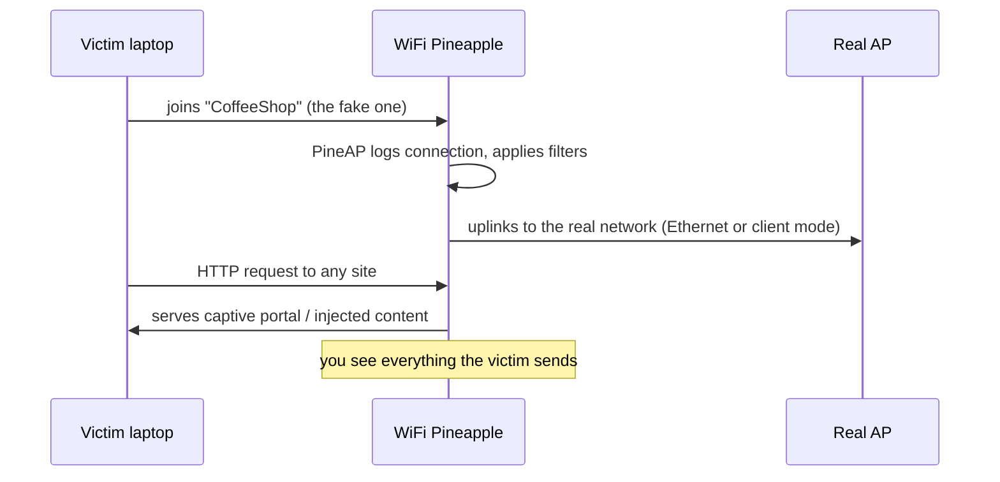

# WiFi Pineapple Mark VII — The Complete Guide

> **一句話定位**：WiFi Pineapple Mark VII 是一台「會自己開 Wi-Fi 來釣魚」的無線攻擊平台 — 它假裝成你信任的無線網路，再用 PineAP 引擎接管受害者的連線。給想學 Wi-Fi 滲透測試、evil twin 攻擊的大學生與 CTF 玩家。

If Wi-Fi pentesting has a mascot, it's the WiFi Pineapple. The Mark VII is the current generation of the device that made the **rogue access point (evil twin)** attack famous: it broadcasts its own network that *looks* like a legitimate one, lures victims in, and then gives you full visibility and control of their traffic — all from a browser interface.

The Mark VII is the device to buy if you're studying wireless security: it's portable (USB-C powered), affordable, and the PineAP suite is the industry-standard way to learn Wi-Fi attack concepts that apply to any modern rogue-AP tooling.

> **⚠️ Authorised testing only.** Run the Pineapple against *your own* network, your own devices, or with written permission. Broadcasting a fake "Free Wi-Fi" on someone else's network is illegal (Taiwan: 刑法第 358–363 條; see also 電信法).

---

## Specs at a glance

| Item | Specification |
|---|---|
| Wireless | 2.4 GHz 802.11 b/g/n, 3 dedicated role-based radios (MediaTek MT7601U + MT7610U); 5 GHz 802.11ac via optional MK7AC adapter (MT7612U) |
| SoC / RAM / Storage | Single-core MIPS network SoC / 256 MB RAM / 2 GB eMMC |
| Antennas | 3× high-gain RP-SMA (external, swappable) |
| Ports | USB-C (power + Ethernet), USB 2.0 host |
| Power | USB-C 5V 2A (10 W) |
| Indicator | Single RGB LED |
| Dimensions | 107 × 93 × 21 mm |
| OS / UI | OpenWrt-based firmware, browser management UI on port 1471 |
| Official docs | https://docs.hak5.org/wifi-pineapple |

## Anatomy

| Part | Purpose |
|---|---|
| 3× RP-SMA antenna ports | Radios for AP / client / monitor roles |
| USB-C port | Power AND Ethernet uplink (one cable, two jobs) |
| USB 2.0 host port | Plug in the MK7AC 5 GHz adapter or a USB drive |
| RGB LED | Boot, update and status feedback |
| Reset pinhole | Factory reset / recovery |

---

## What you can do with it

| Use case | How |
|---|---|
| Evil twin / rogue AP | Broadcast a cloned SSID; victims connect to you instead of the real AP |
| Man-in-the-middle | PineAP captures clients from the real AP; their traffic passes through you |
| Recon | Passive survey of nearby APs and clients (2.4 GHz native; 5 GHz with MK7AC) |
| Captive portal | Host a fake login page module and harvest credentials |
| WPA/WPA2 enterprise testing | Rogue RADIUS-style enterprise AP (supported since firmware 1.1.0) |
| Automated engagements | Modules from the PineAP Marketplace (pmkid attacks, handshake capture, etc.) |



---

## Quickstart — first boot in 10 minutes

### Step 1 — Power up
Plug the USB-C cable into a 5V/2A charger (or your computer). Wait for the LED to settle.

### Step 2 — Join its network
On your laptop, look for the Pineapple's default Wi-Fi: SSID `PineAP`, passphrase `pineapplesareyummy`.

### Step 3 — Open the management UI
Browse to:

```
http://172.16.42.1:1471
```

Expected result — the WiFi Pineapple dashboard. **First thing:** set your admin password in **Settings → Password**.

### Step 4 — Update firmware & connect uplink
1. In **Settings → Software Update**, click **Check for updates**, then **Update**.
2. For Internet: plug an Ethernet cable into the USB-C **Ethernet** port (using the included USB-C adapter if needed), or configure a client-mode Wi-Fi uplink.
3. Verify the dashboard shows the new version in the footer.

### Step 5 — Run your first Recon
1. Open **Recon** in the UI.
2. Set the interface to the internal radio (`wlan1` is the 2.4 GHz monitor radio).
3. Click **Scan**. Within seconds you'll see nearby APs and clients populate the list — the Pineapple is *passively* listening.

```text
[+] Scanning for wireless networks...
[+] Found 12 APs, 23 clients
    CoffeeShop (2.4 GHz, WPA2)
    Home-5G (5 GHz — visible only with MK7AC attached)
    ...
```

---

## PineAP — the core engine

PineAP is what separates the Pineapple from a boring router. Four panels, four jobs:

| Panel | Job | Typical use |
|---|---|---|
| **PineAP** | The engine: respond to probe requests, deauth, impersonate | Turn on "PineAP Daemon" + "Beacon Response" to lure clients |
| **Recon** | Passive AP/client discovery | Survey the airspace before attacking |
| **Modules** | Marketplace of ready-made tools | Handshake capture, PMKID, captive portal, DNS spoof |
| **Client** | Manage connected victims | See who joined, watch their traffic |

**Classic lab demo — deauth + evil twin:**

1. In **Recon**, find a target AP you own.
2. In **PineAP**, enable *PineAP Daemon* and *Beacon Response*; set the *SSID* to match the target.
3. From the **Client** page (or a module), send deauthentication frames to the target's clients.
4. Victims reconnect — to *your* clone. Open the **Client** panel and watch them appear.

> **You might be asking:** *"Why do victims join the fake AP?"* Because clients constantly send **probe requests** for networks they remember ("Home-5G?"), and the PineAP daemon answers every probe with a matching beacon. Your clone looks identical, so the client picks it. That's the whole trick — and it works because Wi-Fi clients *broadcast their history*.

---

## Going 5 GHz (MK7AC adapter)

The Mark VII's internal radios are 2.4 GHz. For 5 GHz monitoring and injection, attach the **MK7AC** (MediaTek MT7612U) to the USB 2.0 host port:

1. Plug the MK7AC in and reboot.
2. In **Settings**, set *Recon Wireless Interface* to the new adapter's interface (`wlan3`).
3. Recon now sweeps 2.4 GHz **and** 5 GHz.

Compatible adapters (confirmed by Hak5): the MK7AC, **ALFA AWUS036ACM** (MT7612U), and EP-AC1605 V1. Other chipsets *may* work but are not guaranteed — stick to MT7612U for reliability. See the [ALFA Network section](/alfa-network/) for the full adapter catalogue and Kali driver guides.

---

## Advanced

| Technique | Where to start |
|---|---|
| Client isolation / filtering | PineAP → Filters: block specific clients from the real AP |
| Captive portal phishing | Install a captive-portal module from the Marketplace; harvest POSTed credentials in loot |
| WPA handshake capture | Handshake-capture module saves `.cap` files — crack them offline on your laptop |
| WPA2-Enterprise rogue AP | Settings → Enterprise tab: generate EAP config and certificates, then broadcast |
| Cloud C² remote ops | Pair with a free self-hosted Cloud C² server to manage the Pineapple remotely (https://cloudc2.io) |
| USB tethering of tools | USB host port accepts storage; move loot off the device easily |

---

## Troubleshooting

| Symptom | Cause | Fix |
|---|---|---|
| `PineAP` SSID invisible | Still booting (up to 60 s) | Wait; check LED. Red LED = error → see logs over wired connection |
| Management UI won't load | You're not on the `172.16.42.0/24` network | Forget other networks; verify you're joined to `PineAP`; retry `172.16.42.1:1471` |
| No Internet in dashboard | No uplink configured | Attach USB-C Ethernet to a real network; or configure client-mode Wi-Fi |
| 5 GHz devices missing in Recon | No MK7AC attached | Add the adapter; set *Recon Wireless Interface* in Settings |
| Modules won't install | No Internet uplink | Fix uplink first; modules download from the Marketplace |
| Forget password | — | Use the reset pinhole to factory-reset and set a new one |

---

## Related resources

- [WiFi Pineapple Enterprise](/hak5/products/wifi-pineapple-enterprise/) — the rack-mount, 5-radio big brother
- [WiFi Pineapple Pager](/hak5/products/wifi-pineapple-pager/) — the tri-band, DuckyScript-powered handheld
- [ALFA Network](/alfa-network/) — MT7612U adapters for 5 GHz Pineapple work
- [Firmware & Downloads](/hak5/firmware-downloads/) — update paths and module repos
- [Troubleshooting Index](/hak5/troubleshooting-index/) — LED and connectivity diagnosis
- [Hak5 overview](/hak5/)
