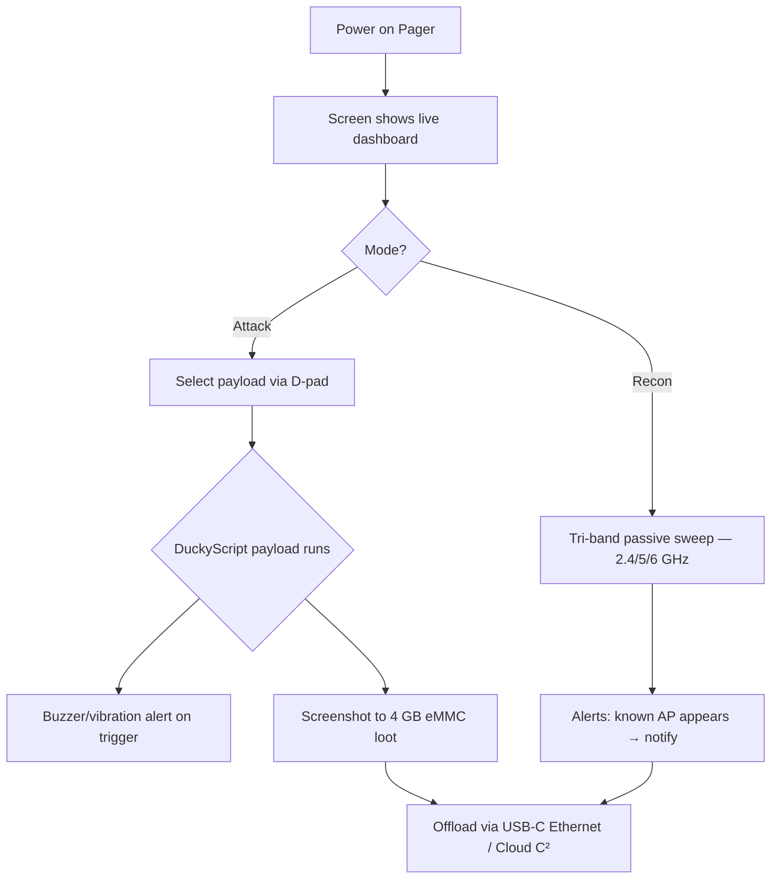

# WiFi Pineapple Pager — The Complete Guide

> **Quick Summary**: The WiFi Pineapple Pager is Hak5's 20th anniversary portable flagship—fitting full Pineapple capabilities into your pocket with a 2.4-inch screen, tri-band Wi-Fi 6 (2.4/5/6 GHz), and a DuckyScript payload engine for standalone field operations.

The Pager answers the question every Pineapple owner eventually asks: *"What if I didn't need a laptop to run this?"* It's a standalone Linux handheld with a full color screen, four RGB D-pad buttons, a buzzer, a vibration motor, and the 8th-generation PineAP engine — capable of tri-band recon, evil-twin attacks, and automated DuckyScript payloads, all on a 2000 mAh battery clipped to your belt.

It's the "retro pager from the 90s" aesthetic with a modern pentest brain — and for students, it's the most approachable Pineapple yet because **the screen tells you what's happening** instead of a cryptic LED.

> **⚠️ Authorised testing only.** A pocket-sized rogue AP is still a rogue AP. Test on your own networks only.

---

## Specs at a glance

| Item | Specification |
|---|---|
| CPU | 580 MHz MIPS 24K router-class chip |
| Wireless (primary) | Dual-PHY 2T2R 802.11 a/b/g/n/ac/ax |
| Wireless (secondary) | Single-PHY 2T2R 802.11 b/g/n |
| Bands | Tri-band: 2.4 GHz / 5 GHz / 6 GHz |
| Bluetooth | Bluetooth 5.2 + BLE 4.2 |
| Display | 2.4" LED-backlit TFT, 480×222 px (221 PPI), 16-bit color |
| Memory / Storage | 256 MB DDR2 RAM / 128 MB SPI flash / 4 GB eMMC |
| Battery | 2000 mAh LiPo (serviceable, BMS, LED charge indicator) |
| Ports | USB-C (charge + integrated Ethernet), USB 2.0 (expansion) |
| Indicators | 4× RGB LED, PWM buzzer, vibration motor, RTC |
| OS / Payloads | OpenWrt-based Linux; DuckyScript + Bash + Python |
| Official docs | https://docs.hak5.org/wifi-pineapple-pager |

## Anatomy

| Part | Purpose |
|---|---|
| 2.4" color screen | Live dashboard: recon results, payload status, menus |
| 4-way D-pad + A/B buttons (RGB) | Navigate menus, trigger payloads, get haptic feedback |
| USB-C port | Charging AND Ethernet adapter (host access to the Pager's LAN) |
| USB 2.0 port | Hardware mods: GPS, extra radios, custom modules |
| Belt clip | Field ops — hands-free deployment |
| Speaker + vibration | Real-time alerts: "target AP appeared", "payload matched" |

---

## What makes it different from other Pineapples

| | Mark VII | Pager |
|---|---|---|
| Laptop required | Yes (web UI on 1471) | **No — screen + buttons onboard** |
| Bands | 2.4 GHz (+5 GHz w/ MK7AC) | **2.4 / 5 / 6 GHz out of the box** |
| Payload engine | Modules only | **DuckyScript + Bash + Python** |
| Feedback | RGB LED | **Screen, buzzer, vibration, RGB** |
| Power | USB-C (tethered) | **Battery — truly portable** |



---

## Quickstart — first boot

### Step 1 — Charge
Plug the Pager into USB-C. The charge LED shows progress; the screen wakes.

### Step 2 — Power & first dashboard
Press the power button. Within ~30 seconds the screen shows the main menu: **Recon**, **PineAP**, **Payloads**, **Settings**.

### Step 3 — Set your timezone & password
- **Settings → System** → timezone (the RTC keeps timestamps correct even when off).
- **Settings → Security** → set an admin password for the web/SSH access.

### Step 4 — Run your first Recon
1. D-pad to **Recon** → **Start Scan**.
2. Watch the screen populate: APs and clients on 2.4 GHz and 5 GHz (6 GHz needs toggling on in Settings → Network → 6 GHz — it's off by default for good reasons: short range, few clients).

Expected screen output:

```text
Scanning...
  [2.4G] CoffeeShop      WPA2   ch 6
  [5G]   Home-5G         WPA3   ch 36
  [2.4G] Office-Guest    OPEN   ch 11   ← interesting
Clients: 23   APs: 12
```

### Step 5 — Trigger your first payload
1. **Payloads → Library** → pick a built-in example (e.g. "AP Alert").
2. Press **A** to arm it as the default.
3. The payload runs automatically when its trigger condition is met — the buzzer chirps and the screen flashes the match.

> **You might be asking:** *"Why would I want a payload that just alerts me?"* Because that's the core red-team workflow: park the Pager in a target zone, let it recon passively, and get **notified** when a specific AP/client pattern appears — then decide to act. The Pager is a *sensor and trigger* device, not just an attack box.

---

## Payloads — DuckyScript on a Pineapple

The Pager runs the same DuckyScript family as the [USB Rubber Ducky](/hak5/products/usb-rubber-ducky/), but extended for wireless: payloads can inspect the airspace, branch on events, and control the buzzer/display. Payload Studio v1.5+ supports Pager payloads (Community & Pro).

```text
REM Example: alert when a specific SSID appears
WAIT_FOR_EVENT ssid "CoffeeShop"
BUZZER 3
DISPLAY "Target AP detected!"
```

```text
REM Example: capture handshakes on a schedule
BEGIN_PAYLOAD
SET_TIME 2 30
REPEAT_FOREVER
    RECON SCAN 60
    IF handshake_found THEN
        BUZZER 2
        SAVE_LOOT "handshake.pcap"
    END_IF
END_PAYLOAD
```

> These examples illustrate the *concepts* — exact command names ship with each firmware release. Always check the Pager docs (https://docs.hak5.org/wifi-pineapple-pager) for the current command set.

---

## Advanced

| Capability | How |
|---|---|
| Rogue AP / evil twin | **PineAP** menu — clone SSIDs, beacon-response luring, deauth |
| WPA3-Enterprise testing | Tri-band radios cover the newest enterprise auth; pair with the [Enterprise](/hak5/products/wifi-pineapple-enterprise/) tab concepts |
| Automated field recon | Payload schedules: scan → save loot → notify, hands-free |
| Custom hardware mods | USB 2.0 port + root Linux: GPS modules, SDR radios, you name it |
| Remote management | **Virtual Pager** web interface — see the screen and press buttons from your browser |
| Cloud C² | Offload loot and manage payloads remotely |
| Host access | USB-C Ethernet adapter gives a computer direct LAN access to the Pager |

---

## Troubleshooting

| Symptom | Cause | Fix |
|---|---|---|
| 6 GHz APs never appear in Recon | 6 GHz disabled by default | Settings → Network → enable 6 GHz (expect shorter range) |
| Screen dim / no buzzer | Battery saver or muted alerts | Check Settings → Display / Audio |
| Payload doesn't trigger | Trigger pattern doesn't match | Recheck SSID/BSSID matching in the payload editor |
| Battery dies fast during scans | Continuous tri-band scanning is power-hungry | Use 2.4+5 GHz only, or schedule payloads |
| Can't reach Virtual Pager | Pager not on the same network as your browser | Connect via USB-C Ethernet or join the Pager's hotspot |

---

## Related resources

- [WiFi Pineapple Mark VII](/hak5/products/wifi-pineapple-mark-vii/) — the classic web-UI Pineapple
- [WiFi Pineapple Enterprise](/hak5/products/wifi-pineapple-enterprise/) — the 5-radio rack monster
- [USB Rubber Ducky](/hak5/products/usb-rubber-ducky/) — DuckyScript 3.0 language reference concepts
- [Firmware & Downloads](/hak5/firmware-downloads/) — PayloadStudio & firmware
- [Troubleshooting Index](/hak5/troubleshooting-index/)
- [Hak5 overview](/hak5/)
