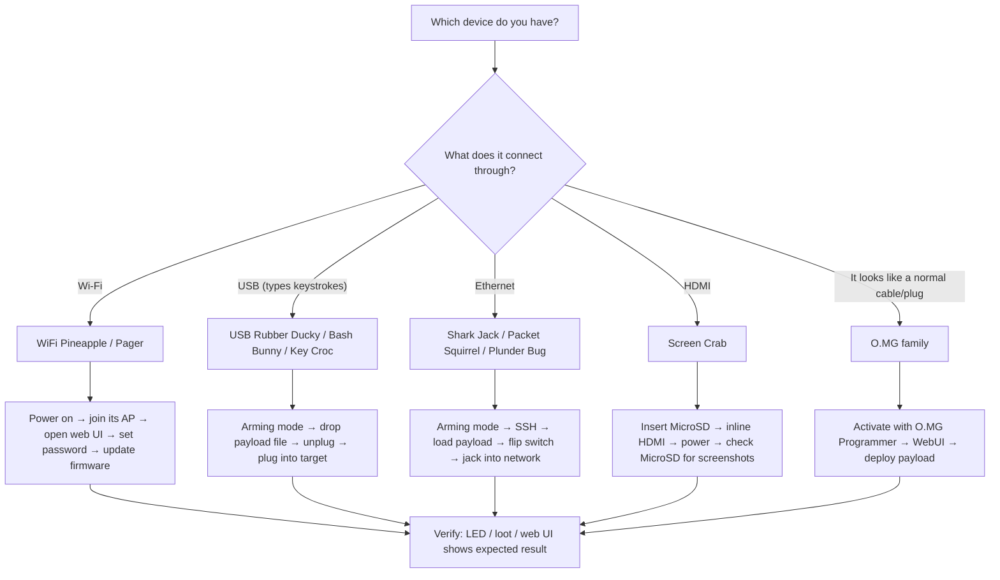

# Hak5 Quickstart — Your First 15 Minutes

> **學習目標**：讀完你將能為任一台 Hak5 裝置完成首次啟動 — 進入 arming mode、載入第一個 Payload、並回收第一批 loot（竊取/收集到的資料）。
> **適用對象**：初學者（完全沒碰過 Hak5 也可以）｜ **前置需求**：一台 Hak5 裝置、一台電腦、一條 USB 線（或 Wi-Fi）。

Every Hak5 device speaks the same three words, so let's learn them once — they make every quickstart below trivial:

1. **Arming mode** — a switch position, hidden button, or default key sequence that turns the device into something harmless and editable (a flash drive, a web UI, or an SSH server). *You load payloads here.*
2. **Payload** — the script that runs when the device is "armed" into *attack mode*. It's just a text file (or a compiled `.bin`).
3. **Loot** — where results land (keystrokes, scans, screenshots). Almost always a `loot/` folder.



---

## 0. Before you start — build your lab

You need a safe place to test. The golden rules:

- Test **only on equipment you own**: an old laptop, a spare router, your own VM.
- Keep a **USB keyboard and monitor** handy in case a payload locks a machine.
- For Wi-Fi work, an [ALFA adapter](/alfa-network/) with monitor mode on Kali Linux is the perfect companion to sniff your own Pineapple's traffic.

Checklist:

- [ ] Hak5 device (any model) + its USB cable / power source
- [ ] A computer with a web browser and SSH client
- [ ] A target you own (old laptop, VM, spare router)
- [ ] (Wi-Fi devices) a 2.4 GHz network you control

---

## 1. WiFi Pineapple family (Mark VII / Enterprise / Pager)

The Pineapple is a **rogue access point**: it broadcasts its own Wi-Fi so you can manage it and run the PineAP suite from a browser.

1. Power it on (USB-C for the [Mark VII](/hak5/products/wifi-pineapple-mark-vii/), AC for the [Enterprise](/hak5/products/wifi-pineapple-enterprise/), battery for the [Pager](/hak5/products/wifi-pineapple-pager/)).
2. On your laptop, join the Pineapple's Wi-Fi. Mark VII default: SSID `PineAP`, passphrase `pineapplesareyummy`.
3. Open the management UI in a browser: `http://172.16.42.1:1471`.
4. Set an **admin password** immediately (Settings → Password). Update the firmware (Settings → Software Update).
5. Connect an Internet uplink if you want the modules to update.

Expected output — the browser shows the Pineapple dashboard with **Recon**, **PineAP**, **Modules** and **Client** panels.

> **Beginner trap:** if you can't see the `PineAP` SSID, the device is still booting — wait 30–60 seconds. Full steps and the 5 GHz upgrade path are on the [Mark VII product page](/hak5/products/wifi-pineapple-mark-vii/).

---

## 2. USB keystroke devices (USB Rubber Ducky / Bash Bunny / Key Croc)

These pretend to be keyboards. The flow is identical across all three: **arm → drop payload → deploy**.

### 2.1 USB Rubber Ducky — Hello, World!

1. Plug the [USB Rubber Ducky](/hak5/products/usb-rubber-ducky/) into your computer. It mounts as a flash drive called `DUCKY` — this is **arming mode**.
2. Write a payload in PayloadStudio (https://payloadstudio.hak5.org) and click **Generate Payload**. You get a compiled `inject.bin`.
3. Copy `inject.bin` to the root of the `DUCKY` drive, replacing the existing file.
4. Unplug. Open Notepad on your target machine (your own machine!). Plug in the Ducky. Watch it type.

```text
REM This is a DuckyScript payload — type into whatever app is focused
DELAY 1000
STRING Hello from my first payload!
ENTER
```

Expected result — `Hello from my first payload!` appears in Notepad.

### 2.2 Bash Bunny — switch to payloads

The [Bash Bunny](/hak5/products/bash-bunny-mark-ii/) has a 3-position switch. Position 3 (closest to the USB plug) is **arming mode** — the Bunny appears as a flash drive and a serial console. Drop `payload.txt` into `/payloads/switch1/`, then flick to position 1 and re-plug.

### 2.3 Key Croc — zero-config keylogging

The [Key Croc](/hak5/products/key-croc/) logs keystrokes **out of the box**: put it inline between a keyboard and a computer and it records to `/root/loot/keystrokes.log` without any setup. Press the hidden arming button to turn it into a flash drive and read the loot.

---

## 3. Network devices (Shark Jack / Packet Squirrel / Plunder Bug)

### 3.1 Shark Jack — first scan in 60 seconds

The [Shark Jack](/hak5/products/shark-jack/) ships with an **nmap recon payload already loaded**. Just:

1. Flip the switch to **Attack mode**.
2. Plug it into any Ethernet jack (your own switch, in your lab!).
3. Watch the RGB LED. Wait ~60 seconds.
4. Flip back to **Arming mode**, plug into your computer over USB, and SSH in to collect loot.

```bash
# From your computer — your NIC must be on the Shark's subnet
ip addr add 172.16.24.2/24 dev eth0
ssh root@172.16.24.1          # password: hak5shark
cat /root/loot/scan/*.txt     # read the nmap results
```

Expected output — a list of hosts, open ports, and services found on the network.

### 3.2 Packet Squirrel — inline man-in-the-middle

The [Packet Squirrel Mark II](/hak5/products/packet-squirrel-mark-ii/) sits **between** a target and the network. Connect *Network* port → your router, *Target* port → the device you want to watch, power it over USB-C, and pick a payload with the switch. Arming mode (switch position that gives you the web UI) is at `172.16.32.1`.

### 3.3 Plunder Bug — sniff with Wireshark

The [Plunder Bug](/hak5/products/plunder-bug-lan-tap/) is a USB-C LAN tap: connect it inline on an Ethernet pair, plug the USB-C side into your laptop, run the cross-platform connection script, and capture in Wireshark.

---

## 4. Screen Crab — screenshots in 2 minutes

1. Insert a MicroSD card into the [Screen Crab](/hak5/products/screen-crab/).
2. Put the Screen Crab **inline**: HDMI source (e.g. a computer) → Screen Crab → monitor.
3. Power it over USB-C. No configuration needed — it captures screenshots at default intervals to the MicroSD card.
4. Eject the MicroSD and browse the captures; edit `config.txt` to change intervals, enable video, or add Wi-Fi + [Cloud C²](/hak5/firmware-downloads/).

---

## 5. O.MG devices — activate first

O.MG devices (Cable / Plug / Adapter / UnBlocker) ship **deactivated** for legal reasons. They cannot run until you activate them with the [O.MG Programmer](/hak5/products/omg-programmer/):

1. Plug the O.MG device into the Programmer, and the Programmer into a computer running **Chrome or Edge**.
2. Open the WebFlasher (https://o.mg.lol/setup/) and follow the 3-step wizard.
3. Once activated, the device broadcasts its own Wi-Fi; join it and open the WebUI to deploy your first DuckyScript payload. Full details on the [O.MG Cable page](/hak5/products/omg-cable/).

---

## 6. Verify you're ready

| Check | How | Success looks like |
|---|---|---|
| Device enumerated | `lsusb` (Linux) / Device Manager (Windows) | Hak5 device visible with vendor name |
| Loot collected | `ls /root/loot/` over SSH, or open MicroSD | Files exist with timestamps |
| Web UI reachable | Browser to device IP | Dashboard renders |
| Payload executed | Observe the target (Notepad, a log file) | Expected keystrokes / files appear |

---

## Common first-run errors

| Symptom | Cause | Fix |
|---|---|---|
| Can't find the device's Wi-Fi | Still booting, or wrong model | Wait 60 s; check the [Troubleshooting index](/hak5/troubleshooting-index/) |
| Flash drive doesn't mount | Device is in attack mode, not arming mode | Flip switch / press arming button / check docs for your model |
| SSH refused | Wrong subnet or device not in arming mode | Set a static IP in the device's range (e.g. `172.16.24.2/24`) |
| Payload typed nothing | Wrong keyboard layout or no `DELAY` at start | Compile with the target's layout; add `DELAY 1000` first |
| O.MG shows no WebUI | Device deactivated | Activate with the O.MG Programmer first |

Now you're armed — literally. Next: pick your device from the [product catalogue](/hak5/) and go deep. Need the exact firmware or payload links? The [Firmware & Downloads](/hak5/firmware-downloads/) page has everything.
