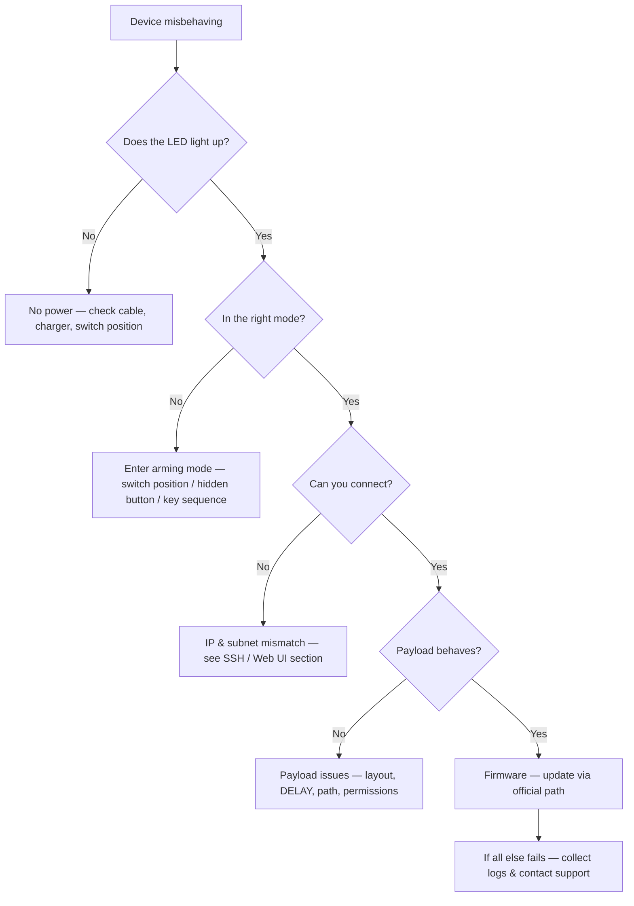

# Hak5 Troubleshooting Index

> **排查鐵律**：先確認電源與模式 → 再查 LED 狀態 → 然後驗證連線（SSH/Web UI）→ 最後檢查 Payload 與韌體。照這個順序走，90% 的問題五分鐘內解決。



---

## Problem categories

| Category | Typical symptoms | Jump to |
|---|---|---|
| Power & boot | No LED, no Wi-Fi, device unresponsive | [Power & boot](#power--boot) |
| Arming mode | Flash drive / web UI / SSH not appearing | [Arming mode problems](#arming-mode-problems) |
| Connection | SSH refused, web UI unreachable, wrong IP | [SSH & web UI connection](#ssh--web-ui-connection) |
| Payloads | Nothing types, scan produces no loot, script errors | [Payload problems](#payload-problems) |
| Wi-Fi | Pineapple AP not visible, no Internet uplink | [Wi-Fi issues](#wi-fi-issues) |

---

## LED reference — what the lights mean

### WiFi Pineapple Mark VII (single RGB LED)

| LED | Meaning |
|---|---|
| Solid green | Booted, healthy |
| Blinking blue | Startup / firmware update in progress |
| Red flash | Error — check the web UI logs |

### Bash Bunny (RGB LED — colour shows *stage*)

| LED | Meaning |
|---|---|
| Solid amber | Arming mode (switch position 3) |
| Flashing red → green | Payload running |
| Solid green | Payload completed OK |
| Flashing red | Payload errored — check `payload.txt` |

### Shark Jack / Shark Jack Cable

| LED | Meaning |
|---|---|
| Green (blinking) | Booting |
| Blue (blinking) | Charging |
| Blue (solid) | Fully charged |
| Yellow (blinking) | Arming mode — SSH server running |
| Red (blinking) | Error — no payload found |

### Key Croc

| LED | Meaning |
|---|---|
| Off during keylogging | Stealth mode — this is normal! |
| Solid (various colours) | Configuration / attack mode activity |

> **Every device is different —** colour codes above match current firmware. When in doubt, the official per-device docs (linked from each [product page](/hak5/)) contain the authoritative legend for your firmware version.

---

## Power & boot

### Device shows no sign of life
**診斷**：Is the LED completely off? Check the cable and power source.

| Cause | Fix |
|---|---|
| Dead battery (Shark Jack / Pager) | Charge over USB-C; Shark Jack needs ~30 min for a full charge |
| Wrong power adapter | Mark VII needs 5V/2A USB-C; Enterprise needs its AC adapter |
| Switch in wrong position | Some devices (Bash Bunny) won't boot payloads in all positions — move to arming mode first |

### Device reboots in a loop
**Cause:** usually a corrupt payload or a failed update. **Fix:** enter arming mode (which bypasses payload execution), replace the payload with a known-good one, or re-flash firmware using the official method from the [Firmware & Downloads](/hak5/firmware-downloads/) page.

---

## Arming mode problems

### Device mounts as a drive, but no `payloads` folder
**診斷**: `lsusb` or the file manager shows the device, but the tree looks wrong.
**Cause:** you're looking at the *loot/configuration* partition instead of the payload area, or the device is a model with a different layout.
**Fix:** check the exact partition layout on the product page for your model (e.g. [Bash Bunny](/hak5/products/bash-bunny-mark-ii/) uses `/payloads/switch1|2|3/`; [Shark Jack](/hak5/products/shark-jack/) exposes `/root/payload/` over SSH, not as a drive).

### Bash Bunny switch doesn't trigger arming mode
**Cause:** switch position confusion. Position 3 (closest to the USB plug) is arming. **Fix:** flip to position 3, unplug and re-plug.

### Key Croc arming button "doesn't exist"
**Cause:** the arming button is **hidden** — a pinhole-sized button that must be pressed while plugging in (or with a paperclip). **Fix:** see the [Key Croc guide](/hak5/products/key-croc/) for the exact technique.

---

## SSH & web UI connection

### `ssh: Connection refused` / page won't load
**Diagnosis step 1 — are you on the right network?**

```bash
# Shark Jack in arming mode expects your machine on 172.16.24.0/24:
ip addr add 172.16.24.2/24 dev eth0
ping 172.16.24.1
```

Expected output:

```text
64 bytes from 172.16.24.1: icmp_seq=1 ttl=64 time=0.4 ms
```

If ping fails, you are not on the device's subnet — fix your IP first.

| Device | Arming address | Credentials |
|---|---|---|
| Shark Jack | `172.16.24.1` | `root` / `hak5shark` |
| Packet Squirrel | `172.16.32.1` (web UI) | `root` / `hak5squirrel` |
| WiFi Pineapple | `172.16.42.1:1471` (web UI) | admin password set on first boot |
| Bash Bunny | USB serial console (no IP) | `root` / `hak5bunny` |
| Key Croc | `172.16.0.1` (web UI, arming mode) | `root` / `hak5croc` |

> **Not sure your model's address?** Check its product page — every one of the [17 product guides](/hak5/) lists the exact management address.

### I can SSH but the shell is tiny / tools missing
**Cause:** you're on the device's limited boot shell, not the full Linux environment. **Fix:** run `exec bash` or launch the full shell via the documented command on your model's page (e.g. Key Croc and Shark Jack expose a full Debian root with `nmap`, `tcpdump`, etc.).

---

## Payload problems

### Keystrokes typed to the wrong app / nothing typed
| Cause | Fix |
|---|---|
| No `DELAY` at payload start | Add `DELAY 1000` (or longer) — the target OS must initialise USB HID |
| Wrong keyboard layout in PayloadStudio | Recompile with the target's layout (e.g. `German`, `French`) |
| Target app has no focus | Design payloads to open Notepad/terminal first (`GUI r`, etc.) |
| Payload compiled for wrong device | Key Croc runs interpreted `payload.txt`; Rubber Ducky needs compiled `inject.bin` |

### Payload runs but loot folder is empty
**Cause:** the payload's output path doesn't exist, or the payload writes to a different directory. **Fix:** verify paths from the payload docs (`/root/loot/` on Shark Jack; `/root/loot/keystrokes.log` on Key Croc) and give the script a moment — scans take time.

### Bash Bunny LED flashes red
**Cause:** payload returned an error. **Fix:** connect the serial console in arming mode and read the output:

```text
LED R
GET SWITCH_POSITION
```

Look at the error line, fix the script, redeploy.

---

## Wi-Fi issues

### Can't see the Pineapple's AP
1. Wait 60 s after power-on (boot is slow on first run).
2. Check the LED — if red, see the web UI logs via a wired connection.
3. On the [Pager](/hak5/products/wifi-pineapple-pager/), the screen shows the AP status directly.

### Pineapple has no Internet, modules won't update
**Cause:** the AP has no uplink. **Fix:** connect an Ethernet cable to the USB-C Ethernet port (Mark VII), or configure the Pager's Ethernet/USB-C, then retry **Settings → Software Update**.

### 5 GHz clients can't connect to the Pineapple
**Cause:** the Mark VII needs the MK7AC adapter (MT7612U) for 5 GHz. **Fix:** see the [compatible-adapters table](/alfa-network/) — ALFA AWUS036ACM works.

---

## Still stuck? Report like a pro

When contacting support (or asking a forum), include:

- [ ] Device model + firmware version (`cat /etc/version` or the web UI footer)
- [ ] Power source and switch/button position at the time of failure
- [ ] LED colour/pattern
- [ ] Exact error text (SSH output, web UI log, payload error)
- [ ] What you already tried (subnet fix, payload swap, firmware update)

> **Pro tip:** most "broken" Hak5 devices are in the wrong mode or the wrong subnet. Re-run the decision tree at the top of this page before you tear anything apart.

Back to the [Hak5 overview](/hak5/) or the [Quickstart](/hak5/quickstart/).
