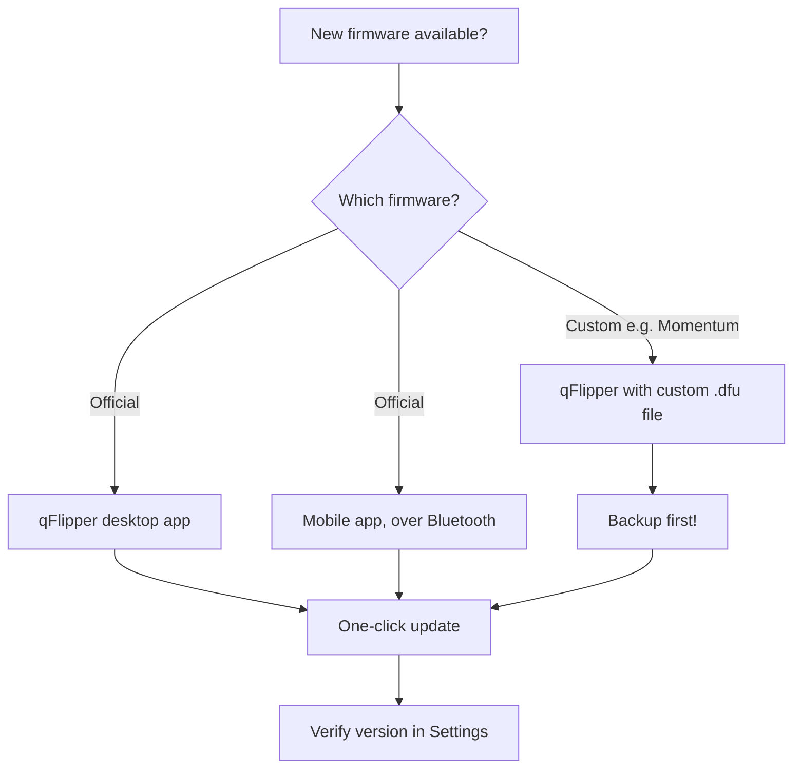
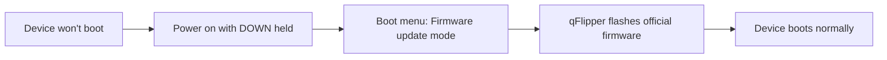

# Firmware & qFlipper — Update Guide

> **Learning goal**: by the end you will understand what "firmware" means on the Flipper Zero, know the three ways to update it, have updated it with qFlipper on your desktop, made a backup, and know how to recover from a bad flash.
>
> **Audience**: beginners who own a Flipper Zero. A PC (Windows / macOS / Linux) is needed for the desktop method.

## What is firmware, anyway?

The Flipper Zero is a small computer: an STM32WB55 microcontroller with a 1 MB flash chip that stores the operating system and all built-in apps — the Sub-GHz reader, NFC, RFID, Infrared, Bad USB, and everything else you see in the main menu. That software is called **firmware** (officially **FlipperOS**).

Firmware updates are released regularly and bring:

- New protocol support (new Sub-GHz and NFC card types)
- Bug fixes and security patches
- New built-in apps and features
- A larger, community-maintained IR database

The two main firmware families:

| Firmware | Maintainer | Key Features & Focus |
|---|---|---|
| **Official FlipperOS** | Flipper Devices | Recommended default. Rock-solid stability, regulatory compliant stock apps. |
| **Momentum** | Momentum Community | **Top Community Recommendation!** Modular UI, full frequency unlock, custom themes, enhanced protocol decoders. |
| **Xtreme** | Xtreme Team | Performance tuned, custom animations, extended Sub-GHz protocols. |
| **Unleashed** | Unleashed Team | Focus on stability, raw Sub-GHz recording, rolling code experimentation. |
| **RogueMaster** | RogueMaster Team | Largest bundled archive of third-party community `.fap` apps and plugins. |



## Prerequisites

- [ ] Flipper Zero with at least 30% battery (or plugged into USB)
- [ ] A USB-C cable that supports data (not charge-only)
- [ ] qFlipper installed (download from the [official downloads page](https://flipper.net/pages/downloads))
- [ ] If using custom firmware: a backup of your current firmware and data

## Method A: Update with qFlipper (recommended)

### Step 1: Install qFlipper

qFlipper is the official desktop app by Flipper Devices. Download it from the [official downloads page](https://flipper.net/pages/downloads).

| OS | Install |
|---|---|
| Windows | Run the `.exe` installer, follow the wizard |
| macOS | Open the `.dmg`, drag qFlipper to Applications |
| Linux (Debian/Ubuntu) | Install the `.deb` with `sudo apt install ./qFlipper-<version>.deb` |

On Ubuntu/Debian, after downloading the `.deb`:

```bash
sudo apt install ./qFlipper-1.3.1-x86_64.deb
```

**Expected output** (tail end):

```text
Preparing to unpack ./qFlipper-1.3.1-x86_64.deb ...
Unpacking qflipper ...
Setting up qflipper (1.3.1) ...
```

> **Note**: the exact filename and version in the download page will differ. Adjust the command to match the file you downloaded.

### Step 2: Connect your Flipper Zero

1. Plug the USB-C cable into your Flipper Zero, then into your PC.
2. On the Flipper Zero, confirm the USB prompt: select **Connect** (the default is to allow USB connection).
3. Open qFlipper. The main screen should show the Flipper Zero and its **current firmware version**, e.g.:

```text
Device: Flipper Zero
Firmware version: 1.0.4
Storage: 14.6 GB free
```

**Verify on Linux** — if qFlipper doesn't see the device, check that the OS recognizes it:

```bash
lsusb
```

**Expected output** (look for the Flipper Devices line):

```text
Bus 001 Device 004: ID 0483:5740 STMicroelectronics Flipper Zero
```

### Step 3: Update

1. In qFlipper, click the **Update** button in the top bar (the Flipper icon with an up arrow).
2. qFlipper checks the release channel and shows the newest version. Click **Update Firmware**.
3. Wait. The Flipper Zero screen shows a progress bar; qFlipper shows a log like:

```text
Downloading firmware ...
Flashing ...
```

4. When the device reboots, qFlipper shows the new version. Done ✅

### Step 4: Verify

On the Flipper Zero itself: **Main Menu → Settings → About**. Check the version matches what qFlipper just flashed.

## Method B: Update with the mobile app

If you prefer your phone: install the [Flipper Mobile App](/flipper-zero/mobile-app/), pair over Bluetooth, then **App → Firmware Update**. The app downloads and flashes the new firmware over the air. See the [Mobile App guide](/flipper-zero/mobile-app/) for full pairing steps.

## Method C: Install custom firmware (Momentum) with qFlipper

> ⚠️ **Warning**: custom firmware can break or be slower to update. Always back up first, and switch back to official firmware if you don't need the extras.

1. **Back up your data** first (see the next section).
2. Download the custom firmware `.dfu` file (e.g. from the [Momentum releases page](https://github.com/Next-Flip/Momentum-Firmware/releases)).
3. In qFlipper: **click the Flipper icon → Install from file → select the .dfu → Flash**.

**Expected output**:

```text
Selected file: momentum-<version>.dfu
Flashing ...
```

4. The Flipper Zero reboots with the custom firmware. Verify in **Settings → About** — the version string now mentions the custom build.

> To go back to official firmware, repeat with the official `.dfu` from the [Flipper release page](https://github.com/flipperdevices/flipperzero-firmware/releases).

## Backup & restore

Your captured keys, IR codes, and settings live on the microSD card — so **the simplest backup is copying the microSD contents to your PC**. But qFlipper can also back up the **internal memory** (region, name, settings, Dolphin level).

| Backup type | How |
|---|---|
| Full backup (recommended) | With Flipper connected, in qFlipper: **Files tab → select all files → Copy to PC** |
| Settings / internal data | **Flipper icon → Backup → Save to file** |
| Restore | **Flipper icon → Restore → choose backup file** |

## Recovery: your Flipper won't boot

Don't panic — the Flipper Zero has a recovery path:

1. **Hold DOWN while powering on** (`LEFT + BACK`) → the boot menu appears.
2. Select **Firmware update mode**.
3. Connect USB and flash official firmware with qFlipper (Method A above).



## Common errors

| Error | Cause | Fix |
|---|---|---|
| `Device not found` / `No device detected` | Charge-only cable, or USB prompt not confirmed | Use a data cable; on Flipper confirm "Connect" prompt |
| qFlipper won't install on Linux | Missing dependencies | `sudo apt install ./qFlipper-<ver>.deb` (installs deps); if that fails, use the AppImage instead |
| Update stops at 0% | USB port issue | Try another USB port / cable, reboot qFlipper |
| `Update failed: insufficient storage` | microSD too full | Free space on the microSD, or use a larger card |
| Custom firmware update fails | Wrong .dfu file | Download the correct file for your hardware; verify it's a `.dfu`, not a source zip |

## Related

- [Flipper Zero Quickstart](/flipper-zero/quickstart/)
- [Flipper Mobile App guide](/flipper-zero/mobile-app/)
- [Official Resources](/flipper-zero/official-resources/)
- [Flipper Zero product page](/flipper-zero/products/flipper-zero/)
