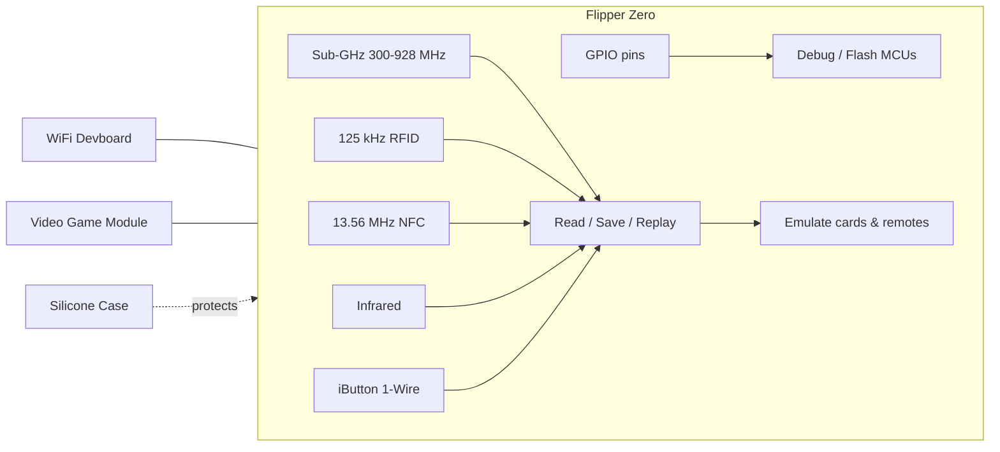

# Flipper Zero

Flipper Zero is a portable, toy-shaped multi-tool for security researchers, hardware hackers and curious students. It talks to the radio and electronic systems around you — garage doors, access badges, NFC cards, TV remotes, temperature sensors, doorbells — using Sub-GHz radio, 125 kHz RFID, 13.56 MHz NFC, infrared, iButton (1-Wire) and GPIO. It is fully open-source and extensible, and it is completely autonomous: the 5-button directional pad and 1.4" monochrome LCD are all you need for day-to-day use.

Think of it as a Swiss Army knife for digital systems: one pocket-sized device that can **read** signals, **store** them, **replay** them, and **emulate** badges or remotes — plus act as a debugger for microcontrollers via its GPIO pins.

## Getting started fast

- **[Quickstart](/flipper-zero/quickstart/)** — charge it, power it on, navigate the menu and read your first card in about 10 minutes.
- **[Firmware & qFlipper](/flipper-zero/firmware-qflipper/)** — keep your Flipper Zero updated, and recover it if a flash goes wrong.
- **[Mobile App](/flipper-zero/mobile-app/)** — pair over Bluetooth, sync data and update firmware from your phone.
- **[Official Resources](/flipper-zero/official-resources/)** — firmware sources, schematics, community, and where to get help.
- **[Troubleshooting](/flipper-zero/troubleshooting/)** — device won't boot, won't charge, won't connect? Start here.

## The Flipper Zero family

We sell and support four products in the Flipper Zero line:

| Product | What it does | Route |
|---|---|---|
| **Flipper Zero** | The multi-tool itself: Sub-GHz, NFC, RFID, IR, iButton, GPIO, BLE | [Product page](/flipper-zero/products/flipper-zero/) |
| **WiFi Devboard** | ESP32-S2 add-on: WiFi Marauder, BlackMagic debug probe, Evil Portal | [Product page](/flipper-zero/products/wifi-devboard/) |
| **Video Game Module** | RP2040 add-on: play retro games, mirror the screen to a TV, motion sensing | [Product page](/flipper-zero/products/video-game-module/) |
| **Silicone Case** | Protective rubber case for everyday carry | [Product page](/flipper-zero/products/silicone-case/) |

## What can it actually do?

- **Sub-GHz (300–928 MHz)** — read, store and replay signals from garage door remotes, boom barriers, wireless doorbells and IoT sensors using the built-in CC1101 transceiver.
- **125 kHz RFID** — read and emulate old-school proximity cards (EM4100, HID, Indala, and more).
- **13.56 MHz NFC** — read, write and emulate high-frequency cards (MIFARE Classic, Ultralight, DESFire, FeliCa, iClass).
- **Infrared** — learn and replay signals from TV / AC / projector remotes, with a community-maintained IR database.
- **iButton (1-Wire)** — read, write and emulate Dallas-style contact keys (DS199x, TM2004, RW1990…).
- **GPIO** — 13 user pins on 2.54 mm headers for flashing and debugging external microcontrollers (SPI, UART, I2C, 5V/3.3V power).
- **Bluetooth 5.4** — connect to the mobile app for remote control, data sharing and over-the-air firmware updates.

## Is Flipper Zero legal to use?

In most regions, owning and using a Flipper Zero for research, education and testing your own equipment is legal. However, laws differ by country: interfering with systems you do not own (opening someone else's garage door, cloning access badges you are not authorized to test) can be illegal. **Only test on your own devices or with explicit permission.** The same applies to the WiFi Devboard and the Video Game Module.

> See our [ALFA Network section](/alfa-network/) for Wi-Fi adapters and antennas used in wireless research, and the [Hak5 section](/hak5/) for pentesting tools like the WiFi Pineapple and USB Rubber Ducky.
