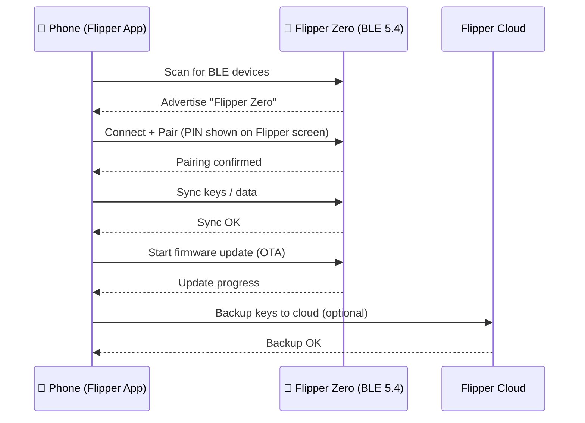

# Flipper Mobile App — Pairing Guide

> **Learning goal**: by the end you will have installed the official app, paired your Flipper Zero over Bluetooth, synced your data, and used the app for remote control and firmware updates.
>
> **Audience**: beginners with an iPhone or Android phone. The Flipper Zero must already be running (see [Quickstart](/flipper-zero/quickstart/)).

The Flipper Zero has Bluetooth Low Energy (BLE 5.4) built into its STM32WB55 radio processor. The official **Flipper Mobile App** (by Flipper Devices) turns your phone into a big-screen remote for the tiny dolphin: browse stored keys, share them with friends, update firmware over the air, and even control the device from across the room.



## Step 1: Install the app

| Platform | Where to get it |
|---|---|
| iOS (iPhone) | [App Store — Flipper Mobile App](https://apps.apple.com/app/flipper-mobile-app/id1534655259) |
| Android | [Google Play — Flipper Mobile App](https://play.google.com/store/apps/details?id=com.flipperdevices.app) |

Make sure your phone's Bluetooth is on and your phone is within a meter or two of the Flipper Zero.

## Step 2: Enable Bluetooth on the Flipper Zero

1. Power on your Flipper Zero (`LEFT + BACK`).
2. Go to **Main Menu → Bluetooth**.
3. Set **Bluetooth** to **ON**.

The Flipper Zero starts advertising as a BLE peripheral.

> **You may be asked about "pairing mode"** — leave the default. If you have paired before and it fails, unpair in the app and on the phone's Bluetooth settings, then retry.

## Step 3: Pair in the app

1. Open the Flipper Mobile App.
2. Tap **Connect** (the app automatically scans for nearby Flipper Zero devices).
3. When the Flipper Zero appears in the list, tap it.
4. A **6-digit PIN** appears on the Flipper Zero screen. Enter it in the app.
5. Confirm on both sides. The app now shows your Flipper Zero with its name, firmware version and storage.

**Expected result** (app screen):

```text
Flipper Zero
  Firmware: 1.0.4
  Storage: 14.6 GB free
  [Synced]
```

> **Why a PIN?** BLE pairing protects the link — this is the same principle as pairing Bluetooth headphones. If the PIN doesn't match, the Flipper Zero and phone refuse to connect.

## Step 4: Sync your data

After pairing, the app synchronizes the contents of your Flipper Zero:

- Stored Sub-GHz remotes
- NFC / RFID card keys
- Infrared remote codes
- iButton keys
- Settings

You can browse them in the app's **Keys** section, rename or delete them, and — most usefully — **share a key with another Flipper Zero user** via the app (the official way to exchange keys without wires).

## Step 5: Remote control

The app's **Remote Control** tab mirrors the Flipper Zero's UI on your phone:

- Tap buttons on screen instead of the 5-button D-pad
- Trigger "Bad USB" scripts from your phone (keyboard emulation)

This is handy when the Flipper is mounted somewhere awkward (e.g. plugged into a target machine) and you want to drive it from your pocket.

## Step 6: Update firmware over the air

1. In the app, open **Firmware Update** (usually under the device settings / menu).
2. The app checks for a new version. Tap **Update**.
3. Keep the phone within a couple of meters — the update streams over BLE and takes a few minutes.
4. The Flipper Zero reboots with the new firmware. Verify in **Main Menu → Settings → About**.

> See [Firmware & qFlipper](/flipper-zero/firmware-qflipper/) for the desktop alternative and for custom firmware (Momentum), which is flashed with qFlipper, not the app.

## Step 7 (optional): Flipper Cloud backup

The app can back up your keys to **Flipper Cloud** (the official cloud service by Flipper Devices) so you can restore them later or move to a new device.

1. In the app, open **Flipper Cloud**.
2. Create an account (email + password) or log in.
3. Tap **Backup** → the app uploads an encrypted snapshot of your data.

> 🔒 Your keys are uploaded encrypted. Still, treat access-badge and remote keys like passwords: don't share your cloud account, and don't store keys for systems you're not authorized to test.

## Common errors

| Error | Cause | Fix |
|---|---|---|
| Device not found in app | Bluetooth OFF on Flipper or phone | Turn on BLE on Flipper (Main Menu → Bluetooth), refresh scan |
| Pairing failed / wrong PIN | A previous pairing is stale | Unpair in app + phone Bluetooth settings, restart both, retry |
| Sync hangs | Phone too far away | Move within 1–2 m, restart the app |
| OTA update fails halfway | BLE link interrupted | Keep phone close, retry; if repeated, use qFlipper over USB |
| App can't connect after firmware update | Firmware and app versions mismatch | Update the app from the store, then reconnect |

## Related

- [Flipper Zero Quickstart](/flipper-zero/quickstart/)
- [Firmware & qFlipper](/flipper-zero/firmware-qflipper/)
- [Official Resources](/flipper-zero/official-resources/)
