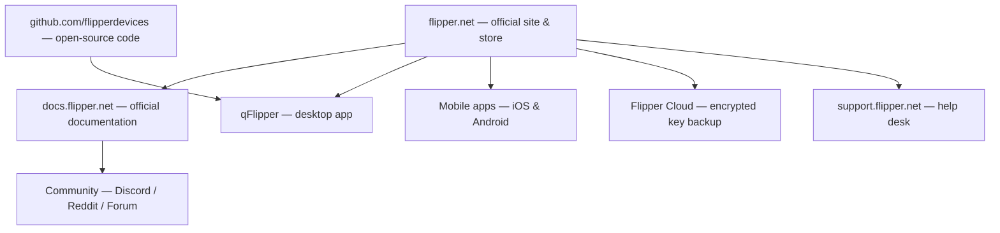

# Official Flipper Zero Resources

> **Learning goal**: this page is a single bookmark for everything official about the Flipper Zero — the company site, docs, source code, tools, and where to get help. Bookmark it.

Flipper Zero is one of the few hacker tools that is **fully open-source**: firmware, schematics, and hardware design files are published by the manufacturer, Flipper Devices. That means you can read exactly how it works, submit your own features, and build your own hardware modules.

## Official website & store

| Resource | URL | What you'll find |
|---|---|---|
| Official site & store | https://flipper.net | Product pages, buying, accessories |
| Official documentation | https://docs.flipper.net | User guides, developer docs, hardware docs |
| Flipper blog | https://blog.flipper.net | Announcements, deep dives, release notes |
| Support portal | https://support.flipper.net | Warranty, RMA, help tickets |

## Downloads

| Resource | URL | Notes |
|---|---|---|
| qFlipper desktop app | https://flipper.net/pages/downloads | Windows / macOS / Linux; firmware flashing, backup, file manager |
| Flipper Mobile App (iOS) | https://apps.apple.com/app/flipper-mobile-app/id1534655259 | Pairing, sync, OTA updates, remote control |
| Flipper Mobile App (Android) | https://play.google.com/store/apps/details?id=com.flipperdevices.app | Same features on Android |

## Open-source repositories (GitHub)

Everything lives under the **Flipper Devices** GitHub organization: https://github.com/flipperdevices

| Repository | What's inside |
|---|---|
| [flipperzero-firmware](https://github.com/flipperdevices/flipperzero-firmware) | The FlipperOS firmware — official release builds, custom firmware base |
| [qFlipper](https://github.com/flipperdevices/qFlipper) | Desktop app source |
| [flipperzero-firmware-sources](https://github.com/flipperdevices/flipperzero-firmware-sources) | Full firmware sources for building your own |
| [video-game-module](https://github.com/flipperdevices/video-game-module) | Video Game Module firmware and games |
| [Flipper Zero schematics & hardware](https://docs.flipper.net) | Official docs host the GPIO pinout and schematics PDFs |

> **Release page**: official firmware `.dfu` files for manual flashing are at https://github.com/flipperdevices/flipperzero-firmware/releases — these are the files qFlipper uses, and the same files you'd flash for recovery.

## Community channels

| Channel | URL | Use it for |
|---|---|---|
| Official Discord | https://discord.gg/flipper | Live chat, dev discussion, show & tell |
| Reddit r/flipperzero | https://www.reddit.com/r/flipperzero/ | Guides, questions, project showcases |
| Official forum | https://forum.flipper.net | Longer-form discussions and Q&A |
| YouTube | https://www.youtube.com/flipperzero | Official videos and demos |

> ⚠️ **Buyer beware**: only download firmware and apps from the official GitHub organization or the official app stores. "Flipper" clone sites and third-party firmware bundles have been used to spread malware.

## What you should bookmark

1. **docs.flipper.net** — the manual for everything.
2. **github.com/flipperdevices** — source code and releases.
3. **flipper.net/pages/downloads** — qFlipper and mobile apps.
4. **Discord** — fastest community help.

## Related

- [Flipper Zero Quickstart](/flipper-zero/quickstart/)
- [Firmware & qFlipper](/flipper-zero/firmware-qflipper/)
- [Flipper Mobile App guide](/flipper-zero/mobile-app/)
- [Flipper Zero product page](/flipper-zero/products/flipper-zero/)
- [WiFi Devboard](/flipper-zero/products/wifi-devboard/)
- [Video Game Module](/flipper-zero/products/video-game-module/)
