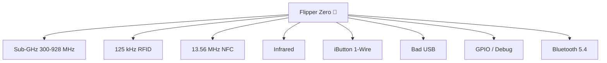

# Flipper Zero — Complete Guide

> **One-line positioning**: a pocket-sized, toy-like multi-tool for reading, storing, replaying and emulating the radio signals and access systems around you — plus debugging hardware via GPIO. For students, hobbyists and security researchers.



## Specification sheet

Official specifications (source: Flipper Devices):

| Category | Specification |
|---|---|
| MCU | **STM32WB55RG** — ARM Cortex-M4 @ 64 MHz + Cortex-M0+ radio core @ 32 MHz |
| Flash / SRAM | 1024 KB flash / 256 KB SRAM (shared app + radio) |
| Display | 1.4" monochrome LCD, 128×64 px, ST7567 controller, SPI |
| Battery | LiPo 2100 mAh, up to 28 days standby |
| Sub-GHz | CC1101 transceiver; 315 / 433 / 868 / 915 MHz bands (region-dependent) |
| RFID (LF) | 125 kHz; AM/OOK; supports EM400x/410x/420x, HID, Indala, FDX, Pyramid, AWID, Viking, Jablotron, Paradox, Gallagher and more |
| NFC (HF) | 13.56 MHz; read / write / emulate MIFARE Classic, Ultralight, DESFire, FeliCa, HID iClass (PicoPass), NFC Forum protocols |
| Infrared | RX 950 nm (38 kHz carrier); TX 940 nm (0–2 MHz, 300 mW); NEC, Kaseikyo, RCA, RC5/RC6, Samsung, SIRC |
| iButton | 1-Wire read / write / emulate; DS199x, DS1971, CYFRAL, Metakom, TM2004, RW1990 |
| Bluetooth | BLE 5.4, TX up to 4 dBm, RX -96 dBm, 2 Mbps |
| USB | USB Type-C, USB 2.0 (12 Mbps), charging up to 1A |
| GPIO | 13 user I/O pins on 2.54 mm headers, 3.3V CMOS, 5V-tolerant inputs, up to 20 mA per pin |
| microSD | Up to 256 GB (SPI mode); 2–32 GB recommended; FAT12/16/32, exFAT |
| Body | 100 × 40 × 25 mm; 102 g; PC/ABS/PMMA |
| Input | 5-button directional pad + BACK button |
| Extra | Vibration motor, buzzer (100–2500 Hz, 87 dB), lanyard loop |

## Overview

Flipper Zero is fully autonomous — the D-pad and monochrome LCD give you complete control without a phone or PC. It is **open-source** (firmware and schematics published by Flipper Devices) and extensible with community apps and hardware modules like the [WiFi Devboard](/flipper-zero/products/wifi-devboard/) and [Video Game Module](/flipper-zero/products/video-game-module/).

**Typical use cases for students & hobbyists:**

- Studying how remote controls and access badges actually work (read → decode → emulate)
- Learning RF fundamentals with a real transceiver
- Controlling IR devices and learning remote codes
- Debugging microcontrollers over GPIO (SPI / UART / I2C / SWD)
- Turning the Flipper into a USB keyboard (Bad USB) to test HID security

> ⚠️ **Legal note**: only test on devices you own or have permission to test. Interfering with systems you don't own (doors, cars, networks) is illegal in most jurisdictions.

## Quickstart

Full step-by-step: [Flipper Zero Quickstart](/flipper-zero/quickstart/). The 60-second version:

1. Charge via USB-C (~2 h).
2. Power on: **LEFT + BACK**.
3. Complete first-boot setup (region, Bluetooth).
4. Insert a microSD card (2–32 GB recommended).
5. **Main Menu → RFID → Read** → place a test badge on the top edge → **OK → Save**.
6. **Main Menu → Sub-GHz → Read** → press your own remote's button → **OK → Save**.

## Advanced usage

### Sub-GHz deep dive

- **Read** captures raw signals; the Flipper decodes common protocols (AM650, AM270, FM, etc.).
- **Raw** mode stores the exact waveform for analysis or replay.
- **Frequency analyzer** (Sub-GHz → Analyze) sweeps the band and shows which frequencies are active — great for discovering what devices around you transmit.
- Rolling-code remotes (e.g. modern garage openers) can't be replayed — that's expected behavior, not a bug.

### NFC & RFID

- **NFC**: read a card, save it, then **Emulate**. Write is supported for rewritable cards only (MIFARE Ultralight, some Classic).
- **RFID**: read and emulate 125 kHz proximity cards; you can also enter card IDs manually (useful for known IDs).
- Encrypted cards (MIFARE DESFire with authentication) won't be readable without the keys — normal.

### Infrared

- **Learn** a new remote: Infrared → Learn → point the original remote at the Flipper → save.
- The built-in **IR database** covers common TV / AC / projector brands and is community-updated.
- Emulate full remotes (TV, AC, stereo) — an AC remote with dozens of buttons can be stored as multiple entries.

### iButton (1-Wire)

- Touch a Dallas-style key to the **pogo pins on the top edge** to read it.
- Emulate it back; write works only on rewritable keys (RW1990, TM2004).

### Bad USB

The Flipper Zero presents itself as a USB HID keyboard. Scripts (`.txt` in the `badusb/` folder of the microSD) type keystrokes automatically — useful for testing USB HID security and for automating keystrokes. Example script:

```text
REM Lock the screen test (Windows)
GUI r
STRING cmd
ENTER
STRING timeout /t 5
ENTER
```

> Only run Bad USB scripts on machines you own. A keyboard that types by itself is the textbook definition of a HID attack.

### GPIO & hardware debugging

The 2.54 mm header exposes 13 pins. Key pins (see the full pinout in the official docs):

| Pin | Function |
|---|---|
| 5V / 3V3 | Power output |
| GND ×2 | Ground |
| PC0 / PC1 | UART TX / RX |
| PB7 / PA6 / PA7 | SPI SCK / MISO / MOSI |
| PC3 | SWC (SWD clock) |
| PA13 / PA14 | SWDIO / SWCLK (debug) |

The Flipper can act as a **UART/SPI/I2C to USB converter**, an **SPI flash programmer**, an **AVR ISP programmer**, and an **OpenDAP debug probe** — enough to flash and debug many hobby boards.

## Firmware

- Update with [qFlipper](/flipper-zero/firmware-qflipper/) (desktop) or the [Mobile App](/flipper-zero/mobile-app/) (over Bluetooth).
- Custom firmware (e.g. Momentum) adds extra apps but must be flashed with qFlipper from a `.dfu` file. Back up before switching.
- Full sources, release builds and schematics: [Official Resources](/flipper-zero/official-resources/).

## Compatibility

| Platform | Support | Notes |
|---|---|---|
| Standalone (no PC) | ✅ | Full main-menu control with the D-pad |
| Windows | ✅ | qFlipper desktop app |
| macOS | ✅ | qFlipper desktop app |
| Linux | ✅ | qFlipper `.deb` or AppImage; verify with `lsusb` |
| iOS / Android | ✅ | Flipper Mobile App over BLE |

## Troubleshooting

- Won't boot → charge 10+ min, then **LEFT + BACK**; if stuck, [recovery mode](/flipper-zero/troubleshooting/#firmware--recovery).
- No capture → check region band, antenna position, and distance ([Sub-GHz & cards](/flipper-zero/troubleshooting/#sub-ghz--cards)).
- Full index: [Flipper Zero Troubleshooting](/flipper-zero/troubleshooting/).

## Related

- [Quickstart](/flipper-zero/quickstart/)
- [Firmware & qFlipper](/flipper-zero/firmware-qflipper/)
- [Mobile App](/flipper-zero/mobile-app/)
- [WiFi Devboard](/flipper-zero/products/wifi-devboard/)
- [Video Game Module](/flipper-zero/products/video-game-module/)
- [Silicone Case](/flipper-zero/products/silicone-case/)
