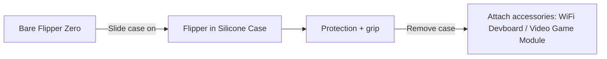
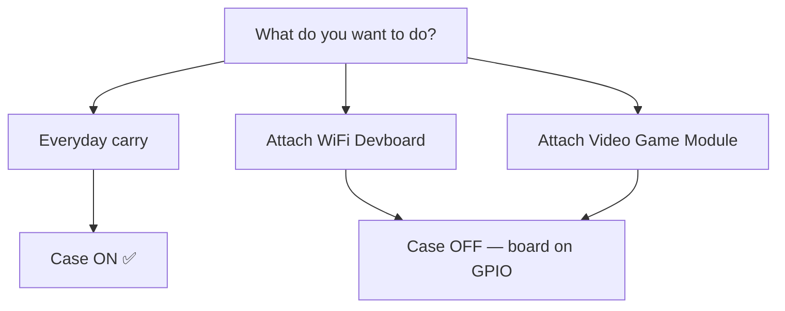

# Silicone Case — Complete Guide

> **One-line positioning**: the official protective silicone case for the Flipper Zero — keeps your cyber-dolphin scratch-free, grippy in hand, and still leaves every button, port and antenna accessible.

## Specification sheet

| Category | Specification |
|---|---|
| Material | Flexible silicone rubber |
| Compatibility | Official Flipper Zero only (matches 100×40×25 mm body) |
| Access | All buttons, D-pad, screen, USB-C, microSD, GPIO header remain usable |
| Color | Black (official) |
| Weight | ~20 g (adds minimal bulk) |
| Included | 1× silicone case (no tools needed) |

## Overview

The Flipper Zero's body is glossy ABS/PC plastic — comfortable in the hand, but it scratches easily on keys, desks and pockets. The Silicone Case is a snug rubber sleeve that solves exactly that: it protects the body and the exposed side buttons while adding grip so the device doesn't slide out of your hand.

It also does double duty as **shock absorption** for the everyday drops a carry-around hacker tool will inevitably take.

## Quickstart — install

No tools, no disassembly. Takes 10 seconds:

1. Orient the case: the **cutout side faces the screen**, the **open bottom exposes the GPIO header**.
2. Slide the Flipper Zero in, **top (antenna / IR window) first**.
3. Push until the case clicks around the USB-C port and the side buttons line up with the case's button covers.

**Verify the fit** — all of these must stay usable:

| Feature | Check |
|---|---|
| D-pad + BACK | Press each button — full travel, no squish |
| Screen | Fully visible through the cutout |
| USB-C port | Cable plugs in fully |
| microSD slot | Card can be inserted / removed |
| IR window | Transparent window aligned with the IR transceiver |
| iButton pogo pins | Exposed on the top edge |

## Removal

1. Peel the top edge of the case away from the device.
2. Work the corners loose one at a time (the rubber is flexible — bend, don't yank).
3. Slide the device out.

> The case stays flexible even when cold, but it's easier to remove when the device has been in a warm pocket for a few minutes.

## Important: accessories and the case

The case covers the GPIO header area by design, so **accessories plug directly onto the GPIO pins — with the case off**:

- **[WiFi Devboard](/flipper-zero/products/wifi-devboard/)** — remove the case, attach the board, re-insert? No: the devboard and the case both occupy the GPIO end. **Use one or the other.**
- **[Video Game Module](/flipper-zero/products/video-game-module/)** — the module ships with its own silicone bumper that fits the bare Flipper. **Remove the case before attaching the module**, otherwise it won't seat correctly.
- **Prototyping boards** — same rule: bare device, GPIO exposed.

## Care instructions

| Situation | Do |
|---|---|
| Dirt / dust | Rinse with lukewarm water + mild soap, air dry |
| Stretched / saggy | Wash, then let it rest off the device overnight — silicone relaxes back |
| Discoloration | Normal for silicone with UV/sun exposure — cosmetic only |
| Replacement | The case is consumable; replace when it no longer fits snugly |

## Compatibility & notes

| Item | Note |
|---|---|
| Flipper Zero (all hardware revisions) | ✅ Fits |
| WiFi Devboard | ⚠️ Can't be attached while the case is on |
| Video Game Module | ⚠️ Module has its own bumper; remove the case |
| Charging while cased | ✅ USB-C fully accessible |
| Wireless range | ✅ No impact (Sub-GHz/NFC antennas are on the device, not blocked by rubber) |

## Troubleshooting

| Symptom | Cause | Fix |
|---|---|---|
| Buttons feel stiff | Case not fully seated | Push the case edges until button covers align |
| IR won't control devices | IR window covered by case fold | Re-seat the case; keep the transparent window clean |
| Case slides off | Wrong orientation or stretched | Flip orientation; replace if worn out |
| Accessory won't fit | Case still attached | Remove the case first (see above) |

## Related

- [Flipper Zero product page](/flipper-zero/products/flipper-zero/)
- [WiFi Devboard](/flipper-zero/products/wifi-devboard/)
- [Video Game Module](/flipper-zero/products/video-game-module/)
- [Flipper Zero Quickstart](/flipper-zero/quickstart/)
