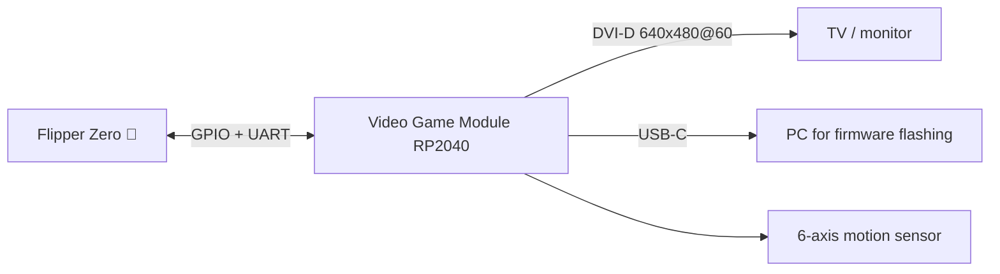
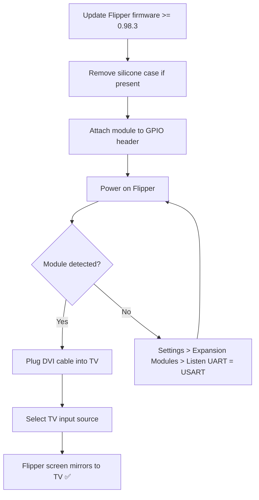

# Video Game Module — Complete Guide

> **One-line positioning**: a Raspberry Pi RP2040-powered module that snaps onto the Flipper Zero to turn it into a mini game console — mirroring the Flipper's screen to a TV (DVI 640×480), playing retro games, and adding 6-axis motion sensing.



## Specification sheet

Official specifications (source: Flipper Devices + Raspberry Pi RP2040):

| Category | Specification |
|---|---|
| MCU | **Raspberry Pi RP2040** — dual-core ARM Cortex-M0+ @ up to 133 MHz (slightly overclocked for video) |
| SRAM | 264 KB on-chip |
| Video out | **DVI-D, 640×480 @ 60 Hz** (driven by RP2040 PIO) |
| Motion sensor | TDK **ICM-42688-P** 6-axis (gyroscope + accelerometer) |
| USB | USB Type-C — device or host (no power delivery) |
| GPIO breakout | 11 GPIO pins + 2 GND + 3.3 V |
| Controls | BOOT button (bootloader mode) + RESET button |
| Compatibility | Raspberry Pi Pico pin-compatible for most projects |
| Firmware | Open source (github.com/flipperdevices/video-game-module) |
| Requirement | Flipper Zero firmware **0.98.3 or later** |

## Overview

The Video Game Module was developed **in collaboration with Raspberry Pi** and uses the RP2040 — the same chip as the Raspberry Pi Pico. Flipper Devices overclocked it slightly so its PIO (programmable I/O) blocks can generate a **DVI-D video signal at 640×480@60 Hz** — the classic "HDMI-like" retro video mode that looks crisp on a modern TV because the Flipper's own screen is only 128×64.

What it unlocks:

- **Screen mirroring** — show the Flipper Zero's UI on a TV (great for demos and teaching).
- **Retro gaming** — load games from the microSD card and play on the TV with the Flipper's D-pad.
- **Motion control** — the 6-axis ICM-42688-P sensor enables air-mouse style control and motion games.
- **Standalone dev board** — because it's a full RP2040, it runs Raspberry Pi Pico projects standalone (e.g. the **Scoppy** oscilloscope app).
- **Flipper Zero Game Engine** — the open-source engine (with the IMU driver) makes writing your own games easy.

> The module comes with a **silicone bumper** so it fits tightly on the Flipper Zero. If your Flipper is in a [Silicone Case](/flipper-zero/products/silicone-case/), remove the case first — the module can't snap on over it.

## Quickstart

### Step 1: Update the Flipper Zero firmware first

The module needs **Flipper Zero firmware 0.98.3 or later**. If you haven't updated recently, do it now via [qFlipper](/flipper-zero/firmware-qflipper/) or the [Mobile App](/flipper-zero/mobile-app/).

### Step 2: Attach the module

1. Remove the Silicone Case if fitted (the module has its own bumper).
2. Power off the Flipper Zero.
3. Align the module's connector with the Flipper's GPIO header (matching the orientation marking) and press down until it clicks.
4. Power on the Flipper Zero. It should automatically detect the module and prepare it.

**Verify**: **Main Menu → Settings → Expansion Modules** → the **Listen UART** option must be set to **USART** (the module communicates over UART). If it's set to anything else, the module won't be detected.



### Step 3: Connect to a TV

1. Plug the video cable into the **Video Out** port on the module (DVI-D; use a DVI or DVI-to-HDMI cable).
2. On the TV, switch the input source to the port you used.
3. The Flipper Zero's screen appears on the TV at 640×480@60 Hz.

> If you see **"Video Game Module not initialized"** on the TV, the Flipper firmware is too old (or the module is powered without a Flipper). Update the Flipper firmware and retry.

### Step 4: Play a game

1. Copy game files (`.fap` apps + assets) to the microSD card — see the official module docs and the Flipper app catalog.
2. On the Flipper: **Apps → Games** → pick your game.
3. Play on the TV with the D-pad; games using the IMU let you tilt/move the Flipper to control the action.

## Advanced usage

### Air mouse

With the right app, wave the Flipper Zero (with the module attached) in the air to control a computer cursor over Bluetooth — the ICM-42688-P reports rotation and acceleration, and the Flipper translates it into mouse movement.

### Write your own games with the Game Engine

The [Flipper Zero Game Engine](https://github.com/flipperdevices/flipperzero-game-engine) handles vector math, sprite caching, rendering and event processing. Build with the standard Flipper firmware SDK, then copy the resulting `.fap` to `apps/` on the microSD.

### Raspberry Pi Pico projects (standalone)

The module can run **without the Flipper Zero**:

1. Hold **BOOT**, plug USB-C into your PC → the RP2040 appears as a USB mass-storage drive.
2. Drop a standard Pico `.uf2` file onto it (e.g. Scoppy oscilloscope firmware).
3. The RP2040 runs the Pico firmware on its own — the Flipper isn't involved.

```bash
# After BOOT + plug, the drive appears; copying a .uf2 is all it takes
cp scoppy.uf2 /media/$(whoami)/RPI-RP2/
```

**Expected output**:

```text
(nothing printed — the drive unmounts itself after a successful flash)
```

> ⚠️ Flashing a generic Pico `.uf2` replaces the video-game firmware. To restore, re-flash the official `vgm-fw-*.uf2` the same way (download from the [video-game-module repo](https://github.com/flipperdevices/video-game-module)).

## Firmware

- Module firmware updates are flashed over USB-C in **BOOT mode** (a `.uf2` file — same flow as a Pico).
- The **module firmware** is separate from the Flipper's own firmware. Update both for best compatibility.
- Sources and release firmware: [github.com/flipperdevices/video-game-module](https://github.com/flipperdevices/video-game-module).

## Compatibility

| Platform | Support | Notes |
|---|---|---|
| Flipper Zero (official) | ✅ | Requires firmware ≥ 0.98.3 |
| TV / monitor | ✅ | DVI-D 640×480@60; HDMI via DVI-to-HDMI cable |
| Standalone (no Flipper) | ✅ | Runs Raspberry Pi Pico firmware |
| PC flashing | ✅ | BOOT + USB-C → drag-and-drop `.uf2` |

## Troubleshooting

| Symptom | Cause | Fix |
|---|---|---|
| "Video Game Module not initialized" | Flipper firmware too old | Update Flipper firmware ≥ 0.98.3 |
| Module not detected | Listen UART not set to USART | Settings → Expansion Modules → Listen UART = USART |
| No picture on TV | Wrong input / cable | Select the correct HDMI/DVI input; use a data-capable cable |
| No motion control in game | IMU not initialized | Re-attach module (power off first), restart game |
| Module won't flash | Not in bootloader mode | Hold BOOT before plugging USB-C |

## Related

- [Flipper Zero product page](/flipper-zero/products/flipper-zero/)
- [Firmware & qFlipper](/flipper-zero/firmware-qflipper/)
- [Silicone Case](/flipper-zero/products/silicone-case/)
- [Flipper Zero Troubleshooting](/flipper-zero/troubleshooting/)
