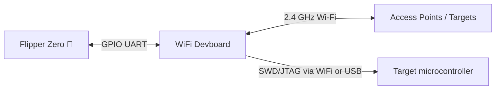
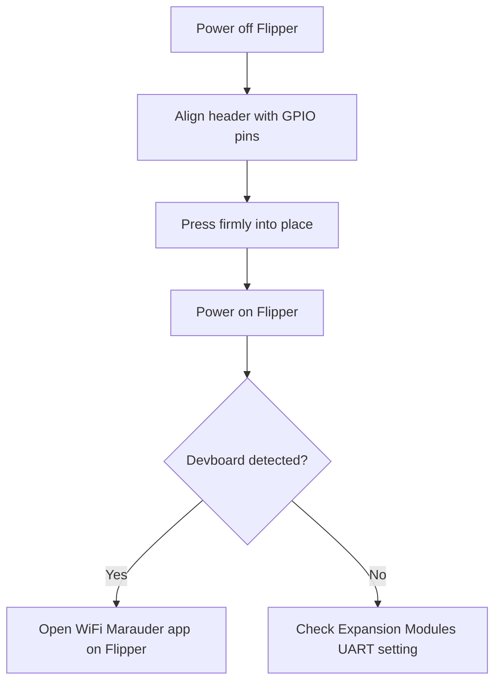

# WiFi Devboard — Complete Guide

> **One-line positioning**: a small ESP32-S2 development board that plugs onto the Flipper Zero's GPIO header and gives it 2.4 GHz Wi-Fi — for WiFi auditing (Marauder), captive-portal demos (Evil Portal), and as a wireless debug probe (BlackMagic).



## Specification sheet

Official specifications (source: Flipper Devices + Espressif ESP32-S2-WROVER datasheet):

| Category | Specification |
|---|---|
| Module | **ESP32-S2-WROVER** |
| CPU | Xtensa single-core LX7, up to 240 MHz |
| Wireless | 2.4 GHz Wi-Fi, IEEE 802.11 b/g/n (**no 5 GHz, no Bluetooth** — S2 chip) |
| Flash / PSRAM | 4 MB flash / 2 MB PSRAM |
| SRAM | 320 KB SRAM, 16 KB RTC SRAM |
| USB | USB Type-C (USB OTG) |
| Buttons | BOOT and RESET tactile switches |
| Interfaces | UART, SPI, I2C, GPIO (via Flipper connector + breakout) |
| Preloaded firmware | **BlackMagic** (SWD/JTAG debugging over Wi-Fi or USB) |
| Compatibility | Official Flipper Zero GPIO connector (UART link) |

## Overview

The WiFi Devboard is the official Wi-Fi add-on for the Flipper Zero. Two things make it special:

1. **It gives the Flipper a Wi-Fi radio** — the Flipper Zero itself has no Wi-Fi, only Sub-GHz, NFC, RFID and BLE. With the devboard attached and flashed with **WiFi Marauder**, the Flipper becomes a portable Wi-Fi auditing tool: scan networks, deauthenticate clients, probe for hidden SSIDs.
2. **It's a wireless debug probe** — it ships with **BlackMagic** firmware, which lets you flash and debug other microcontrollers (including the Flipper Zero's own STM32) over SWD/JTAG, wired **or over Wi-Fi**.

It's also a full ESP32-S2 development platform: you can write your own ESP-IDF or Arduino firmware and flash it — the board is a proper dev kit, not just an accessory.

> ⚠️ **Legal note**: Wi-Fi auditing tools can disrupt networks. Only test on networks you own or have explicit permission to test. Deauth attacks against others' networks are illegal in most places.

## Quickstart

### Step 1: Attach the devboard

1. Power off the Flipper Zero.
2. Line up the devboard's 2.54 mm header with the Flipper's GPIO pins — **match the silk-screen orientation** (the board plugs onto the pins with the USB-C port pointing outward).
3. Press down firmly until it sits flush.
4. Power on the Flipper. You should see the new module detected (check **Settings → Expansion Modules** — UART should be enabled).



### Step 2: Install the WiFi Marauder app on the Flipper

The **WiFi Marauder** Flipper app (by 0xchocolate) talks to Marauder firmware running on the devboard.

1. Plug the Flipper into your PC (USB-C).
2. In qFlipper, open the **Apps** catalog (or download the `.fap` from the Marauder project) and install **WiFi Marauder**.
3. On the Flipper: **Apps → WiFi Marauder**.
4. The app connects to the devboard over the UART link and shows its status.

### Step 3: Flash Marauder firmware to the devboard

The devboard ships with BlackMagic; Marauder is a separate firmware you flash once. Two options:

**Option A — flash from the Flipper Zero itself** (the officially supported path):

1. With the devboard attached and the Flipper powered on, connect the Flipper to your PC via USB.
2. In qFlipper, use the built-in **ESP32 flashing** option (qFlipper ≥ 1.3): it downloads the Marauder firmware and flashes it through the Flipper's UART.
3. qFlipper log shows something like:

```text
ESP32 firmware flashing started
Erasing flash ...
Writing 0x00000000 ...
Flashing complete. Rebooting board ...
```

**Option B — flash from your PC over the devboard's USB-C**:

1. Put the devboard in **download mode**: hold **BOOT**, then plug USB-C into your PC (release BOOT).
2. Install Espressif's `esptool` (Python):

```bash
python3 -m pip install esptool
```

3. Flash the Marauder `.bin`:

```bash
esptool.py --chip esp32s2 --port /dev/ttyACM0 erase_flash
esptool.py --chip esp32s2 --port /dev/ttyACM0 write_flash 0x10000 marauder_vX.Y_esp32s2.bin
```

**Expected output** (tail end):

```text
Hash of data verified.
Leaving...
Hard resetting via RTS pin...
```

> The port name differs by OS: `/dev/ttyACM0` (Linux), `COMx` (Windows), `/dev/cu.usbmodem*` (macOS). Adjust accordingly.

### Step 4: Verify

Back on the Flipper: **Apps → WiFi Marauder** → the app should show the devboard's firmware version and detected AP count. Point the Flipper at any nearby network you own and run a **Scan** — you'll see SSIDs, channels and encryption types listed on the Flipper's screen.

## Advanced usage

### WiFi Marauder features

| Feature | What it does |
|---|---|
| Scan APs / stations | Lists nearby networks and connected clients |
| Beacon spam | Broadcasts fake SSIDs (use on your own test lab only) |
| Deauth | Forces clients off a network (test networks only!) |
| Sniff | Captures probe requests |
| Hidden SSID reveal | Shows hidden network names when clients probe them |
| Packet capture | Logs raw 802.11 frames to the SD card |

### Evil Portal

Flash the **Evil Portal** ESP32 firmware and it serves a captive portal (a fake login page) that demonstrates how open Wi-Fi can be abused. In combination with a [WiFi Pineapple](/hak5/) from our Hak5 range, this is how real-world captive portal attacks are tested — always in a lab you control.

### BlackMagic debugging

Keep the factory BlackMagic firmware (or reflash it) to use the devboard as a debug probe:

- Connect the devboard's **SWDIO / SWCLK** pins to a target MCU (e.g. an STM32 board).
- Debug over USB-C, or over Wi-Fi via `netcat`-style TCP connection — no cables needed once on the bench.
- Works with GDB and OpenOCD workflows; the Flipper Zero's own firmware recovery can use this path too.

### Your own ESP32 projects

Because it's a standard ESP32-S2, install ESP-IDF or Arduino core and flash your own code exactly like any other ESP32 board. The 2 MB PSRAM gives you room for image-heavy experiments (camera streaming demos, etc.).

## Compatibility

| Platform | Support | Notes |
|---|---|---|
| Flipper Zero (official) | ✅ | UART over GPIO; detected in Expansion Modules |
| Any ESP32 host | ✅ | Standard ESP32-S2 dev board |
| PC flashing | ✅ | esptool over USB-C (BOOT + plug) |
| qFlipper ESP32 flasher | ✅ | Flipper-embedded flashing, qFlipper ≥ 1.3 |

## Troubleshooting

| Symptom | Cause | Fix |
|---|---|---|
| Flipper doesn't detect the board | Expansion module UART disabled | Settings → Expansion Modules → enable UART / USART |
| Marauder app says "no connection" | Wrong firmware on board | Flash Marauder firmware (Step 3) |
| `esptool` can't connect | Board not in download mode | Hold BOOT before plugging USB-C, release after |
| Board detected but no Wi-Fi scan | Board flashed with BlackMagic, not Marauder | Reflash Marauder; BlackMagic doesn't scan |
| 5 GHz networks invisible | S2 only supports 2.4 GHz | By design — use 2.4 GHz for testing |

## Related

- [Flipper Zero product page](/flipper-zero/products/flipper-zero/)
- [Firmware & qFlipper](/flipper-zero/firmware-qflipper/)
- [Flipper Zero Troubleshooting](/flipper-zero/troubleshooting/)
- [Official Resources](/flipper-zero/official-resources/)
- [Hak5 WiFi Pineapple](/hak5/) — dedicated Wi-Fi audit platform
