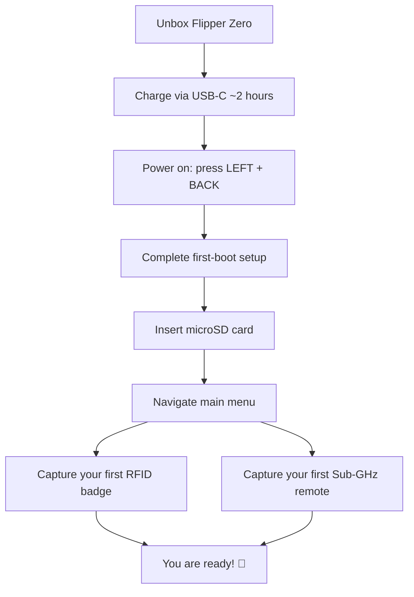

# Flipper Zero Quickstart

> **Learning goal**: by the end of this guide you will have charged your Flipper Zero, booted it for the first time, inserted a microSD card, navigated the main menu, and captured your first RFID badge and your first Sub-GHz remote.
>
> **Audience**: complete beginners. No soldering, no PC needed — the Flipper Zero is fully autonomous.

Your Flipper Zero arrives with the firmware pre-installed and the battery partially charged. Let's get it out of the box and talking to the world.



## What's in the box

| Item | Purpose |
|---|---|
| Flipper Zero device | The multi-tool itself |
| USB Type-C cable | Charging and connection to a PC |
| Plastic protector (peel-off) | Protects the screen during shipping |

You will also want a **microSD card (2–32 GB recommended)** — the device stores captured keys, IR databases and apps on it. Flipper Zero supports FAT12, FAT16, FAT32 and exFAT cards up to 256 GB, but 2–32 GB cards are recommended for reliability (SPI mode).

## Step 1: Charge the battery

Plug the USB-C cable into your Flipper Zero and any USB power source (a laptop, a phone charger, a power bank).

- The battery icon in the top-right of the screen shows the charge level.
- Full charge takes roughly **2 hours** and the battery lasts **up to 28 days** on standby (LiPo 2100 mAh).
- Charging stops automatically at 100% — leaving it plugged in overnight is safe.

> **Quick tip**: while charging, the Flipper can still be used, but wireless transmit range is best when it is running on battery.

## Step 2: Power on

Power on by pressing **LEFT + BACK** simultaneously. The cyber-dolphin logo animation plays and the main menu appears.

| Action | Button combo |
|---|---|
| Power on | LEFT + BACK |
| Power off | LEFT + BACK (hold 2 seconds, confirm) |
| Navigate | Directional pad (UP / DOWN / LEFT / RIGHT) |
| Select / enter | OK (center button) |
| Go back | BACK |

If nothing happens, the battery may be completely drained — plug in USB-C and wait 5 minutes before trying again.

## Step 3: First-boot setup

On the very first boot the Flipper Zero walks you through a short setup:

1. **Select your region** — this configures which Sub-GHz frequency bands are enabled (315, 433, 868 or 915 MHz depending on region).
2. **Enable Bluetooth** — optional but recommended; required later for the [mobile app](/flipper-zero/mobile-app/).
3. **Do a firmware update check** — you can do it right away or skip it (see [Firmware & qFlipper](/flipper-zero/firmware-qflipper/)). We recommend updating before you start playing.

## Step 4: Insert a microSD card

1. Look at the bottom edge of the device — the microSD slot sits next to the USB-C port.
2. Push the card in until it clicks (**push-push mechanism** — it locks into place).
3. Power cycle the device (LEFT + BACK → power off → power on).

You can verify the card is recognized: **Main Menu → Settings → Storage**. You should see the card capacity and free space instead of `SD card: not present`.

> **What happens if I skip the microSD?** The internal flash (1 MB) fills up fast — captured signals, IR codes and installed apps all need storage. A card is strongly recommended.

## Step 5: Navigate the main menu

The main menu is a vertical list. Use **UP / DOWN** to scroll, **OK** to enter, **BACK** to return.

| Menu item | What it does |
|---|---|
| Sub-GHz | Read and replay 300–928 MHz signals (remotes, sensors) |
| NFC | Read/write/emulate 13.56 MHz cards |
| RFID | Read/emulate 125 kHz proximity cards |
| Infrared | Learn and replay IR remote signals |
| iButton | Read/emulate 1-Wire contact keys |
| Bad USB | Act as a USB keyboard and type scripts (HID attack) |
| GPIO | Interact with the 2.54 mm header pins |
| Bluetooth | Toggle BLE and see paired devices |
| Settings | Region, display, storage, about, firmware version |
| Apps | Community and built-in apps (Weather Station, etc.) |

## Step 6: Capture your first RFID badge

Let's do a real capture — this is the "hello world" of Flipper Zero.

1. Go to **Main Menu → RFID**.
2. Select **Read** (it reads 125 kHz cards).
3. Place your test badge flat on the **top edge of the Flipper Zero** (the RFID antenna is located there, near the iButton pogo pins).
4. Watch the screen — when it reads, you'll see the card type and ID appear, e.g.:

```text
EM4100
Key: 04 00 45 23 12
```

5. Press **OK → Save**. Give it a name like `test-badge`.

You can now emulate it: **RFID → Saved → select your badge → Emulate**. Hold the Flipper Zero where you'd normally hold the card. The reader will see your Flipper as the badge.

> ⚠️ **Only test on cards and doors you own or have permission to test.** Cloning badges you don't own is illegal in most jurisdictions.

## Step 7: Capture your first Sub-GHz remote

Point your Flipper Zero at a Sub-GHz remote you own (garage door, wireless doorbell, car key fob — **test only with your own devices**).

1. Go to **Main Menu → Sub-GHz**.
2. Press **OK → Read** (raw signal capture mode).
3. Point the remote at the Flipper Zero (antenna is at the top) and press the remote's button.
4. The screen shows the detected frequency and modulation, e.g.:

```text
433.92 MHz, AM650
```

5. Press **OK → Save** and name it `my-remote`.

To replay it later: **Sub-GHz → Saved → select → Send**. The Flipper Zero transmits the captured signal.

> **Why is my frequency different?** Region matters: Europe uses 868 MHz, the US 915 MHz, and many remotes use 433.92 MHz worldwide. If your remote shows a frequency outside your region's enabled band, see [Troubleshooting](/flipper-zero/troubleshooting/).

## You're ready 🎉

From here you can explore:

- **[Firmware & qFlipper](/flipper-zero/firmware-qflipper/)** — keep your device updated and recover it if something goes wrong.
- **[Mobile App](/flipper-zero/mobile-app/)** — remote control and sync from your phone.
- **[Flipper Zero product page](/flipper-zero/products/flipper-zero/)** — full spec sheet, GPIO pinout and advanced usage.
- **[WiFi Devboard](/flipper-zero/products/wifi-devboard/)** — turn your Flipper into a WiFi pentest tool.
- **[Video Game Module](/flipper-zero/products/video-game-module/)** — retro gaming and TV mirroring.

## Common mistakes

| Mistake | Symptom | Fix |
|---|---|---|
| Forgot to insert microSD | "SD card: not present" in Settings | Insert card, power cycle |
| Region too restrictive | Can't receive a 433 MHz remote | Change region in Settings (or use the 868/915 bands if supported) |
| RFID badge placed wrong | No read, screen stays blank | Slide badge along the top edge until it clicks |
| Battery drained during first boot | Won't power on | Plug in USB-C, wait 5 minutes, retry |
