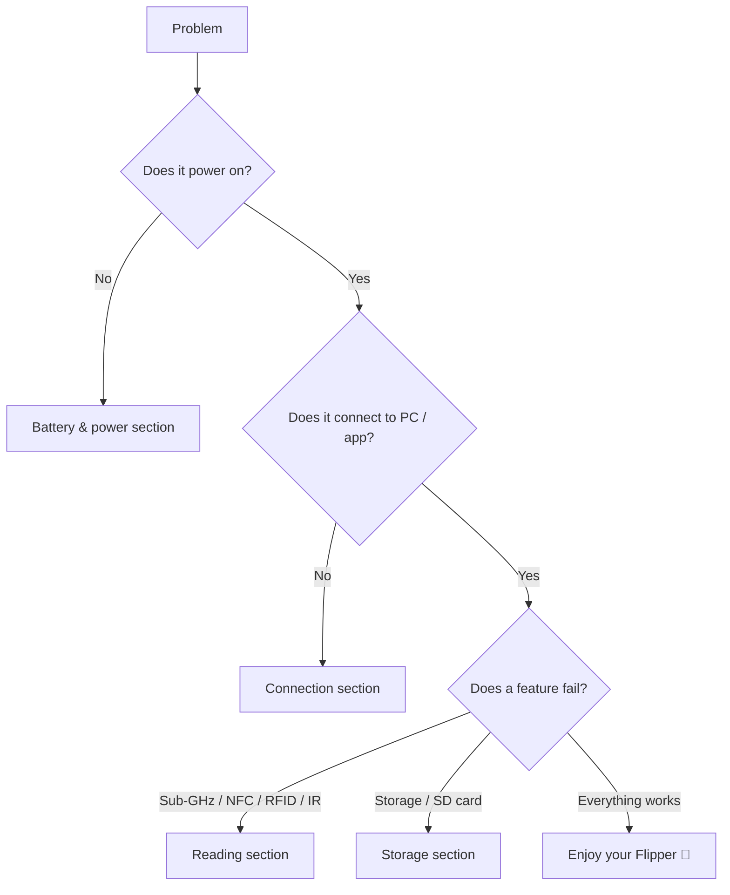

# Flipper Zero Troubleshooting

> **排查鐵律 (Rule of thumb)**: hardware first → firmware/driver second → settings last. In Flipper Zero terms: **battery & cable → firmware version → configuration (region, Bluetooth, SD card)**.

This page is a decision-tree index. Find your symptom below, jump to that section, and follow the diagnosis steps in order.



## Problem index

| Category | Symptoms | Go to |
|---|---|---|
| Power | Won't turn on, won't charge, dies fast | [Battery & power](#battery--power) |
| Connection | qFlipper can't find device, app won't pair | [USB & Bluetooth](#usb--bluetooth) |
| Reading | No Sub-GHz capture, NFC/RFID won't read | [Sub-GHz & cards](#sub-ghz--cards) |
| Storage | SD card not detected, "no storage" | [Storage & microSD](#storage--microsd) |
| Firmware | Update fails, device stuck on logo | [Firmware & recovery](#firmware--recovery) |

## Battery & power

### Q1: Device won't power on

**Diagnosis** — try charging:

1. Connect USB-C to a known-good charger for **10+ minutes**.
2. Press **LEFT + BACK**.
3. If the screen stays dark, the battery may be fully drained (safe mode) — this is normal after long storage.

**Root cause**: LiPo battery protection circuit enters a low-voltage state when deeply discharged.

**Fix**: leave it charging (LED stays on) for up to an hour; it will boot normally once the cell is above the threshold. If it still won't power on after 2 hours of charging, the battery or charge IC may be faulty — see [Still stuck?](#still-stuck).

### Q2: Charges slowly or not at all

**Diagnosis**:

```text
Charge LED: OFF → ORANGE (charging) → GREEN (full)
```

| Symptom | Cause | Fix |
|---|---|---|
| No LED at all | Bad cable / port / charger | Try another USB-C data cable and a 5V charger |
| Charges very slowly | Charging limited to ~1A max by design | Use any decent 5V/2A charger; time to full ≈ 2 h |
| Stops at some % | Cell imbalance or worn battery | Charge in cooler room; if persistent, contact support |

## USB & Bluetooth

### Q3: qFlipper says "no device found"

**Diagnosis** — on Linux, check the USB bus:

```bash
lsusb
```

**Expected output** (Flipper Zero connected and confirmed):

```text
Bus 001 Device 004: ID 0483:5740 STMicroelectronics Flipper Zero
```

| Symptom | Cause | Fix |
|---|---|---|
| `lsusb` shows nothing | Charge-only cable | Use a data-capable USB-C cable |
| `lsusb` shows it, qFlipper doesn't | USB prompt not confirmed on Flipper | On Flipper, when asked, select **Connect**; replug |
| qFlipper sees it but hangs | Old qFlipper version | Update qFlipper from [flipper.net/pages/downloads](https://flipper.net/pages/downloads) |
| Works on Windows, not Linux | Missing udev rules | See the qFlipper Linux install notes / AppImage |

### Q4: Mobile app can't pair over Bluetooth

**Diagnosis** — on the Flipper Zero: **Main Menu → Bluetooth** must read **ON**.

| Symptom | Cause | Fix |
|---|---|---|
| App can't find device | BLE off / too far | Enable BLE on Flipper, keep phone within 1–2 m |
| PIN mismatch | Stale pairing | Unpair in app + phone Bluetooth settings, restart both, re-pair |
| Pairing succeeds but sync hangs | App too old vs new firmware | Update the app; see [Mobile App guide](/flipper-zero/mobile-app/) |
| Connects only after reboot | BLE stack stuck | Reboot Flipper (LEFT + BACK → power off → on) |

## Sub-GHz & cards

### Q5: Sub-GHz can't capture a remote

**Diagnosis** — check what the Flipper sees:

1. **Sub-GHz → Read**.
2. Aim the remote at the **top of the Flipper Zero** (antenna is at the top edge).
3. Watch the top-right of the screen — does the signal strength meter move?

| Symptom | Cause | Fix |
|---|---|---|
| Meter shows signal but no decode | Unknown protocol or too weak | Move closer (range up to ~50 m, but reading is strongest up close); try again with the remote button held |
| No signal at all | Wrong band for your region | Region must allow the remote's frequency (315/433/868/915 MHz). Change region in **Settings → Region** (regulatory-permitting) |
| Captures but replay does nothing | Signal replayed at wrong time | Some remotes use rolling codes — they can't be replayed after the original is used. Nothing is broken |
| Only hears noise | Interference | Move away from Wi-Fi routers / other transmitters |

> ⚠️ Replaying signals you don't own may be illegal. Test only on your own devices.

### Q6: NFC / RFID won't read a card

**Diagnosis**:

1. **NFC** (13.56 MHz): place card on the **center-top back** of the device, hold flat.
2. **RFID** (125 kHz): slide the card along the **top edge**.

| Symptom | Cause | Fix |
|---|---|---|
| "No card detected" | Wrong antenna position / card type | Rotate card 90°, try both faces; some cards need a moment to couple |
| Reads some cards, not others | Card type unsupported (e.g. encrypted DESFire with auth) | Check supported list on the [product page](/flipper-zero/products/flipper-zero/); encrypted cards can't be read without keys |
| Reads but won't emulate | Emulation range is short by design | Emulation antenna is tiny — hold the Flipper right against the reader |

## Storage & microSD

### Q7: "SD card: not present" or save fails

**Diagnosis** — **Main Menu → Settings → Storage**:

| Symptom | Cause | Fix |
|---|---|---|
| "not present" | Card not pushed fully in | Push until it clicks (push-push slot), then power cycle |
| Card detected, files won't save | Wrong filesystem / corrupt card | Reformat to FAT32 (or exFAT); see below |
| "Storage full" | 1 MB internal flash exhausted | Use a microSD card (2–32 GB recommended) |

**Reformat from Linux** (replace `/dev/sdX` with your card device — double-check with `lsblk`!):

```bash
sudo mkfs.vfat -F 32 /dev/sdX
```

**Expected output**:

```text
mkfs.fat 4.2 (2021-01-31)
```

> ⚠️ Formatting wipes the card. Back up first. Never point `mkfs` at your OS disk — verify the device name with `lsblk` before running.

## Firmware & recovery

### Q8: Update failed, or device stuck on boot logo

**Diagnosis** — determine if the device is alive:

1. Hold **DOWN** while pressing **LEFT + BACK** → the **boot menu** should appear.
2. If it does, the bootloader is intact — recovery is straightforward.

**Fix**:


If even the boot menu doesn't appear: leave it charging for 1 hour, then retry. If still nothing, the firmware storage may be corrupt — this is rare and warrants [support](#still-stuck).

## Still stuck?

If none of the above fixes it, open a ticket on the [official support portal](https://support.flipper.net). To get a fast answer, prepare:

- Firmware version (**Settings → About**) and app version
- OS / phone model and qFlipper version
- What you did before the failure (update? custom firmware? dropped it?)
- `lsusb` / `dmesg` output if it's a USB problem (on Linux)

## Related

- [Flipper Zero Quickstart](/flipper-zero/quickstart/)
- [Firmware & qFlipper](/flipper-zero/firmware-qflipper/)
- [Flipper Mobile App guide](/flipper-zero/mobile-app/)
- [Official Resources](/flipper-zero/official-resources/)
