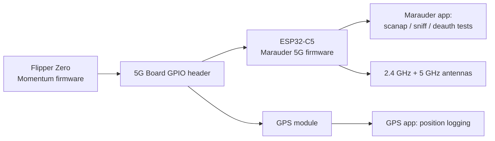
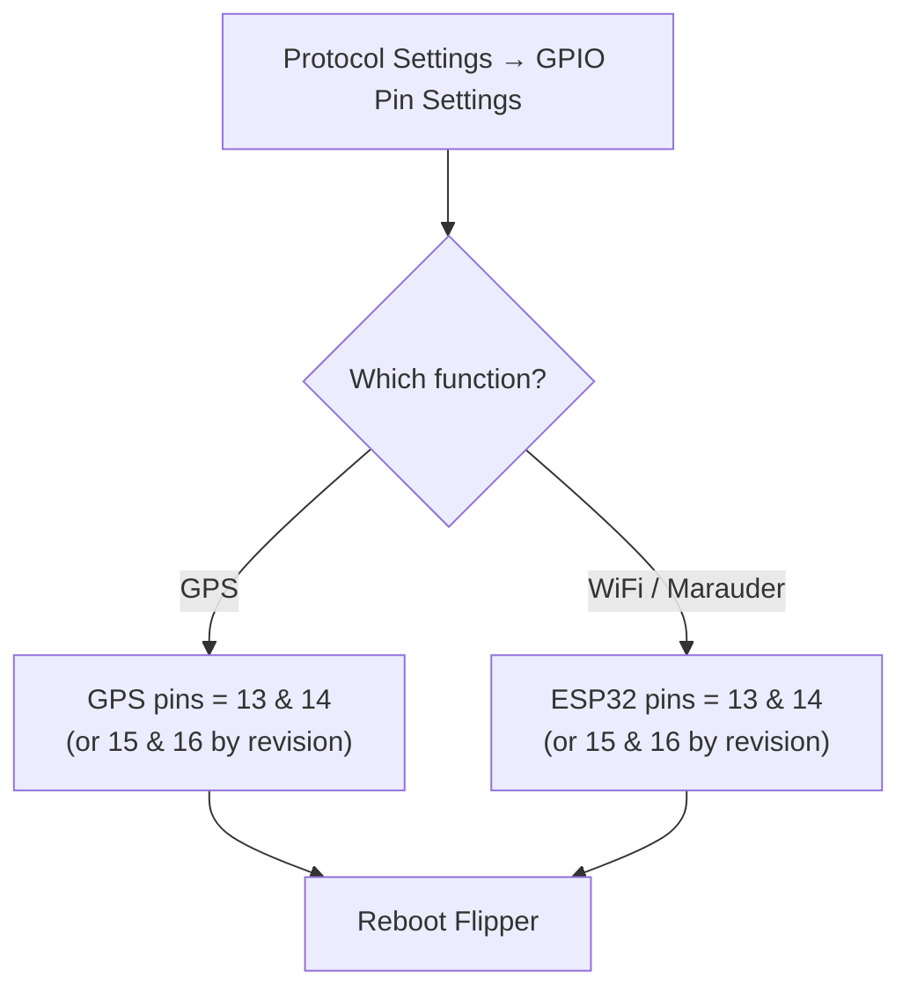

# Flipper Zero 5G Expansion Board — Complete Guide

> **One-liner**: the 5G Expansion Board bolts a dual-band **2.4 GHz + 5 GHz WiFi** tool onto your Flipper Zero — an ESP32-C5 running Marauder firmware, plus a GPS receiver and an on-board battery, in one compact module.

## Specs at a glance

| Item | Specification |
|---|---|
| WiFi module | ESP32-C5 (2.4 GHz + 5 GHz), pre-flashed with Marauder 5G firmware |
| GPS | On-board GPS module with automatic power switching (Flipper power when attached, battery power when detached) |
| Battery | 800 mAh, charging indicator on the board |
| Protection | TVS diodes on every signal pin |
| Antennas | WiFi 3 dBi dual-band (11 cm), GPS 20 dBi, SMA internal-pin connectors |
| Flashing | USB-C port (front-left); hold the button on the back-right, then insert USB to enter flash mode |
| Control | Flipper Zero apps: WiFi Marauder, GPS |

## What this board is for

The ESP32-C5 is the WiFi workhorse: with **Marauder firmware** it can scan access points and clients, sniff beacons and probe requests, run deauth and PMKID capture tests, and log WiFi activity — now including **5 GHz** networks, which older ESP32 boards cannot see. The GPS module turns your wardriving sessions into mapped data, and the small battery lets the WiFi side run without draining the Flipper.

> **Use it on your own networks and equipment.** Deauth attacks and probe sniffing are disruptive to others and regulated in most countries — this is a lab/teaching tool.



## Before you start

- The Flipper needs a **custom firmware** that includes the Marauder and GPS apps — **Momentum**, **Unleashed** or **Xtreme**. (See the [Flipper Zero section](/flipper-zero/) for firmware basics.)
- Install the modules on the Flipper as described in the vendor quick-start (some versions include a 433 MHz sub-GHz module and/or a 2.8″ Marauder screen — read your board's note).

## Setup: GPIO pins (Momentum firmware)

On **Momentum**:

1. Open `Protocol Settings → GPIO Pin Settings`.
2. Set the **GPS pins** to `13` and `14` (UART pins; some board revisions use 15/16 — check your vendor quick-start).
3. Set the **ESP32 / ESP8266 pins** to `13` and `14` (or 15/16 per the board revision) — this is the UART that talks to the ESP32-C5.
4. Exit settings and reboot the Flipper.



## Using the board

### WiFi Marauder

1. With the board attached, open `Apps → GPIO → [ESP32] WiFi Marauder`.
2. Run **Scan AP**: nearby access points appear with SSID, channel, RSSI and encryption.
3. Run **Scan PSD** (packet sniff) to watch beacon/probe traffic.
4. **Channel hopping** and **wardriving** (with GPS) produce logs you can export.

Expected first screen after `scanap`:

```
SSID              CH  RSSI  ENC  AUTH
yupitek-lab       6   -55   WPA2 PSK
Campus_Guest      11  -72   OPEN
...
```

### GPS

1. Attach the GPS antenna, point it at the sky (near a window is fine; outdoors is better).
2. Open `Apps → GPIO → GPS`. Wait — first fix can take a few minutes.
3. When satellites are acquired, position data flows. Combined with Marauder, you get location-tagged WiFi logs.

## Updating the ESP32-C5 firmware

1. Enter flash mode: press and hold the button on the back-right, then plug in the USB-C cable.
2. Flash Marauder 5G via your preferred tool (vendor instructions / ESP flasher / FZEasyMarauderFlash-style tool for ESP32).
3. Unplug, reboot the Flipper, reopen the Marauder app.

## Troubleshooting

| Problem | Cause | Fix |
|---|---|---|
| App says "no module" | GPIO pins not set | Re-check `GPIO Pin Settings`; reboot Flipper |
| GPS never gets a fix | Antenna not attached / indoors | Attach the GPS antenna, go near a window/outdoors, wait 3–5 min |
| Marauder scans nothing | Wrong pin set for ESP UART | Set ESP32 pins per board revision; reboot |
| Board charges but Flipper sees nothing | Flipper firmware lacks the app | Install Momentum/Unleashed/Xtreme |
| 5 GHz networks invisible | ESP32 (not C5) firmware | Confirm the board runs ESP32-C5 firmware (5 GHz-capable) |

More help: the [SDRLAB troubleshooting hub](/sdrlab/troubleshooting/).

## Related

- [WiFi multiboard (ESP8266)](/sdrlab/expansion/wifi-multiboard/) — the 2.4 GHz-only little brother.
- [NRF24 module](/sdrlab/expansion/nrf24/) — 2.4 GHz packet radio sniffing.
- [Flipper Zero section](/flipper-zero/) — base firmware and device basics.
