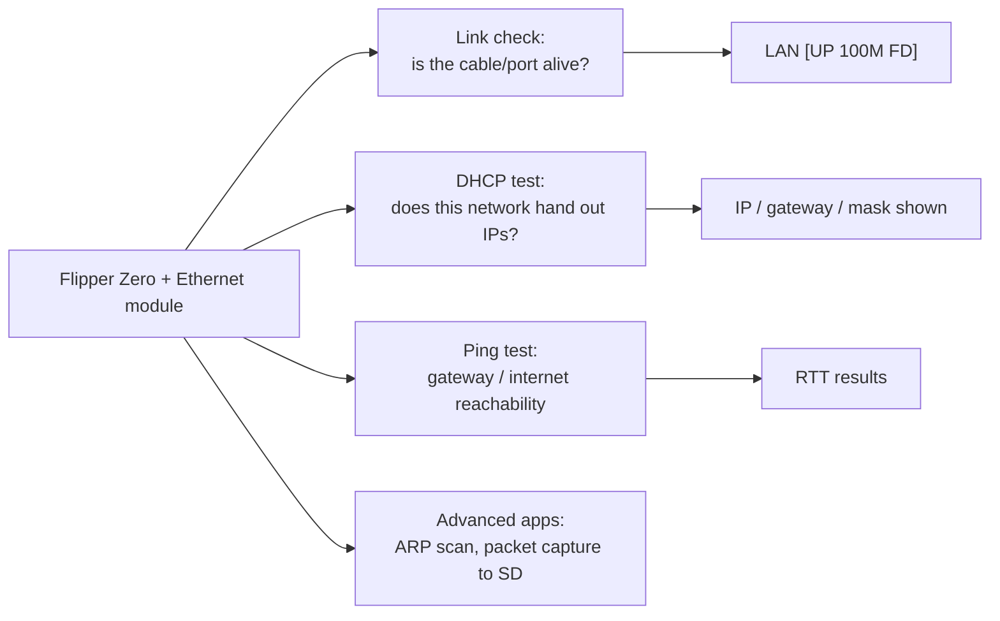

# Flipper Zero Ethernet Test Module — Complete Guide

> **One-liner**: the Ethernet test module plugs a **10/100 Ethernet port onto your Flipper Zero** — a WIZnet W5500 with a built-in TCP/IP stack — turning the Flipper into a pocket LAN tester for cable checks, DHCP validation and ping tests.

## Specs at a glance

| Item | Specification |
|---|---|
| Controller | WIZnet W5500 (hardwired TCP/IP stack) |
| Ethernet | 10/100 Mbps with embedded MAC + PHY, auto-negotiation (full/half duplex) |
| Protocols | TCP, UDP, ICMP, IPv4, ARP, IGMP, PPPoE; Wake-on-LAN over UDP |
| Sockets | 8 independent |
| Buffer | 32 KB internal TX/RX memory |
| Interface | SPI (up to 80 MHz) |
| Voltage | 3.3 V operation, 5 V-tolerant I/O |
| Connector | RJ45 with link/activity LEDs |
| Power | From the Flipper GPIO (3.3 V / OTG) |

## What you can do with it



For a university networking lab this is gold: verify a wall jack before you complain to IT, prove a cable is bad in seconds, and demonstrate DHCP behavior on a real network — all from your pocket.

## Wiring to the Flipper {#wiring-to-the-flipper}

Typical W5500 module (W5500 Lite) wiring:

| W5500 module | Flipper GPIO (pin) |
|---|---|
| MOSI (MO) | A7 (pin 2) |
| SCLK (SCK) | B3 (pin 5) |
| CS (nSS) | A4 (pin 4) |
| MISO (MI) | A6 (pin 3) |
| RESET (RST) | C3 (pin 7) |
| 3V3 (VCC) | 3V3 (pin 9) |
| GND (G) | GND (pin 8 or 11) |

> Ready-made "W5500 Ethernet module for Flipper Zero" boards (RJ45 + breakouts) are available; they still expose the same SPI signals — double-check the silkscreen against the table above.

## Setup

### 1. Install the app

The Ethernet apps run on **stock and custom firmware alike**. Install via:

- **Web catalog** (browser + WebUSB): open the Flipper app catalog in a Chromium browser, connect the Flipper, click install. Search for "W5500" or "Ethernet".
- **Mobile app**: Flipper mobile app → app catalog → GPIO → W5500 Ethernet.

### 2. Connect everything

1. Wire the module to the Flipper GPIO per the table above.
2. Plug an Ethernet cable into the module's RJ45.
3. Plug the other end into a switch/router/PC port.

### 3. First test

1. Launch the **Ethernet** app (`Apps → GPIO`).
2. Check the header: `LAN [UP 100M FD]` means the link is established.
3. Press **DHCP** — the app requests an address and displays:

```
IP:      192.168.1.162
MASK:    255.255.255.0
GW:      192.168.1.1
```

4. Press **Ping** and target the gateway (or `8.8.8.8`): replies with latency confirm end-to-end connectivity.

## Troubleshooting

| Problem | Cause | Fix |
|---|---|---|
| No link light | Bad cable / port / wiring | Try another cable and port; re-check SPI wiring (CS + RESET especially) |
| `LAN [DOWN]` | Module not initialized | Confirm 3V3 and GND; re-run the app; reboot Flipper |
| DHCP times out | Network has no DHCP / cable fault | Check the link first; try a static IP; test cable elsewhere |
| App missing | Not installed | Install via web or mobile app catalog |
| Only 10 Mbps | Auto-negotiation quirk on some switches | Try a different switch port; the module is 10/100 by design |

More help: the [SDRLAB troubleshooting hub](/sdrlab/troubleshooting/).

## Related

- [WiFi multiboard](/sdrlab/expansion/wifi-multiboard/) — wireless networking tools.
- [NRF24 module](/sdrlab/expansion/nrf24/) — 2.4 GHz packet radio.
- [Flipper Zero section](/flipper-zero/) — base device and firmware.
