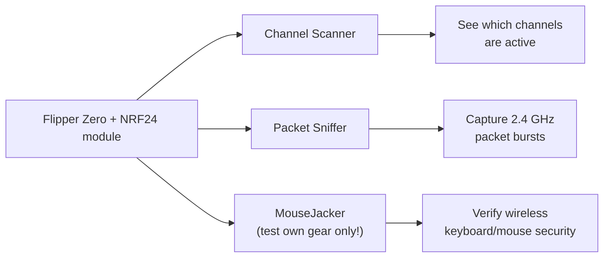

# Flipper Zero NRF24 Module — Complete Guide

> **One-liner**: the NRF24 module adds a **2.4 GHz packet radio** to your Flipper Zero — built around the ubiquitous Nordic nRF24L01+ chip — letting you scan the 2.4 GHz band, sniff wireless keyboard/mouse traffic, and test the security of your own devices.

## Specs at a glance

| Item | Specification |
|---|---|
| Radio chip | Nordic nRF24L01+ (2.4 GHz ISM band) |
| Frequency range | 2.400 – 2.525 GHz (126 channels, 1 MHz spacing) |
| Modulation | GFSK |
| Data rates | 250 kbps, 1 Mbps, 2 Mbps |
| Interface | SPI (controlled entirely by Flipper apps) |
| Antenna | External SMA (PA/LNA-equipped modules offer much better range) |
| Power | From the Flipper GPIO (3.3 V) |
| Extra radios | Some boards combine NRF24 with CC1101 (sub-GHz) on one module |

## What you can do with it

- **Channel scanner**: which of the 126 channels are busy — useful for finding where a device is hopping.
- **Sniffer**: watch packet bursts from 2.4 GHz devices in your lab (wireless mice, keyboards, drones, game controllers).
- **MouseJack testing**: the well-known nRF24 "MouseJack" technique targets *unencrypted* wireless keyboards/mice. Use it strictly on equipment you own, to demonstrate why unencrypted input devices are risky.

> **Legal and ethical note**: sniffing and injecting packets on devices you don't own is illegal in most jurisdictions. This module is a security-education tool — test your own gear, or gear you have written permission to test.

## Setup

### 1. Firmware and apps

The NRF24 apps are **not** in the stock Flipper firmware. Install a custom firmware that bundles them — **Momentum**, **Unleashed** or **Xtreme** (see the [Flipper Zero section](/flipper-zero/)).

### 2. GPIO pins (if required)

Most ready-made NRF24 modules are pre-wired and need no pin changes — just plug in. If your board has configurable pins, set the **NRF24 SPI pins** under `Protocol Settings → GPIO Pin Settings` (SPI default is usually fine). On multi-radio boards, make sure the NRF24 radio is the selected/enabled one (dip switch or button where present).

### 3. First test — channel scan

1. Attach the antenna.
2. Open `Apps → GPIO → [NRF24] Channel Scanner`.
3. Move a wireless mouse or press a wireless keyboard key repeatedly.
4. Watch channels light up — bursts appear where the device is transmitting.

Expected behavior: activity spikes on channels in use; a hopping mouse shows bursts jumping channels.

## Using the sniffer

1. Open `Apps → GPIO → [NRF24] Sniffer`.
2. Set **rate** to 2 Mbps first (most devices), then 1 Mbps / 250 kbps if you see nothing.
3. Set the address to the target (often 6-byte addresses on mice; the app shows config options).
4. Press the OK button to toggle sniffing. Addresses and packet counts start moving when a device transmits.

## Troubleshooting

| Problem | Cause | Fix |
|---|---|---|
| Scanner shows nothing | Antenna missing / device idle | Attach SMA antenna; move/jiggle the wireless device |
| Only noise / no bursts | Wrong data rate | Try 2 Mbps → 1 Mbps → 250 kbps |
| App missing | Stock firmware | Install Momentum/Unleashed/Xtreme |
| "No module" error | Pin config or dip switch | Check GPIO pin settings / module switch; reboot Flipper |
| Range is tiny | Module without PA/LNA | Accept short range, or use a PA/LNA module |

More help: the [SDRLAB troubleshooting hub](/sdrlab/troubleshooting/).

## Related

- [5G Expansion Board](/sdrlab/expansion/5g-board/) — 2.4/5 GHz WiFi + GPS board.
- [WiFi multiboard](/sdrlab/expansion/wifi-multiboard/) — ESP8266 WiFi tooling.
- [Flipper Zero section](/flipper-zero/) — firmware and device basics.
