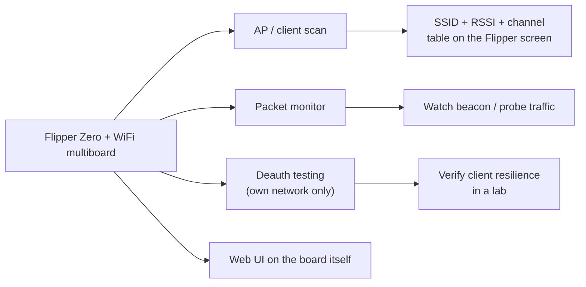

# Flipper Zero WiFi Multiboard (ESP8266) — Complete Guide

> **One-liner**: the WiFi multiboard is an **ESP8266-powered WiFi tool for the Flipper Zero** — typically pre-flashed with the ESP8266 Deauther firmware — giving you AP scanning, packet monitoring and (on your own networks) deauth testing, plus a standalone web UI you control from any browser.

## Specs at a glance

| Item | Specification |
|---|---|
| WiFi chip | Espressif ESP8266 (2.4 GHz, 802.11 b/g/n) |
| Firmware (typical) | ESP8266 Deauther v2 (Spacehuhn) or ESP8266 Marauder port |
| Frequency band | 2.4 GHz only (no 5 GHz) |
| Interface | UART serial to Flipper GPIO (TX/RX) |
| Power | From the Flipper GPIO (3.3 V) |
| Extras (board-dependent) | Socket for a second radio module (NRF24 / CC1101), dip switch for radio selection |
| Web UI | AP mode at `192.168.4.1` (default SSID `pwned`, password `deauther`) |

## What you can do with it



The ESP8266 Deauther is the classic pocket tool: scan for networks, pick a target, and run attack modes (deauth, beacon spam) — with the Flipper as the control surface. Because the ESP8266 also exposes its own **access point**, you can drive everything from a phone browser at `http://192.168.4.1` — the Flipper screen is optional.

> **Use it on networks you own or have explicit permission to test.** Deauth attacks actively disrupt other people's connections; using them on networks you don't control is illegal in most places. The whole point of this tool in a university lab is to learn *why* unsecured WiFi fails and how to defend it.

## Setup

### 1. Firmware on the Flipper

Install a custom firmware (**Momentum**, **Unleashed**, **Xtreme**) so the WiFi deauther/Marauder apps are available — see the [Flipper Zero section](/flipper-zero/).

### 2. Flash the ESP8266 (first time only)

Most boards ship pre-flashed with Deauther. To (re)flash:

1. Put the board in flash mode per your vendor's instructions (often a button while powering).
2. Connect via USB/UART (or use the Flipper's own flasher app).
3. Flash the **ESP8266 Deauther v2** binary — sources and pre-built files: [SpacehuhnTech/esp8266_deauther](https://github.com/SpacehuhnTech/esp8266_deauther).

### 3. Wire / attach to the Flipper

| ESP8266 | Flipper GPIO |
|---|---|
| TX0 | 14 or 16 (RX pin) |
| RX0 | 13 or 15 (TX pin) |
| VIN | 1 (5V) or 9 (3.3 V) |
| GND | 8 or 11 (GND) |

> On multi-radio boards, set the dip switch to the WiFi/ESP8266 position before use.

### 4. First run — scan

1. Plug the board in, open `Apps → WiFi → WiFi Deauther`.
2. Wait for the startup scan to finish (the blue LED goes off).
3. A list of nearby APs appears: SSID, channel, RSSI.

Expected app screen:

```
#  SSID            CH  RSSI
1  yupitek-lab     6   -55
2  Library_Guest   1   -78
...
```

## Using the web UI

1. On your phone/PC, join the WiFi network `pwned` (password `deauther`).
2. Browse to `http://192.168.4.1`.
3. The full Deauther interface loads: scan, select target, configure attacks, save settings.
4. Tip: when only using the Flipper for serial control, you can disable the web interface (`set webinterface false`, save, reboot) to hide the `pwned` AP.

## Troubleshooting

| Problem | Cause | Fix |
|---|---|---|
| Web UI unreachable | Client joined another network | Disable auto-join/mobile data; join `pwned`; browse `192.168.4.1` |
| App freezes at startup | Interrupted startup scan | Wait for the blue LED to go off before touching controls |
| No networks listed | Wrong dip switch / pins | Set switch to WiFi; re-check TX/RX wiring |
| Board not detected | UART pins wrong | Use pins 13/15 (TX) and 14/16 (RX) |
| Weak or no signal | 2.4 GHz antenna orientation | Attach/aim the SMA antenna |

More help: the [SDRLAB troubleshooting hub](/sdrlab/troubleshooting/).

## Related

- [5G Expansion Board](/sdrlab/expansion/5g-board/) — 2.4/5 GHz Marauder with GPS.
- [NRF24 module](/sdrlab/expansion/nrf24/) — 2.4 GHz packet radio sniffing.
- [Flipper Zero section](/flipper-zero/) — firmware basics.
