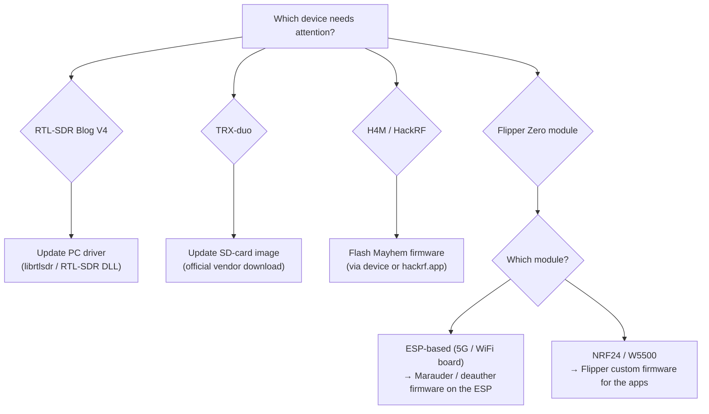
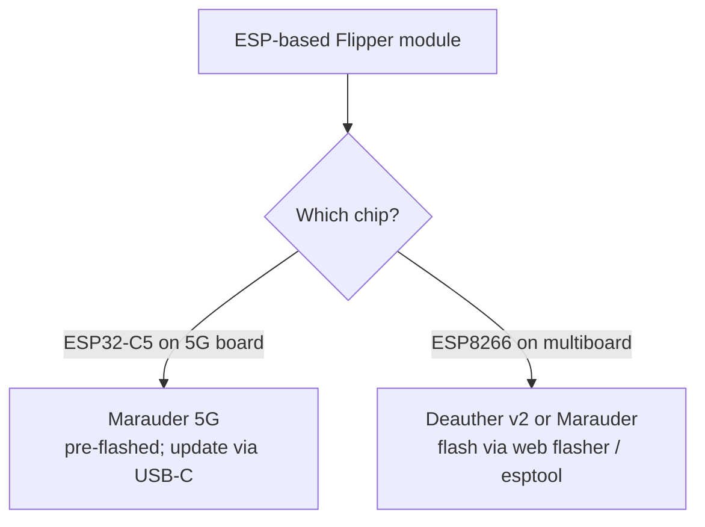

# Firmware & Drivers — Keeping SDRLAB Hardware Current

> **Learning goal**: you will understand which "brain" each SDRLAB device runs, and be able to update it safely — or at least know exactly where the official update lives.
> **Audience**: beginner to intermediate ｜ **Prerequisites**: a device from the [SDRLAB section](/sdrlab/) and its [quickstart](/sdrlab/quickstart/) done.

## Concept: firmware vs drivers

Two words that get mixed up constantly — let's fix that:

- **Firmware** is software *embedded in the hardware*: the TRX-duo's SD-card OS, the H4M's PortaPack operating system, the ESP chip on a Flipper module. Updating it changes what the device itself can do.
- **Drivers** are software *on your computer* that let the OS talk to the hardware: `librtlsdr` on Linux, the RTL-SDR DLL on Windows.



## RTL-SDR Blog V4: update the driver, not the dongle

The V4 has **no user-updatable firmware** — what matters is the driver on your computer. Older drivers (especially distro-packaged ones) predate the V4's R828D tuner and will fail with confusing errors. The V4 page has the full [Linux driver install](/sdrlab/hardware/rtl-sdr-v4/#linux-install) — the short version:

```bash
sudo apt purge ^librtlsdr
sudo apt install libusb-1.0-0-dev git cmake pkg-config build-essential
git clone https://github.com/osmocom/rtl-sdr
cd rtl-sdr && mkdir build && cd build
cmake ../ -DINSTALL_UDEV_RULES=ON
make && sudo make install
sudo cp ../rtl-sdr.rules /etc/udev/rules.d/
echo 'blacklist dvb_usb_rtl28xxu' | sudo tee /etc/modprobe.d/blacklist-dvb_usb_rtl28xxu.conf
sudo ldconfig
```

Then **reboot** and verify with `rtl_test`. On Windows, SDR#, SDR++ and SDR Console ship current V4-compatible drivers — just keep those apps updated.

## TRX-duo: the SD image is the firmware

The TRX-duo is an embedded Linux computer (Xilinx Zynq 7010 + ARM Cortex-A9) that **boots from a microSD card**. The card contains the OS, the FPGA bitstream and the Red Pitaya-compatible applications — updating the "firmware" literally means writing a newer official SD image.

> ⚠️ **Important**: the SD image is downloaded from the **official vendor pages** — do **not** use random third-party links. See the [TRX-duo page → Firmware and SD image](/sdrlab/hardware/trx-duo/#firmware-and-sd-image) for the official download locations (vendor site and the vendor's product page with the firmware/quick-start manual).

Typical SD-card flow (see the product page for the exact official instructions):

1. Download the official image from the vendor.
2. Write it to a microSD card (≥ 4 GB) with `dd` or balenaEtcher.
3. Insert the card, connect Ethernet + USB-C power, and boot.
4. The device appears at its network address (by default it requests an IP via DHCP; the Red Pitaya-compatible default is `http://192.168.1.100` when no DHCP is present).

## H4M: Mayhem firmware

The H4M runs the open-source **Mayhem firmware** (the community fork that turns the PortaPack into a full toolkit). The [H4M page](/sdrlab/hardware/h4m/#mayhem-firmware) covers installation; the official sources are:

- [Mayhem firmware releases](https://github.com/portapack-mayhem/mayhem-firmware/releases) — download `FIRMWARE_mayhem_*.zip` and the matching `COPY_TO_SDCARD` files.
- [hackrf.app](https://hackrf.app/) — browser-based update over USB (WebUSB).

Flash methods, in order of convenience:

1. **In-device Flash Utility** — copy the firmware `.bin` to microSD, open `Utilities → Flash Utility`, select it. Easiest.
2. **hackrf.app** — connect USB-C, let the website flash the device. No local tools.
3. **hackrf_spiflash** (classic) — with the device in HackRF mode:

```bash
sudo apt install hackrf
hackrf_spiflash -w portapack-h1_h2-mayhem.bin
```

> Keep the **microSD content in sync** with the firmware version: every release ships a `COPY_TO_SDCARD` archive — extract it to a FAT32 microSD card. Out-of-sync SD cards are the #1 cause of "apps missing" reports.

## Flipper Zero expansion modules: two firmware layers

Flipper modules have *two* brains to keep in mind:

### 1. The Flipper Zero itself (custom firmware for the apps)

The NRF24 sniffer, mousejacker and extended WiFi apps are **not** in the official Flipper firmware. Install a custom build — **Momentum**, **Unleashed** or **Xtreme** — which bundles these apps. Updating the Flipper is done via `qFlipper` (desktop) or the mobile app; see the [Flipper Zero section](/flipper-zero/) for the base flow.

### 2. The module's own chip (ESP firmware)

- **5G board / ESP32-C5** → Marauder firmware (2.4/5 GHz). Flashed over the board's USB-C port; the vendor ships it pre-flashed.
- **WiFi multiboard / ESP8266** → ESP8266 Deauther or Marauder firmware. Flashed via the board's USB/UART or a web flasher.
- **NRF24 / W5500 modules** → no module firmware; they are plain SPI peripherals controlled entirely by Flipper apps.



## Update safety checklist

- [ ] Back up SD cards before rewriting (TRX-duo, H4M).
- [ ] Download firmware only from **official vendor / project pages** (links above and on each product page).
- [ ] Match firmware version with SD-card content (H4M).
- [ ] Reboot / re-plug after driver changes (RTL-SDR V4).
- [ ] Verify with the device-specific test (`rtl_test`, `hackrf_info`, web UI, module app).

## Related

- [SDR software guide](/sdrlab/sdr-software/) — what to run on the PC side.
- [Troubleshooting](/sdrlab/troubleshooting/) — firmware-update horror stories, solved.
- Product pages: [RTL-SDR V4](/sdrlab/hardware/rtl-sdr-v4/), [TRX-duo](/sdrlab/hardware/trx-duo/), [H4M](/sdrlab/hardware/h4m/).
