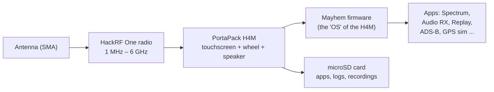
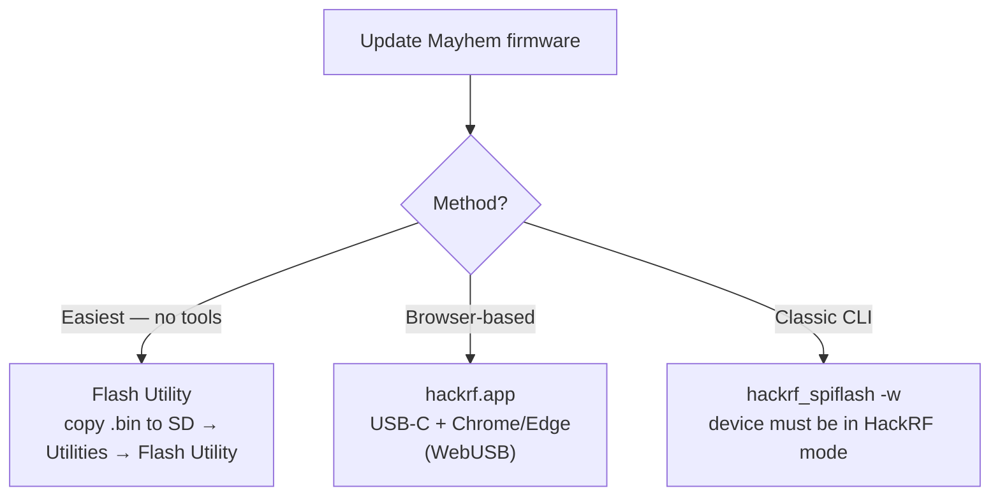

# SDRLab H4M (HackRF PortaPack) — Complete Guide

> **One-liner**: the H4M is the current-generation PortaPack for the HackRF One — a 3.2″ touchscreen case that turns a 1 MHz–6 GHz SDR transceiver into a **standalone handheld radio lab** that runs on battery, with no computer attached. The Mayhem firmware turns it into an audio receiver, spectrum analyzer, signal recorder and much more.

## What's in the box

| Item | Typical content |
|---|---|
| PortaPack H4M | Extension case with 3.2″ matte touchscreen, rotary wheel, speaker, microphone |
| HackRF One (or R10C) | The SDR board the H4M mounts on |
| Antennas | Wideband telescopic (40–6000 MHz) + band-specific (5dBi, 12dBi, 8dBi, 35dBi variants) |
| Cables | USB-C cable, SMA male-to-male |
| Extras (kit-dependent) | 20 dB power amplifier, batteries, cases |

## Specs at a glance

### HackRF One (the radio core)

| Item | Specification |
|---|---|
| Frequency range | 1 MHz – 6 GHz |
| Operation mode | Half-duplex transceiver |
| Sample rates | 2 – 20 Msps (quadrature) |
| Resolution | 8-bit I / 8-bit Q |
| Interface | High-Speed USB (USB-C on H4M bundle) |
| Antenna port | SMA female, 50 Ω |
| Antenna port power | Software-controlled, max 50 mA @ 3.0–3.3 V |
| Max RX input | -5 dBm (exceeding it can permanently damage the device!) |
| Max TX output | +10 dBm (10 mW); typical 0 to +5 dBm |
| Clock | CLK IN / CLK OUT for synchronization |

### PortaPack H4M (the shell)

| Item | Specification |
|---|---|
| Display | 3.2″ 240×320 matte LCD touchscreen |
| Controls | Arrow keys, 360° rotary wheel (flat design), select buttons, power button |
| Audio | Built-in speaker, built-in microphone (toggle switch), 3.5 mm headphone/mic jack |
| Storage | microSD card slot (required for apps, logs, recordings) |
| Battery | 2500 mAh rechargeable with management IC + status display |
| Charging | USB-C, with a proper on/off switch |
| Expansion | GPIO port (I2C-capable) for add-ons like GPS receivers |
| Case | Transparent ABS injection-molded shell |

### What's new on the H4M vs the older H2

USB-C instead of Micro-USB, a real on/off switch, built-in speaker + microphone with auto-switching, I2C-capable GPIO port, battery info shown in firmware, and a flatter design.

## Concept: how the H4M works



The HackRF digitizes the spectrum; the PortaPack provides the human interface; Mayhem firmware provides the apps. No PC involved — the H4M is the whole lab.

## Mayhem firmware {#mayhem-firmware}

The H4M runs the open-source **Mayhem firmware** ([portapack-mayhem/mayhem-firmware](https://github.com/portapack-mayhem/mayhem-firmware)), the community continuation of the PortaPack software with hundreds of apps: spectrum analyzer, audio receiver/transmitter, signal recorder and replay, ADS-B, APRS, GPS simulator, and more.

### Step 1 — Prepare the microSD card

1. Format a microSD card (16 GB is comfortable) as **FAT32**.
2. From the [Mayhem releases page](https://github.com/portapack-mayhem/mayhem-firmware/releases), download the `COPY_TO_SDCARD` archive matching the release you'll flash.
3. Extract it to the card root. This is what puts the apps, maps and assets on the card.

### Step 2 — Update the firmware (three ways)



**Option A — Flash Utility (recommended):**
1. Copy the `FIRMWARE_mayhem_*.bin` from the release archive to the microSD card root.
2. Insert the card, power on the H4M.
3. `Utilities → Flash Utility` → select the file → confirm. The device reboots.

**Option B — hackrf.app:** connect USB-C (data cable), open [https://hackrf.app/](https://hackrf.app/) in a WebUSB-capable browser, click *Connect Device*, choose your PortaPack, and let it flash.

**Option C — classic CLI (Linux/macOS):**

```bash
sudo apt install hackrf          # Debian/Ubuntu/Kali; brew install hackrf on macOS
hackrf_info                      # confirm the board is seen
hackrf_spiflash -w portapack-h1_h2-mayhem.bin
```

Expected `hackrf_info` output:

```
Found HackRF board.
Board ID Number: 2 (HackRF One)
Firmware Version: git-... (API:1.02)
```

> ⚠️ In HackRF mode the H4M is a plain HackRF — the PortaPack UI is bypassed. Keep the `COPY_TO_SDCARD` content in sync with the firmware version.

## Quickstart — hear the world

1. Charge the battery (USB-C) until the indicator shows full.
2. Insert the prepared microSD card.
3. Attach a suitable antenna to the SMA port.
4. Slide the power switch on. The Mayhem menu appears.
5. Open **Audio RX** (or **FM Broadcast RX**), tune to a local FM station (88–108 MHz). Adjust the gain; audio comes from the built-in speaker.

### Command-line spectrum check (as plain HackRF)

```bash
hackrf_transfer -s 8M -f 100M -g 20 -r /dev/null
```

If the device streams without errors, the radio core is healthy.

## Example project — spectrum around you

1. **Spectrum Analyzer** app → sweep 88–108 MHz: you should see the FM broadcast band as several bright peaks.
2. Tune the center on the waterfall and note the station callsigns with **Audio RX** → FM.
3. Try 1090 MHz (ADS-B): install the ADS-B app and watch aircraft positions stream in.

## Compatibility

| Platform | Support | Notes |
|---|---|---|
| Standalone (PortaPack) | ✅ | The whole point — no PC needed |
| Linux / macOS (as HackRF) | ✅ | `hackrf` tools, GQRX, SDR# with ExtIO |
| Windows (as HackRF) | ✅ | SDR# / SDR++ with HackRF source |
| SDR software for the PortaPack | ✅ | Mayhem ecosystem apps |

## Responsible-use note

The H4M is a **transceiver**: with the right antenna it can transmit on amateur bands and beyond. Radio laws vary by country — transmitting without a license, or on frequencies you're not authorized for, can be illegal and can interfere with critical services (aviation, emergency). Great for *listening* and lab experiments; think carefully before pressing TX.

## Troubleshooting

| Problem | Cause | Fix |
|---|---|---|
| Won't power on | Flat battery / stuck mode | Charge 10+ min; hold power button; try USB-C to PC |
| Apps missing | microSD missing or stale | Extract the matching `COPY_TO_SDCARD` to a FAT32 card |
| No audio | Wrong output / gain | Unplug headphones to re-route to speaker; raise gain; check mode (WFM for FM) |
| PC doesn't see a HackRF | Not in HackRF mode | Switch to HackRF mode in the UI before USB tools |
| Noise floor everywhere | No antenna / overload | Attach antenna; lower gain; max RX input is -5 dBm |

More help: the [SDRLAB troubleshooting hub](/sdrlab/troubleshooting/).

## Related

- [SDR software](/sdrlab/sdr-software/) — HackRF tools, GQRX and SatDump.
- [Firmware & drivers](/sdrlab/firmware/) — Mayhem update flow in depth.
- [SDRLAB Quickstart](/sdrlab/quickstart/) — first-30-minutes checklist.
