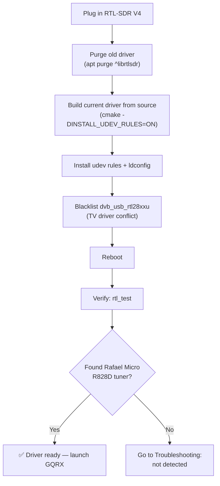

# RTL-SDR Blog V4 — Complete Guide

> **One-liner**: the RTL-SDR Blog V4 is the definitive USB SDR receiver dongle — a refined take on the legendary RTL2832U design, covering **500 kHz to 1.766 GHz**, with a built-in HF upconverter and an aluminum case. It is the perfect first SDR for students: cheap, indestructible, and with a gigantic community behind it.

## Specs at a glance

| Item | Specification |
|---|---|
| Demodulator / ADC | RTL2832U (8-bit) |
| Tuner chip | Rafael Micro R828D (three inputs, 28.8 MHz HF LO) |
| Frequency range | 500 kHz – 1.766 GHz |
| Bandwidth | 2.56 MHz stable (up to 3.2 MHz with drops) |
| HF implementation | Built-in upconverter with 28.8 MHz local oscillator (no more direct-sampling aliasing) |
| Input filtering | Triplexer: HF (0–28.8 MHz) / VHF (28.8–250 MHz) / UHF (250 MHz–1.766 GHz) + switchable notch filters |
| Input connector | 1× SMA (50 Ω) |
| USB connector | USB-A male, USB bus powered |
| Current draw | 250–270 mA typical |
| Reference clock | 1 PPM TCXO |
| Bias tee | 4.5 V, 180 mA (software switchable) |
| Enclosure | Aluminum with thermal pad |
| Transmit | None (receive only) |

## What makes the V4 different from older dongles

Think of the V4 as the "SDR-optimized" revision. Older RTL-SDRs were DVB-T TV sticks adapted for radio hacking; the V4 was redesigned from the ground up for SDR users:

1. **No more HF aliasing mess.** Old dongles used direct sampling below ~24 MHz, which folded the spectrum around 14.4 MHz and made HF reception frustrating. The V4 contains a real **upconverter** (28.8 MHz LO) that shifts HF signals up where the tuner handles them properly. The driver does the frequency math automatically — you just tune normally.
2. **A triplexer with three switchable inputs.** The R828D tuner has three RF inputs; the V4 splits them by band (HF / VHF / UHF) so a strong broadcast FM station can't swamp your HF or UHF reception.
3. **Switchable notch filters** for known problem bands (AM/FM broadcast, VHF pager/digital bands) — again handled automatically by current drivers.

## Linux install {#linux-install}

The V4 needs a **current** driver: stock distro packages sometimes predate the R828D support. These steps install the current open-source Osmocom driver with udev rules (no root needed to run SDR apps afterwards).



### Step 1 — Remove old drivers

```bash
sudo apt purge ^librtlsdr
sudo rm -rvf /usr/lib/librtlsdr* /usr/include/rtl-sdr* /usr/local/lib/librtlsdr* /usr/local/include/rtl-sdr* /usr/local/include/rtl_* /usr/local/bin/rtl_*
```

Expected: a list of removed files, ending with a shell prompt (errors about missing files are fine).

### Step 2 — Build and install the current driver

```bash
sudo apt-get install libusb-1.0-0-dev git cmake pkg-config build-essential
git clone https://github.com/osmocom/rtl-sdr
cd rtl-sdr
mkdir build && cd build
cmake ../ -DINSTALL_UDEV_RULES=ON
make
sudo make install
sudo cp ../rtl-sdr.rules /etc/udev/rules.d/
sudo ldconfig
```

Expected output ends with:

```
[ 50%] Built target rtl_sdr ...
[100%] Built target rtl_fm ...
-- Install configuration: "Release"
```

### Step 3 — Blacklist the TV driver and reboot

```bash
echo 'blacklist dvb_usb_rtl28xxu' | sudo tee --append /etc/modprobe.d/blacklist-dvb_usb_rtl28xxu.conf
sudo reboot
```

### Step 4 — Verify

```bash
rtl_test
```

Expected output:

```
Found 1 device(s):
  0:  Realtek, RTL2838UHIDIR, SN: 00000001

Using device 0: Generic RTL2832U OEM
Detached kernel driver
Found Rafael Micro R828D tuner
Supported gain values (29): 0.0 0.9 1.4 2.7 ...
[R82XX] PLL not locked!
Sampling at 2048000 S/s.
```

The `Found Rafael Micro R828D tuner` line is your "V4 recognized" badge.

> **Windows**: install [SDR#](https://airspy.com/download/) (or SDR++ / SDR Console) — these ship V4-ready drivers; just launch and select the RTL-SDR source.

## Quickstart — hear FM in three clicks

1. Launch GQRX (see the [SDR software guide](/sdrlab/sdr-software/#linux-install-gqrx-recommended-starting-point)).
2. Click **▶**. The waterfall should start.
3. Tune to a local FM station (88–108 MHz), select **WFM**, unmute. Done — that's your first SDR signal.

### Command-line sanity test (audio)

```bash
sudo apt install sox
rtl_fm -f 97.3M -M wbfm -s 200k | play -t raw -r 200k -e signed -b 16 -c 1 -V1 -
```

Swap `97.3M` for your local station. Hearing music = the whole chain works.

## Using the bias tee (powering active antennas)

The V4 can feed 4.5 V / 180 mA up the antenna coax for LNAs, active antennas and GPS/ADS-B amplifiers:

- **SDR# / SDR++**: enable **"Offset tuning"** in the device config — on the V4 this option is repurposed as the bias-tee switch.
- **GQRX**: device icon → enable **Bias-T**.
- **CLI**: `rtl_biast -b 1` (from the rtl-sdr-blog tools) or `rtl_tcp -b` with your preferred client.

## Software compatibility

| Software | Platform | V4 support |
|---|---|---|
| GQRX | Linux / macOS / Windows | ✅ |
| SDR# | Windows | ✅ (ships V4 driver) |
| SDR++ | Windows / Linux / macOS | ✅ |
| SDR Console V3 | Windows | ✅ |
| SDRuno / CubicSDR | Windows / cross | ✅ / ✅ |
| `rtl_*` CLI tools | All | ✅ (with current build) |

## Troubleshooting

| Problem | Cause | Fix |
|---|---|---|
| `No devices found` in `rtl_test` | Kernel DVB driver owns the dongle | Blacklist `dvb_usb_rtl28xxu` (Step 3 above), reboot |
| HF sounds aliased / wrong frequencies | Outdated driver (pre-R828D) | Rebuild driver from Step 2, verify `Found Rafael Micro R828D tuner` |
| Ghost stations everywhere | Overload / gain too high | Lower gain to ~20–30 dB; use a band antenna |
| Bias tee doesn't power the LNA | Tee not enabled | Enable "Offset tuning" / Bias-T in the app |
| Falls off USB randomly | Marginal port power | Use a direct port or a powered hub |

More help: the [SDRLAB troubleshooting hub](/sdrlab/troubleshooting/).

## Related

- [SDR software guide](/sdrlab/sdr-software/) — GQRX/SDR#/CLI tools in depth.
- [SDRLAB Quickstart](/sdrlab/quickstart/) — the universal first-30-minutes flow.
- [ALFA Linux guide](/sdrlab/shared/alfa-linux-guide/) — Wi-Fi companion adapters.
