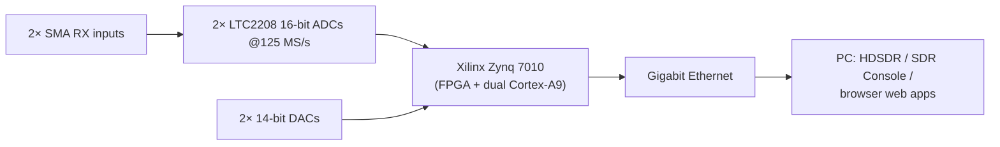
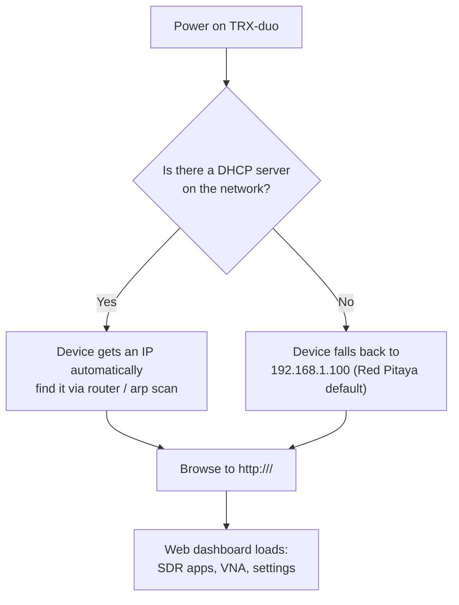

# SDRLab TRX-duo — Complete Guide

> **One-liner**: the TRX-duo is a serious dual-channel, dual-transmit SDR transceiver built around a Xilinx Zynq 7010 SoC, with two 16-bit ADCs and two 14-bit DACs covering **10 kHz to 60 MHz** — all the HF ham bands plus 6 m. Because it is **Red Pitaya compatible**, it inherits a whole ecosystem of open-source SDR, VNA and lab software.

## Specs at a glance

| Item | Specification |
|---|---|
| Radio type | Dual-channel transceiver (2× RX, 2× TX), direct sampling |
| Frequency range | 10 kHz – 60 MHz (HF to 6 m) |
| ADC | 2× Linear Technology LTC2208, **16-bit**, 125 MS/s |
| DAC | 2× Analog Devices AD9767, **14-bit**, 125 MS/s |
| Real-time bandwidth | 61.44 MHz |
| FPGA / SoC | Xilinx Zynq 7010 (dual-core ARM Cortex-A9) |
| RAM | 512 MB DDR3 |
| RF inputs | 2× SMA (50 Ω), 0.5 Vpp, transformer + AC coupled |
| RF outputs | 2 channels, 1 Vpp |
| Network | Gigabit Ethernet (1 Gbit) |
| USB | USB 2.0 Type-C (power + connectivity) |
| Extension | 16 digital I/O, 4 analog inputs (0–3.3 V, 12-bit, 100 kSps), 4 analog outputs (0–1.8 V), I2C, UART, SPI |
| Boot media | microSD card (the OS + applications live on the card) |
| Enclosure | Aluminum, 115 × 70 × 25 mm (with connectors) |
| Compatibility | Red Pitaya (STEMlab 125-14 style) software ecosystem |

## What makes the TRX-duo special

If the RTL-SDR V4 is a pocket knife, the TRX-duo is the lab instrument:

- **Two independent receivers** — run diversity reception, compare two antennas, or copy two bands at once. Great for university experiments on diversity, direction-finding and interference studies.
- **True transceiver** — two 14-bit transmit channels let you experiment with real TX (within amateur radio rules and local regulations).
- **Red Pitaya compatible** — the same applications that run on a Red Pitaya STEMlab 125-14 (SDR receivers/transceivers, VNA, oscilloscope apps from the [red-pitaya-notes](https://github.com/pavel-demin/red-pitaya-notes) project) run on the TRX-duo with the matching SD image.
- **Network-native** — it's a headless box you drive over gigabit Ethernet from any PC, phone or tablet browser. No USB tethering.



## Firmware and SD image {#firmware-and-sd-image}

> ⚠️ **The SD image is NOT hosted by us.** Download it exclusively from the **official vendor pages** below. Do not use random mirrors.

| Resource | Official link | What it is |
|---|---|---|
| Vendor site — TRX-DUO | [https://trx-duo.com/](https://trx-duo.com/) | Official product site, including firmware and starting information |
| Vendor product page (SDRLab) | [https://opensourcesdrlab.com/products/trx-duo-compatible-with-red-pitaya-sdr-dual-16bit-adc-zynq7010](https://opensourcesdrlab.com/products/trx-duo-compatible-with-red-pitaya-sdr-dual-16bit-adc-zynq7010) | Official product page with the **Firmware and Quick start manual** |
| Red Pitaya software ecosystem | [https://github.com/pavel-demin/red-pitaya-notes](https://github.com/pavel-demin/red-pitaya-notes) | The open-source application suite (SDR RX/TX, VNA) the TRX-duo is compatible with |

**How the SD card works**: the TRX-duo is an embedded Linux computer. The microSD card carries the operating system, the FPGA bitstream and the SDR applications. "Updating firmware" = writing a newer official image. Always read the vendor's firmware/quick-start instructions first — they list the exact image to use.

### Writing the image (generic flow)

1. Download the official image from the vendor page above.
2. Write it to a microSD card (≥ 4 GB; the card is erased!):

```bash
# Replace /dev/sdX with YOUR card device — double-check with lsblk!
sudo dd if=trx-duo-image.zip of=/dev/sdX bs=4M status=progress conv=fsync
```

> Zip images sometimes need to be unzipped first — follow the vendor instructions. On Windows, [balenaEtcher](https://etcher.balena.io/) handles both zip and img files safely.

3. Insert the card into the TRX-duo.
4. Connect **Gigabit Ethernet** and **USB-C power**, then switch on.

## First boot and network {#first-boot-and-network}



- With a DHCP network (typical home router): connect both your PC and the TRX-duo to the router, then look up the device's IP (router admin page, or `arp -a` / `ip neigh show` on your PC).
- On a direct cable link or isolated network: set your PC to a static address in `192.168.1.x` (e.g. `192.168.1.10/24`) and open `http://192.168.1.100`.
- Some images also respond to the hostname `trx-duo-alpine`.

### Verify

```bash
ping 192.168.1.100
curl -s http://192.168.1.100/ | head
```

A live board answers ping and serves its dashboard HTML.

## Using it with SDR software

| Software | How it connects | Typical use |
|---|---|---|
| Browser web apps (on the board) | Direct, no PC software | Spectrum, SDR RX, VNA — the fastest start |
| HDSDR | Red Pitaya network interface | Classic panadapter-style HF transceiver control |
| SDR Console V3 | Red Pitaya-compatible network source | Serious RX with digital modes, remote operation |
| Red Pitaya notes apps (on the board) | Built into the SD image | Diversity RX, transceiver experiments, FT8 skimmers |

See the [SDR software guide](/sdrlab/sdr-software/#trx-duo-software-notes) for the wider picture.

## Quickstart checklist

- [ ] Downloaded the official SD image from the vendor page
- [ ] Written it to microSD and inserted it
- [ ] Ethernet + USB-C power connected
- [ ] Device reachable (DHCP IP or `192.168.1.100`)
- [ ] Dashboard loads in the browser
- [ ] Antenna attached to RX1/RX2 (HF antenna — long wire or loop — not a WiFi antenna)
- [ ] Listened to a real HF signal (shortwave broadcasters are loud at night, 3–30 MHz)

## Troubleshooting

| Problem | Cause | Fix |
|---|---|---|
| Dashboard unreachable | DHCP missing / wrong subnet | Set PC static `192.168.1.x`, try `http://192.168.1.100` |
| No link light on RJ45 | Cable or port issue | Change cable/port; confirm the switch port supports 10/100/1000 |
| Boots but never appears | Bad SD card / wrong image | Re-write with the official image; test card on a PC |
| Noise only on RX | No HF antenna / attenuator on | Attach a proper HF antenna; raise gain, remove attenuation |
| Apps mismatch the board | Wrong image variant | Re-check the vendor quick-start for the correct image for 125 MS/s 16-bit boards |

More help: the [SDRLAB troubleshooting hub](/sdrlab/troubleshooting/).

## Related

- [Firmware & drivers](/sdrlab/firmware/) — how SD images relate to firmware updates.
- [SDR software](/sdrlab/sdr-software/) — HDSDR / SDR Console / Red Pitaya apps.
- [RTL-SDR Blog V4](/sdrlab/hardware/rtl-sdr-v4/) — the opposite end of the SDR price spectrum.
