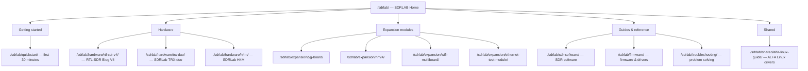

# SDRLAB

Welcome to the **SDRLAB** corner of the wiki. This section covers the software-defined radio (SDR) hardware we carry — from the legendary little RTL-SDR dongle that launched a million hobby projects, to a serious dual-channel transceiver that could sit in a university lab, plus a handheld HackRF-powered radio that fits in a jacket pocket. We also document the **Flipper Zero expansion modules** that turn the Flipper into a pocket wireless lab.

> **What is an SDR, really?** A *software-defined radio* replaces traditional analog radio circuitry (mixers, filters, demodulators) with a wideband digitizer: the hardware captures a chunk of radio spectrum, and a computer — or an FPGA — does the "radio math" in software. Want to listen to a different mode or frequency? Change the software, not the hardware.

## How this section is organized

## SDR hardware

| Product | What it is | Frequency range | Best for |
|---|---|---|---|
| [RTL-SDR Blog V4](/sdrlab/hardware/rtl-sdr-v4/) | USB dongle receiver (RTL2832U + R828D tuner) | 500 kHz – 1.766 GHz | The classic first SDR: ADS-B, AIS, POCSAG pager, FM, NOAA satellites |
| [SDRLab TRX-duo](/sdrlab/hardware/trx-duo/) | Dual-channel 16-bit transceiver (Xilinx Zynq 7010) | 10 kHz – 60 MHz | HF ham radio, lab experiments, Red Pitaya-compatible applications |
| [SDRLab H4M](/sdrlab/hardware/h4m/) | HackRF One + PortaPack handheld transceiver | 1 MHz – 6 GHz | Field signal hunting, spectrum analysis, portable TX/RX experiments |

## Flipper Zero expansion modules

| Module | What it does | Radio chip | Page |
|---|---|---|---|
| [5G Expansion Board](/sdrlab/expansion/5g-board/) | 2.4/5 GHz WiFi (Marauder) + GPS | ESP32-C5 | WiFi recon, wardriving, GPS logging |
| [NRF24 module](/sdrlab/expansion/nrf24/) | 2.4 GHz packet radio | nRF24L01+ | Channel scanning, sniffing, wireless mouse/keyboard testing |
| [WiFi multiboard](/sdrlab/expansion/wifi-multiboard/) | 2.4 GHz WiFi tool | ESP8266 | Deauth testing, packet capture, Evil Portal experiments |
| [Ethernet test module](/sdrlab/expansion/ethernet-test-module/) | 10/100 Ethernet interface | WIZnet W5500 | Cable testing, DHCP checks, LAN diagnostics |

## Guides and reference

- [Quickstart](/sdrlab/quickstart/) — your first 30 minutes with any SDRLAB product, step by step.
- [SDR software](/sdrlab/sdr-software/) — GQRX, SDR#, SDR++, SDR Console, HDSDR and the command-line tools, and which to pick for which job.
- [Firmware & drivers](/sdrlab/firmware/) — how to keep your hardware's drivers and firmware current.
- [Troubleshooting](/sdrlab/troubleshooting/) — a problem-solving hub with a decision tree and symptom tables.
- [ALFA Linux guide](/sdrlab/shared/alfa-linux-guide/) — chipset-focused ALFA adapter drivers for Ubuntu and Kali (useful when you pair an ALFA adapter with your SDR rig).

## Related sections

- [Flipper Zero](/flipper-zero/) — the base device that most of our expansion modules plug into.
- [ALFA Network](/alfa-network/) — high-gain Wi-Fi adapters and antennas, commonly used alongside SDRs for wireless protocol analysis.
- [Getting Started](/getting-started/) — if this is your first visit to the wiki, start there.
