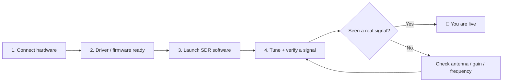

# SDRLAB Quickstart — Your First 30 Minutes

> **Learning goal**: by the end of this page you will have picked a product, understood the general "plug in → driver → software → signal" flow, and verified that your SDR hardware actually works.
> **Audience**: first-timers ｜ **Prerequisites**: one SDRLAB product, a computer (Windows/Linux/macOS), and the will to hear radio noise and love it.

## Concept: the universal SDR flow

Every SDRLAB product follows the same three-stage journey, even though the details differ:

Think of it like plugging in a new game controller: **hardware first** (the thing must be recognized), **driver second** (the OS must talk to it), **software third** (the game — actually the radio — must know how to use it). Nine times out of ten, "nothing works" means one of these three stages was skipped.

## Step 1: Pick your product and connect it

| Product | How it connects | Needs extra power? | First step |
|---|---|---|---|
| [RTL-SDR Blog V4](/sdrlab/hardware/rtl-sdr-v4/) | USB-A to your PC | No (USB powered) | Plug in, install driver |
| [SDRLab TRX-duo](/sdrlab/hardware/trx-duo/) | Gigabit Ethernet + USB-C power | Yes, power via USB-C | Flash SD card, boot, browse to web UI |
| [SDRLab H4M](/sdrlab/hardware/h4m/) | Standalone handheld (USB-C for charging/flashing) | Battery or USB-C | Charge, insert microSD, install Mayhem firmware |
| [5G Expansion Board](/sdrlab/expansion/5g-board/) | Flipper Zero GPIO header | No (Flipper/battery) | Set GPIO pins, open Marauder app |
| [NRF24 module](/sdrlab/expansion/nrf24/) | Flipper Zero GPIO header | No | Plug in, open NRF24 sniffer app |
| [WiFi multiboard](/sdrlab/expansion/wifi-multiboard/) | Flipper Zero GPIO header | No | Plug in, open WiFi deauther app |
| [Ethernet test module](/sdrlab/expansion/ethernet-test-module/) | Flipper Zero GPIO header + RJ45 cable | No | Wire SPI, open Ethernet app |

> **New to Flipper Zero?** Head to the [Flipper Zero section](/flipper-zero/) first to get your Flipper updated and comfortable.

## Step 2: Make the driver/firmware layer happy

- **RTL-SDR V4 on Linux**: you need a *current* driver — older distro packages don't know about the V4's R828D tuner. Follow the [driver update steps on the RTL-SDR V4 page](/sdrlab/hardware/rtl-sdr-v4/#linux-install).
- **RTL-SDR V4 on Windows**: modern tools (SDR#, SDR++, SDR Console) ship with V4-compatible drivers — just install the software and go.
- **TRX-duo**: the SD card *is* the firmware. Download the official image (see the [TRX-duo page](/sdrlab/hardware/trx-duo/#firmware-and-sd-image)), write it to a microSD card, insert, boot.
- **H4M**: install the [Mayhem firmware](/sdrlab/hardware/h4m/#mayhem-firmware) — the device ships functional but Mayhem unlocks the full toolkit.
- **Flipper modules**: most need a *custom* Flipper firmware (Momentum, Unleashed, Xtreme) for the extra apps, plus a GPIO pin setting. Each [expansion page](/sdrlab/#flipper-zero-expansion-modules) lists the exact pins.

## Step 3: Launch software and verify a signal

The fastest "it works!" test per device:

| Product | Test | Expected result |
|---|---|---|
| RTL-SDR V4 | `rtl_test` in terminal | "Supported sample rates", `PASS` lines scrolling |
| TRX-duo | Browser → `http://192.168.1.100` | Red Pitaya-style web dashboard loads |
| H4M | Spectrum app on screen | Waterfall shows FM broadcast band noise/signals |
| 5G board | Marauder `scanap` | Nearby SSIDs appear with RSSI |
| NRF24 module | Channel scanner | 2.4 GHz activity on channels 1–126 |
| WiFi multiboard | Deauther scan | AP list populates |
| Ethernet module | W5500 app → DHCP | IP address assigned, ping works |

## Step 4: Tune something real

Pick a frequency you *know* has signals, not a random spot:

- **FM broadcast radio**: 88–108 MHz — your first SDR signal, guaranteed.
- **NOAA weather satellites (137 MHz)**: APT satellite images, a weekend project favorite.
- **Aircraft (ADS-B, 1090 MHz)**: planes streaming position data.
- **Pager (POCSAG)**: ~137 MHz and ~466 MHz — classic RTL-SDR curiosity.
- **Aircraft (HF, if you own a TRX-duo)**: 3–30 MHz shortwave broadcasters at night.

## Step 5: Check your checklist

- [ ] Hardware recognized (led light on / app sees the device)
- [ ] Driver or firmware version is current
- [ ] SDR software sees the device by name/model
- [ ] Waterfall or spectrum shows *something* — then a real signal
- [ ] Know where your antenna is and what band it suits (this matters more than you think!)

## Common first-day mistakes

| Mistake | Why it happens | Fix |
|---|---|---|
| `No devices found` in `rtl_test` | Kernel DVB driver grabbed the dongle | Blacklist `dvb_usb_rtl28xxu` (see [RTL-SDR V4 page](/sdrlab/hardware/rtl-sdr-v4/#linux-install)) |
| TRX-duo web UI unreachable | Wrong static IP / no DHCP on the network | Check the [network section](/sdrlab/hardware/trx-duo/#first-boot-and-network) |
| H4M has no apps | microSD missing or stale | Copy the `COPY_TO_SDCARD` files from the [Mayhem release](/sdrlab/hardware/h4m/#mayhem-firmware) |
| Flipper app says "no module" | GPIO pins not set for the module | Set pins under `Protocol Settings → GPIO Pin Settings` (per expansion page) |
| Everything dead | No antenna attached | Screw on the antenna — an SDR without an antenna is a very quiet paperweight |

## Next steps

- Ready to go deeper? The [SDR software guide](/sdrlab/sdr-software/) explains the tools; the [firmware guide](/sdrlab/firmware/) covers updates.
- Stuck on something specific? The [troubleshooting hub](/sdrlab/troubleshooting/) is organized by symptom.
- Pairing an ALFA Wi-Fi adapter with your SDR work? See the [ALFA Linux guide](/sdrlab/shared/alfa-linux-guide/).
