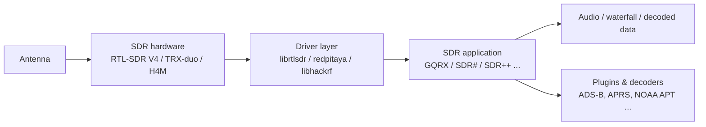
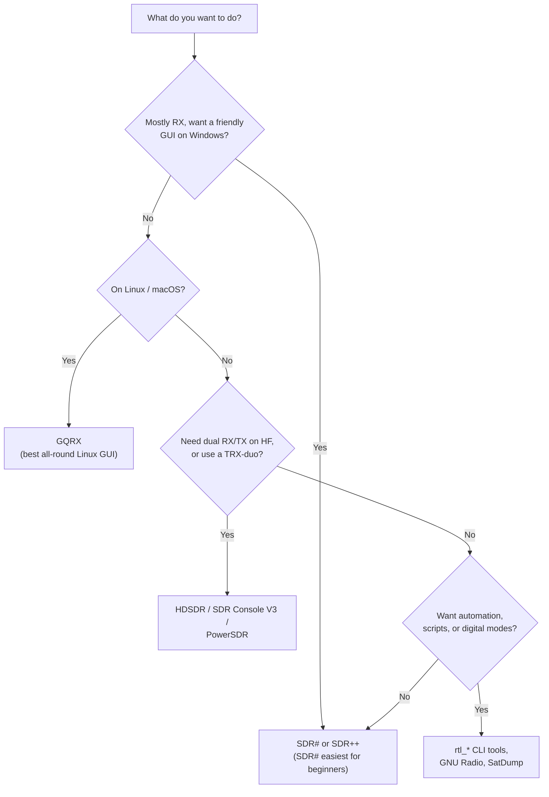

# SDR Software — Choosing and Installing Your Tools

> **Learning goal**: by the end you will be able to pick the right SDR application for your device and goal, and install it on Linux or Windows.
> **Audience**: beginner to intermediate ｜ **Prerequisites**: one working SDRLAB device (see [Quickstart](/sdrlab/quickstart/)).

## Concept: the software stack

Your SDR hardware digitizes radio spectrum, but *something* has to turn those raw samples into waterfalls, audio, or decoded packets. That "something" is the SDR application:



Each stage has its own ecosystem. A common beginner trap: the hardware is fine and the app is fine, but the **driver layer** between them is outdated — the RTL-SDR Blog V4 is the classic example, since older drivers simply don't understand its tuner.

## Which app should I use?



### Quick pick table

| Tool | Platform | Devices | Best for |
|---|---|---|---|
| [GQRX](https://www.gqrx.dk/) | Linux / macOS / Windows | RTL-SDR V4, H4M (as HackRF) | General RX, spectrum, FM/AM demod, SDR newcomers on Linux |
| [SDR# (SDRSharp)](https://airspy.com/download/) | Windows | RTL-SDR V4 | The classic beginner Windows app; huge plugin ecosystem |
| [SDR++](https://www.sdrpp.org/) | Windows / Linux / macOS | RTL-SDR V4, HackRF | Cross-platform modern GUI, server mode, great waterfall |
| [SDR Console V3](https://www.sdr-radio.com/console) | Windows | RTL-SDR V4, TRX-duo | Serious receiver features, ham radio, remote operation |
| [HDSDR](https://www.hdsdr.de/) | Windows | TRX-duo, RTL-SDR V4 | HF transceiver-style control, IF panadapters, TRX-duo support |
| [CubicSDR](https://cubicsdr.com/) | Windows / Linux / macOS | RTL-SDR V4, HackRF | Simple cross-platform waterfall |
| [SatDump](https://github.com/SatDump/SatDump) | Windows / Linux | RTL-SDR V4 | Satellite decoding (NOAA, MetOp, LRPT, Meteor) |
| `rtl_*` command-line tools | Linux / Windows / macOS | RTL-SDR V4 | Testing (`rtl_test`), raw IQ capture, scripts |
| `hackrf_*` tools | Linux / Windows / macOS | H4M (as HackRF) | Firmware flashing, raw IQ TX/RX, spectrum (`hackrf_transfer`) |

## Linux: install GQRX (recommended starting point)

GQRX is the friendliest Linux GUI and pairs perfectly with the RTL-SDR V4.

### Step 1 — Install GQRX

```bash
# Debian / Ubuntu / Kali
sudo apt update
sudo apt install gqrx-sdr
```

Expected output (last lines):

```
Setting up gqrx-sdr (2.17-1) ...
Processing triggers for desktop-file-utils ...
```

### Step 2 — Install the RTL-SDR command-line tools (used for driver checks)

```bash
sudo apt install rtl-sdr
rtl_test -t
```

Expected output when the V4 is plugged in and drivers are current:

```
Found 1 device(s):
  0:  Realtek, RTL2838UHIDIR, SN: 00000001

Using device 0: Generic RTL2832U OEM
...
Supported sample rates: 225001-300000, 900001-3200000, ...
```

> `Found 1 device(s)` is the moment to cheer. If it prints `No devices found`, see [Troubleshooting → RTL-SDR not detected](/sdrlab/troubleshooting/#rtl-sdr-not-detected).

### Step 3 — Open GQRX and find a signal

1. Launch `gqrx` (or `gqrx-sdr`).
2. On first run, the **Device configuration** dialog appears — pick your dongle, leave the I/Q settings at defaults, and click **OK**.
3. Click the **▶** (play) button. The waterfall starts streaming.
4. Enter **97.3 MHz** in the frequency box (any strong FM station works — check your local one).
5. Click the **FM** mode button, then press the **mute** icon off. You should hear the station.

## Windows: install SDR# (recommended starting point)

1. Download the SDR# zip from the [Airspy download page](https://airspy.com/download/).
2. Extract the zip to a folder (e.g. `C:\SDRSharp`).
3. Run `sdrsharp.exe`. It needs **.NET** — Windows will offer to install it if missing.
4. In the top-left **Source** dropdown, select **RTL-SDR (RTL2832U)** and click the play icon.
5. Tune to a local FM station (88–108 MHz), select **WFM** demodulation, and you're listening.

## TRX-duo software notes

The TRX-duo is *not* a plug-and-play USB device — it is a networked instrument running its own embedded software (see the [TRX-duo page](/sdrlab/hardware/trx-duo/) for the official firmware image). On the PC side, the ecosystem that works with it is the **Red Pitaya SDR software family**:

- **HDSDR** — connect via the Red Pitaya network interface (ExtIO / network interface as documented by the vendor).
- **SDR Console V3** — supports Red Pitaya-compatible devices over the network.
- **Red Pitaya web apps** — the board itself serves browser-based applications (spectrum analyzer, SDR receiver, VNA) straight from its own web UI.

Because the Red Pitaya ecosystem is driven by [Pavel Demin's red-pitaya-notes](https://github.com/pavel-demin/red-pitaya-notes) project, most Red Pitaya-compatible applications run on the TRX-duo with the matching SD image.

## H4M software notes

The H4M is a standalone device: it runs **Mayhem firmware** on the PortaPack itself, so no PC software is needed for basic operation. To use it as a plain HackRF from a computer, install the **HackRF tools**:

```bash
# Debian / Ubuntu / Kali
sudo apt install hackrf
hackrf_info
```

Expected output:

```
Found HackRF board.
Board ID Number: 2 (HackRF One)
Firmware Version: git-... (API:1.02)
```

See the [H4M page](/sdrlab/hardware/h4m/) for firmware installation and the [firmware guide](/sdrlab/firmware/) for update steps.

## Command-line essentials worth learning

| Command | What it does | Typical use |
|---|---|---|
| `rtl_test` | Self-test an RTL-SDR dongle | Verify driver + hardware |
| `rtl_fm -f 97.3M -M wbfm -s 200k \| play -t raw` | Stream FM audio to speaker | Quick "is my dongle alive" test |
| `rtl_sdr -f 1090M -s 2M -` | Dump raw IQ samples to stdout | Feed ADS-B decoders |
| `hackrf_transfer -r out.iq -f 433M -s 2M` | Record raw samples from HackRF | Capture bursts for replay analysis |
| `hackrf_info` | Show HackRF version info | Verify H4M as HackRF |

## Where to go next

- [Firmware & drivers](/sdrlab/firmware/) — keep the layers under the software healthy.
- [Troubleshooting](/sdrlab/troubleshooting/) — "the app opens but there's no signal" and friends.
- Product pages: [RTL-SDR V4](/sdrlab/hardware/rtl-sdr-v4/), [TRX-duo](/sdrlab/hardware/trx-duo/), [H4M](/sdrlab/hardware/h4m/).
