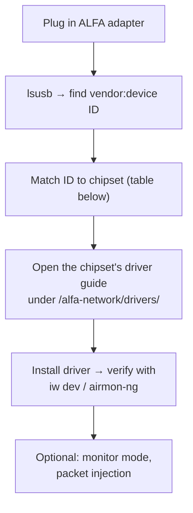

# ALFA Adapters on Linux — Driver Pointer Guide

> **Learning goal**: identify the chipset inside any ALFA adapter with two commands, then land on the exact driver guide you need — no guessing, no rabbit holes.
> **Audience**: anyone pairing an ALFA Wi-Fi adapter with Ubuntu or Kali Linux (including SDR rigs that also do wireless protocol analysis).

## Why this page exists

ALFA Network makes many adapters, and they don't all use the same radio chip. **The chipset decides the driver** — the model name alone is not enough. This page is the shared "front door": it teaches you the two-command identification ritual, then points you to the chipset-specific guides in the [ALFA Network section](/alfa-network/). It works for **any** ALFA adapter on **any** Debian-family distro.



## Step 1 — Identify the chipset

```bash
lsusb
```

Find the ALFA adapter line. Example output:

```
Bus 003 Device 002: ID 0cf3:9271 Qualcomm Atheros Communications AR9271 802.11n
```

The `ID xxxx:xxxx` is the vendor:device pair. Compare it against the table below — the *device* part narrows it to one family of chips.

### Chipset lookup table

| Chipset | Typical `lsusb` device IDs | Typical ALFA models | Driver guide |
|---|---|---|---|
| MediaTek MT7921AUN | `0e8d:7961` | AWUS036AXML, AWUS036AXM | [MT7921AUN guide](/alfa-network/drivers/mt7921aun/) |
| Realtek RTL8812AU | `0bda:8812` | AWUS036ACH, AWUS036ACHM | [RTL8812AU guide](/alfa-network/drivers/rtl8812au/) |
| Realtek RTL8811AU | `0bda:8811` | AWUS036ACS | [RTL8811AU guide](/alfa-network/drivers/rtl8811au/) |
| Realtek RTL8821CU | `0bda:c811` / `0bda:1a2b` | AWUS036ACM | [RTL8821CU guide](/alfa-network/drivers/rtl8821cu/) |
| Realtek RTL8832BU | `0bda:b832` | AWUS036AXER | [RTL8832BU guide](/alfa-network/drivers/rtl8832bu/) |
| MediaTek MT7612U | `0e8d:7612` | AWUS036AC | [MT7612U guide](/alfa-network/drivers/mt7612u/) |
| MediaTek MT7610U | `0e8d:7610` | AWUS036NHA (variant), AWUS051NH | [MT7610U guide](/alfa-network/drivers/mt7610u/) |

> The table is a *starting* map — ALFA releases new SKUs over time. When in doubt, read the chip from the printed label on the adapter's IC, or check the [ALFA Network product pages](/alfa-network/) for your exact model.

## Step 2 — Install the matching driver

Each chipset has its own quirks:

- **MediaTek (MT79xx / MT76xx)**: some kernels already carry in-tree `mt76` support — the chipset guide tells you when that's enough and when to build the vendor driver.
- **Realtek (RTL88xx)**: almost always need the out-of-tree driver (`rtl88x2bu`-style DKMS builds). Expect `make` + `sudo make install` + reboot.
- **Atheros**: `ath9k_htc` is in the kernel — usually plug-and-play.

Follow the chipset-specific guide for exact commands; they all end with a **verify step**:

```bash
iw dev          # shows your wlan interface and connected state
sudo airmon-ng  # confirms monitor-mode capability
```

Expected `iw dev` output fragment:

```
Interface wlan0
    ifindex 3
    wdev 0x1
    addr 00:c0:ca:xx:xx:xx
    type managed
```

## Step 3 — Common Linux driver pitfalls

| Symptom | Likely cause | Quick fix |
|---|---|---|
| `iw dev` shows nothing | Driver not loaded or failed to build | Check `dmesg | grep -i rtl\|mt76`; rebuild per chipset guide |
| Adapter works then dies on reboot | Kernel module conflict | Follow the blacklist steps in the chipset guide |
| Monitor mode fails (`airmon-ng` error) | Driver doesn't support it yet | Use the DKMS version from the chipset guide, not the distro package |
| Works on Ubuntu, not Kali | Kali's kernel headers version mismatch | Rebuild DKMS: `sudo dkms autoinstall` |

## Why SDR users care about this

An ALFA adapter is not an SDR — but it is the natural *companion* to one. Typical setups that combine them:

- **Wi-Fi protocol analysis** while your [RTL-SDR V4](/sdrlab/hardware/rtl-sdr-v4/) watches the ISM band spectrum.
- **Kali-based lab stations** doing wireless pentesting classes, where an SDR verifies what the Wi-Fi adapter is doing in the spectrum.
- **Field surveys** pairing the [H4M](/sdrlab/hardware/h4m/) spectrum view with an ALFA adapter's deauth/packet tools.

The [SDR software guide](/sdrlab/sdr-software/) covers the SDR side; the [troubleshooting hub](/sdrlab/troubleshooting/) helps when the radio side misbehaves.

## Related

- [ALFA Network section](/alfa-network/) — products, antennas, Jetson/Raspberry Pi/Unitree integrations.
- Chipset driver guides: [MT7610U](/alfa-network/drivers/mt7610u/) ・ [MT7612U](/alfa-network/drivers/mt7612u/) ・ [MT7921AUN](/alfa-network/drivers/mt7921aun/) ・ [RTL8811AU](/alfa-network/drivers/rtl8811au/) ・ [RTL8812AU](/alfa-network/drivers/rtl8812au/) ・ [RTL8821CU](/alfa-network/drivers/rtl8821cu/) ・ [RTL8832BU](/alfa-network/drivers/rtl8832bu/)
