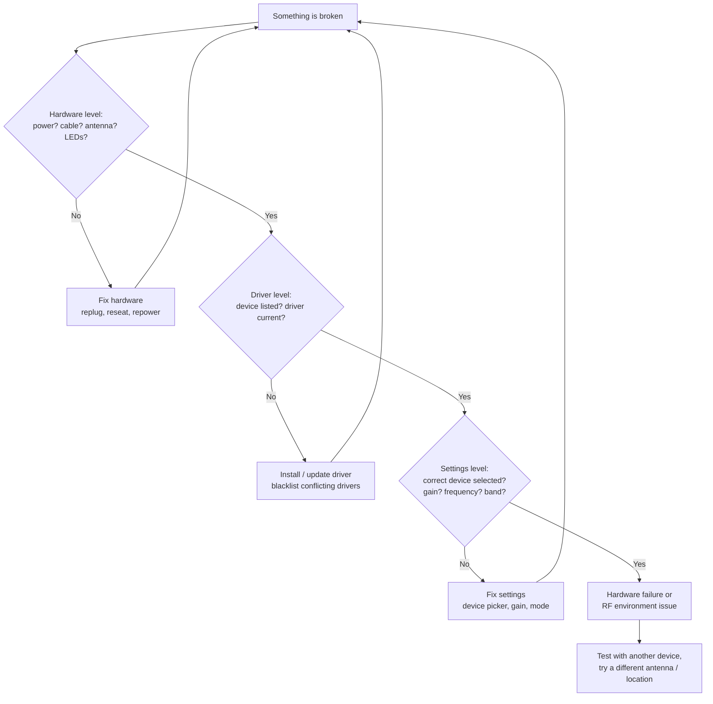

# SDRLAB Troubleshooting Hub

> **The golden rule**: always debug in this order — **hardware first, then driver, then settings**. Ninety percent of SDR problems are an unplugged antenna, an old driver, or a wrong setting hiding in plain sight.



## Problem index

| Category | Problems covered here |
|---|---|
| RTL-SDR V4 | [Not detected](#rtl-sdr-not-detected) ・ [Strange signals / aliasing](#rtl-sdr-picks-up-images-of-other-signals) ・ [Bias tee not working](#bias-tee-wont-turn-on) |
| TRX-duo | [Web UI unreachable](#trx-duo-web-ui-unreachable) ・ [Boot loop / no DHCP](#trx-duo-boots-but-never-appears-on-the-network) ・ [No receive signal](#trx-duo-rx-shows-noise-only) |
| H4M | [Apps missing after update](#h4m-apps-missing-after-firmware-update) ・ [Does not power on](#h4m-wont-power-on) ・ [No audio](#h4m-no-audio-from-speaker-or-jack) |
| Flipper modules | [Module app says "no module"](#flipper-app-says-no-module) ・ [NRF24 sees nothing](#nrf24-sees-nothing-on-channel-scan) ・ [WiFi board won't connect](#wifi-board-web-interface-unreachable) ・ [Ethernet module no link](#ethernet-module-no-link-light) |

---

## RTL-SDR not detected

### Symptom
`rtl_test` prints `No devices found.` or GQRX lists no devices.

### Diagnosis
```bash
lsusb
```
Expected output shows the dongle:

```
Bus 001 Device 004: ID 0bda:2838 Realtek Semiconductor Corp. RTL2838 DVB-T
```

If `lsusb` shows nothing, the USB connection itself is the problem (cable, port, hub). If it *does* show the device, continue.

### Root cause
The kernel's DVB-T driver (`dvb_usb_rtl28xxu`) grabbed the dongle before the SDR driver could — the classic RTL-SDR failure mode.

### Fix
1. Blacklist the DVB driver:
```bash
echo 'blacklist dvb_usb_rtl28xxu' | sudo tee /etc/modprobe.d/blacklist-dvb_usb_rtl28xxu.conf
```
2. Reboot, or `sudo modprobe -r dvb_usb_rtl28xxu` if the module is loaded.
3. Re-run `rtl_test` — expect `Found 1 device(s)`.
4. Still nothing? Install the current driver from source — see [RTL-SDR V4 → Linux install](/sdrlab/hardware/rtl-sdr-v4/#linux-install).

---

## RTL-SDR picks up images of other signals

### Symptom
You tune to one frequency but hear stations from *other* frequencies mixed in, especially on HF.

### Root cause
Overload from strong broadcast stations, or tuning below ~24 MHz where old-style dongles fold signals (aliasing). The RTL-SDR Blog V4 handles this differently from older dongles — it has a built-in 28.8 MHz upconverter for HF and a triplexer + notch filters for strong FM/DAB interference.

### Fix
- On HF, make sure your driver supports the V4 (R828D). With an outdated driver the upconverter isn't activated and HF behaves like an aliasing mess.
- Turn the gain **down** (start at 20–30 dB) — most "ghost signals" are overload.
- Add attenuation or use a band-specific antenna instead of a wideband one.

---

## Bias tee won't turn on

### Symptom
An active antenna that needs DC power doesn't get it.

### Root cause
The V4 bias tee is software-controlled (4.5 V, 180 mA). In SDR# / SDR++ it is mapped to the **"Offset tuning"** option; it must be enabled per session.

### Fix
Enable "Offset tuning" in the device config (this is the bias-tee switch on V4). In GQRX, click the device icon → enable **Bias-T**. Note the tee can't supply heavy loads — 180 mA max.

---

## TRX-duo web UI unreachable

### Symptom
Browser won't load the TRX-duo dashboard; `ping` fails.

### Diagnosis
```bash
ip neigh show
arp -a
```
Look for an address like `192.168.1.100` or a `trx-duo-alpine` hostname.

### Root cause
Network misconfiguration: the device expects DHCP, or you are on a subnet where its default static address doesn't fit.

### Fix
1. Connect the TRX-duo to the **same switch/router** as your PC.
2. Prefer a network with DHCP — the device requests an address automatically.
3. If no DHCP server exists, the Red Pitaya-compatible default is `http://192.168.1.100` — set your PC to a static `192.168.1.x` address and try that.
4. See [TRX-duo → First boot and network](/sdrlab/hardware/trx-duo/#first-boot-and-network) for the full official procedure.

---

## TRX-duo boots but never appears on the network

### Symptom
Power LED on, but no link light on the Ethernet jack, or link light on but no address.

### Diagnosis
- Check the Ethernet link LED on the RJ45 jack — if it's dark, the cable/port is the problem.
- Check the SD card: a corrupted or wrong image means the OS never boots far enough to configure networking.

### Root cause
Usually one of: bad cable, card not fully seated, or an image written for the wrong board variant.

### Fix
1. Try another cable/port.
2. Re-seat and re-write the microSD card with the official image (see [Firmware and SD image](/sdrlab/hardware/trx-duo/#firmware-and-sd-image)).
3. If it still won't appear, test the card on a PC — a card that fails `fsck` or reads as near-empty is suspect.

---

## TRX-duo RX shows noise only

### Symptom
The waterfall is alive but you hear nothing, even on strong HF broadcasters.

### Diagnosis
Check the input: is the antenna on the **RX1/RX2 SMA port**? Is it the correct band (10 kHz – 60 MHz)?

### Root cause
No antenna / wrong port, input attenuator engaged, or a receive app with gain set to minimum.

### Fix
1. Attach a proper HF antenna (a long wire or a tuned loop — a 2.4 GHz WiFi antenna is nearly useless here).
2. In the app, raise the RX gain / disable attenuators.
3. Confirm the app you launched is an *SDR receiver* app, not the VNA.

---

## H4M apps missing after firmware update

### Symptom
The PortaPack boots, menus look right, but many apps are gone.

### Root cause
Since Mayhem 1.8.0, most applications live on the **microSD card**, not in flash. A missing or out-of-date SD card means missing apps.

### Fix
1. Get a microSD card (16 GB is comfortable), format it **FAT32**.
2. Download the release's `COPY_TO_SDCARD` archive from the [Mayhem releases page](https://github.com/portapack-mayhem/mayhem-firmware/releases) — see [H4M → Mayhem firmware](/sdrlab/hardware/h4m/#mayhem-firmware).
3. Extract the archive to the card root.
4. Insert and reboot. Apps appear.

---

## H4M won't power on

### Symptom
No display, no LEDs.

### Diagnosis
- Charge via USB-C for 10+ minutes, then try the **power switch** (the H4M has a proper on/off button).
- Try booting with the USB-C cable connected to a PC.

### Root cause
Flat battery is the usual suspect; occasionally a stuck DFU/flash mode.

### Fix
1. Charge until the charging indicator shows progress.
2. Hold the power button ~3 seconds.
3. If it still won't start, connect USB-C and check if the PC sees a HackRF device — if yes, flash Mayhem again per [H4M → Mayhem firmware](/sdrlab/hardware/h4m/#mayhem-firmware).

---

## H4M no audio from speaker or jack

### Symptom
Signal in the waterfall, silence in the ear.

### Root cause
Mode/gain settings, or audio routed to the wrong output (the H4M auto-switches between the built-in speaker and the 3.5 mm jack when headphones are plugged in).

### Fix
1. Raise the RX gain and re-check the demod mode (WFM for broadcast FM).
2. Unplug headphones to re-route audio to the speaker, or vice versa.
3. Check the volume setting in the audio menu.

---

## Flipper app says "no module"

### Symptom
An expansion app (NRF24, Marauder, GPS) reports the module isn't present even though it's plugged in.

### Root cause
The GPIO pins are not set for the module, or the Flipper firmware doesn't bundle the app. Most modules need a custom firmware (Momentum / Unleashed / Xtreme) and an explicit pin assignment.

### Fix
1. On **Momentum**: `Protocol Settings → GPIO Pin Settings` — set the module's pins (exact pins per product page).
2. On **Unleashed/Xtreme**: the equivalent GPIO config lives in the app's own settings or firmware settings.
3. Reboot the Flipper and retry.

See the specific module pages: [5G board](/sdrlab/expansion/5g-board/), [NRF24](/sdrlab/expansion/nrf24/), [WiFi multiboard](/sdrlab/expansion/wifi-multiboard/), [Ethernet](/sdrlab/expansion/ethernet-test-module/).

---

## NRF24 sees nothing on channel scan

### Symptom
The sniffer shows zero activity even with a wireless mouse/keyboard nearby.

### Diagnosis
Confirm the module's SMA antenna is attached and the mouse is actively moving (idle mice transmit little).

### Root cause
No antenna, wrong SPI pins, or simply no traffic: many 2.4 GHz devices use frequency hopping and are quiet when idle.

### Fix
1. Attach the antenna.
2. Verify pins per the [NRF24 page](/sdrlab/expansion/nrf24/).
3. Move/jiggle the mouse or keyboard while scanning — you should see channel bursts.
4. Try channel range 1–126 at 2 Mbps, then 1 Mbps and 250 kbps (different devices use different rates).

---

## WiFi board web interface unreachable

### Symptom
After flashing the deauther, you can't reach `192.168.4.1`.

### Root cause
Your phone/PC auto-joined another network, or the board's AP didn't start.

### Fix
1. Connect to the board's access point (default SSID `pwned`, password `deauther`).
2. Disable mobile data / auto-join on the client.
3. Browse to `http://192.168.4.1`.
4. Still nothing? Re-flash the firmware per the [WiFi multiboard page](/sdrlab/expansion/wifi-multiboard/).

---

## Ethernet module no link light

### Symptom
The RJ45 port LEDs stay dark after plugging in a cable.

### Diagnosis
- Try another cable and another switch port (the module is 10/100 — some 1G-only "smart" ports are picky).
- Confirm wiring to the Flipper per the [Ethernet module page](/sdrlab/expansion/ethernet-test-module/#wiring-to-the-flipper).

### Root cause
Bad cable/port, or the SPI wiring (CS/RESET) is wrong so the W5500 never initializes.

### Fix
1. Test the cable with any known-good device first.
2. Double-check every SPI wire — one swapped wire kills the link.
3. Launch the app; the header should show `LAN [UP 100M FD]` when connected.

---

## Still stuck?

When bringing a problem to us (or a forum), include:

- **Device + firmware version**: e.g. "RTL-SDR V4, osmocom driver 2.x"; "H4M, Mayhem nightly 2026-07-26"; "Flipper Zero, Momentum 8.x".
- **Environment**: OS and version, USB hub or direct, network topology for networked devices.
- **Evidence**: `lsusb` / `dmesg` output, `rtl_test` errors, `hackrf_info` output, screenshots of the app.
- **What you already tried**: this prevents duplicate advice and shows the debug order was followed.

Related: [Quickstart](/sdrlab/quickstart/) ・ [Firmware & drivers](/sdrlab/firmware/) ・ [SDR software](/sdrlab/sdr-software/).
