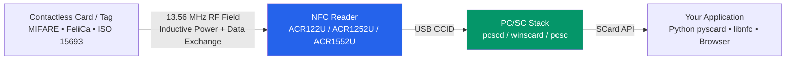

---

id: acs-index
title: ACS Smart Card & NFC Readers
slug: /acs/
sidebar_position: 5
description: ACS (Advanced Card Systems) smart card readers and NFC readers — ACR122U, ACR1252U, and ACR1552U. Contactless ISO 14443, MIFARE, FeliCa, ISO 15693, and NFC technologies.
tags: [acs, smart-card, nfc, rfid, acr122u, acr1252u, acr1552u, pcsc]
keywords: [ACS, ACR122U, ACR1252U, ACR1552U, smart card reader, NFC reader, PC/SC, ISO 14443, MIFARE]
authors: yupitek
date: 2026-08-21
last_updated: 2026-08-21
category: product
difficulty: beginner
toc: true
---

# ACS — Smart Card & NFC Readers

> **Quick Summary**: ACS (Advanced Card Systems) PC/SC smart card and NFC readers bridge physical contactless cards (access badges, transit cards, MIFARE, FeliCa, e-Passports, and ISO 15693 asset tags) into standardized computer `SCard*` interfaces, allowing applications and custom scripts to read and write them effortlessly.

If you are new to smart card and NFC readers, review the architectural concept below before exploring individual product guides.

## Architecture: How Smart Card Readers Work

When a contactless card is presented to a reader, operations occur across three distinct layers:

- **Contactless Cards / Tags**: Passively powered by the reader's 13.56 MHz electromagnetic field. The card contains no internal battery and powers on inductively when placed in proximity.
- **NFC Readers** (e.g., ACR122U, ACR1252U, ACR1552U): Modulate and translate RF field communication into standard USB CCID messages recognized by the host operating system.
- **PC/SC Subsystem**: The OS-level standard interface (`pcscd` on Linux, WinSCard on Windows, PC/SC framework on macOS). Any PC/SC-compliant application can communicate with connected readers without vendor-specific driver rewrites.

:::tip Why is PC/SC Important?
PC/SC serves as the universal API for smart card hardware. Code developed against PC/SC functions seamlessly across different hardware models and manufacturers.
:::

## Product Lineup Positioning

| Product | One-Line Summary | Best Use Case |
|---|---|---|
| [ACR122U](/acs/products/acr122u/) | The classic, budget-friendly entry-level NFC reader with widespread community support | Student projects, MIFARE research, libnfc direct hardware testing |
| [ACR1252U](/acs/products/acr1252u/) | NFC Forum-certified reader featuring a built-in SAM security slot (NFC Reader III) | Production NFC deployments, Card Emulation, Peer-to-Peer, secure authentication |
| [ACR1552U](/acs/products/acr1552u/) | 4th-Gen multi-protocol flagship reader with ISO 15693 & Keyboard Emulation | Enterprise multi-protocol environments, ISO 15693 asset tracking, healthcare & e-Government |

## Choosing the Right Reader

1. **What is your target media?** For standard MIFARE access cards or coursework → **ACR122U**. For production security and hardware SAM slot requirements → **ACR1252U**. For ISO 15693 asset tags and high-speed multi-card support → **ACR1552U**.
2. **Which development stack are you using?** For direct raw `libnfc` driver access → **ACR122U** (the only model with direct `acr122_usb` kernel driver support). For standard PC/SC across platforms → all three models.
3. **Budget and Certification Requirements?** ACR122U offers maximum economy; ACR1252U provides official NFC Forum compliance; ACR1552U offers future-proof multi-protocol versatility.

## Quick Specification Comparison

| Feature | ACR122U | ACR1252U | ACR1552U |
|---|---|---|---|
| ISO 14443 Baud Rate | 106 / 212 / **424** kbps | 106 / 212 / **424** kbps | 106 / 212 / 424 / **848** kbps |
| Operating Distance | Up to 50 mm | Up to 50 mm | Up to 70 mm |
| ISO 15693 Support | ❌ | ❌ | ✅ |
| SAM Security Slot | ❌ | ✅ | ✅ |
| NFC Forum Certified | ❌ | ✅ | ❌ |
| Keyboard Emulation Mode | ❌ | ❌ | ✅ |
| Native libnfc Driver | ✅ (`acr122_usb`) | ⚠️ (PC/SC mode) | ⚠️ (PC/SC mode) |
| Web / Browser NFC | Requires PC/SC Bridge | Requires PC/SC Bridge | Requires PC/SC Bridge |

## Getting Started

- **Using ACR122U?** → Read the [ACR122U Complete Guide](/acs/products/acr122u/)
- **Using ACR1252U?** → Read the [ACR1252U Complete Guide](/acs/products/acr1252u/)
- **Using ACR1552U?** → Read the [ACR1552U Complete Guide](/acs/products/acr1552u/)
- **Setting up on Linux?** Each product guide contains step-by-step instructions for `pcscd`, `pcsc_scan`, and `pyscard`.

## Additional Resources

- For other hardware categories (ALFA adapters, Hak5 tools, Flipper Zero, SDR), return to the [Yupitek Wiki Overview](/getting-started/).
- Official ACS technical documentation and API reference manuals are available at [acs.com.hk](https://www.acs.com.hk).

:::info Responsible Usage
Smart card readers and NFC analysis tools must only be used with credentials, badges, and target systems you own or have authorized permission to assess (Taiwan Criminal Code Articles 358–363).
:::
