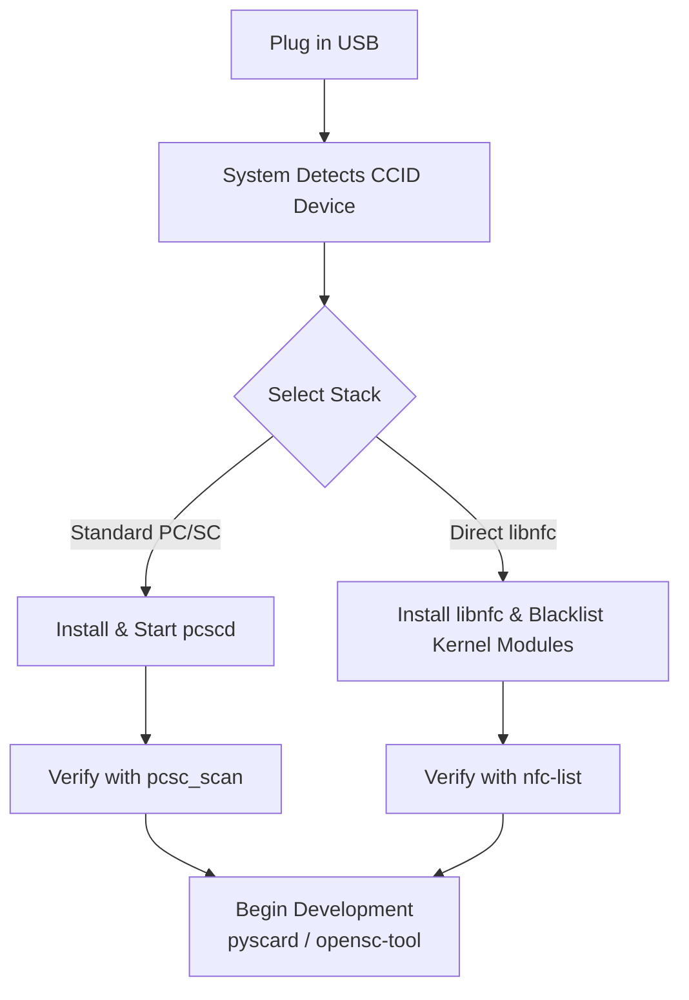

# ACR122U — USB NFC Reader Complete Guide

> **Quick Summary**: The ACR122U is ACS's most iconic and widely adopted PC/SC contactless reader. Bridging ISO 14443 Type A/B, MIFARE, FeliCa, and ISO 18092 NFC tags into standard USB interfaces, it boasts unmatched open-source library support (`libnfc`, `pyscard`, `mfoc`) and serves as the definitive starting point for RFID/NFC academic projects and research.

Often referred to as the "Arduino of NFC readers," the ACR122U is cost-effective, widely available, PC/SC-compliant, and the **only model** in its class featuring a direct native `libnfc` driver (`acr122_usb`).

## Unboxing & Hardware Overview

- **Dimensions & Weight**: 98.0 × 65.0 × 12.8 mm, pearl-white ABS casing, 70 g.
- **Antenna**: Integrated 50 × 40 mm PCB antenna located beneath the top surface (operating range up to 50 mm).
- **LED**: Bi-color LED (Red/Green), software controllable.
- **Buzzer**: Monotone buzzer, software controllable.
- **Cable**: Integrated USB 2.0 Type-A cable, 1.0 m length.

When a card is successfully detected, the LED flashes green and the buzzer emits a confirmation beep.

## Specifications Overview

| Item | Specification |
|---|---|
| Core Chipset | NXP PN532 (13.56 MHz) |
| Supported Standards / Cards | ISO/IEC 18092 NFC, ISO 14443 Type A & B, MIFARE Classic®, MIFARE Ultralight®, FeliCa |
| Operating Frequency | 13.56 MHz |
| Read/Write Speed | 106 / 212 / **424** kbps |
| Host Interface | USB 2.0 Full Speed (12 Mbps), CCID compliant |
| Operating Distance | Up to 50 mm (dependent on tag geometry) |
| Anti-collision | Built-in (one card accessed at a time) |
| Power Supply | USB bus-powered, 5V DC (typical 100 mA, max 200 mA) |
| Dimensions / Weight | 98.0 × 65.0 × 12.8 mm / 70 g |
| API Support | PC/SC, CT-API (via PC/SC wrapper) |
| Certifications | ISO 14443, PC/SC, CCID, CE, FCC, KC, VCCI, RoHS, Microsoft WHQL |
| USB Vendor/Product ID | `072F:2200` |
| OS Support | Windows, Linux, macOS, Solaris, Android 3.1+ |
| Official Documentation | [ACR122U Product Page](https://www.acs.com.hk/en/products/3/acr122u-usb-nfc-reader/), [API Manual (PDF)](https://downloads.acs.com.hk/drivers/en/API-ACR122U-2.02.pdf) |

## Supported & Unsupported Capabilities

| Feature | Status | Notes |
|---|---|---|
| Read/Write MIFARE Classic & Ultralight | ✅ Supported | Compatible with `libfreefare` and `nfc-mfclassic` |
| Read/Write ISO 14443-4 Cards | ✅ Supported | Standard PC/SC APDU transmission |
| Read/Write FeliCa & ISO 18092 Tags | ✅ Supported | Handled via pseudo-APDU commands |
| Read Card Serial Number (UID) | ✅ Supported | Standardized `FF CA 00 00 00` APDU call |
| Card Emulation Mode | ❌ Not Supported | Dedicated reader/writer firmware |
| ISO 15693 (Vicinity Cards) | ❌ Not Supported | Requires ACR1552U |
| SAM (Secure Access Module) Slot | ❌ Not Supported | Requires ACR1252U or ACR1552U |

## Installation & Driver Setup

The driver architecture operates across two potential paths:



:::caution Kernel Module Conflict on Linux
The Linux kernel's default `pn533` and `pn533_usb` drivers automatically claim PN532-based devices, blocking `pcscd` and `libnfc`. Blacklisting these kernel modules is required for reliable operation:
```bash
sudo modprobe -r pn533_usb pn533
echo "blacklist pn533_usb" | sudo tee -a /etc/modprobe.d/blacklist-nfc.conf
echo "blacklist pn533" | sudo tee -a /etc/modprobe.d/blacklist-nfc.conf
```
:::

### Method A: Standard PC/SC Stack (Recommended)

**Step 1: Install PC/SC Tools (Debian / Ubuntu / Kali)**

```bash
sudo apt update
sudo apt install -y pcscd pcsc-tools libpcsclite-dev
```

**Step 2: Start and Enable pcscd Service**

```bash
sudo systemctl enable --now pcscd
```

**Step 3: Verify Reader Detection**

```bash
pcsc_scan
```

*Expected output:*
```text
Scanning present readers...
0: Advanced Card Systems Ltd. ACR122U 00 00
Waiting for the first reader...
```

When a contactless card is presented:
```text
Card state: Card inserted,
ATR: 3B 8F 80 01 80 4F 0C A0 00 00 03 06 03 00 01 00 00 00 00 6A
```

### Method B: Direct libnfc Stack

**Step 1: Install libnfc and Utilities**

```bash
sudo apt install -y libnfc-bin libnfc-dev libfreefare-bin
```

**Step 2: Configure libnfc (`/etc/nfc/libnfc.conf`)**

```ini
device.name = "ACR122U"
device.connstring = "acr122_usb:072f:2200"
```

**Step 3: Run `nfc-list`**

```bash
nfc-list
```

*Expected output:*
```text
nfc-list uses libnfc 1.8.0
NFC device: ACS / ACR122U PICC Interface opened
1 ISO14443A passive target(s) found:
ISO/IEC 14443A (106 kbps) target:
    ATQA (SENS_RES): 00  04
       UID (NFCID1): a1  b2  c3  d4
      SAK (SEL_RES): 08
```

## Quickstart: Reading Card UID with Python (pyscard)

```bash
pip install pyscard
```

```python
from smartcard.System import readers
from smartcard.util import toHexString

# 1. Connect to reader
r = readers()
if not r:
    print("No PC/SC readers detected.")
    exit(1)

reader = r[0]
print(f"Connected to: {reader}")

connection = reader.createConnection()
connection.connect()

# 2. Transmit standard Get UID APDU: FF CA 00 00 00
GET_UID = [0xFF, 0xCA, 0x00, 0x00, 0x00]
data, sw1, sw2 = connection.transmit(GET_UID)

if sw1 == 0x90 and sw2 == 0x00:
    print(f"Card UID: {toHexString(data)}")
else:
    print(f"Command failed with status: {sw1:02X} {sw2:02X}")
```

## Operating System Compatibility

| OS / Platform | Compatibility | Driver / Notes |
|---|---|---|
| Windows 10 / 11 | ✅ Supported | Plug & Play via Microsoft CCID driver |
| Ubuntu / Debian / Kali | ✅ Supported | `pcscd` + `libpcsclite` (requires kernel module blacklist) |
| macOS | ✅ Supported | Built-in Apple CCID / PC/SC framework |
| Android | ✅ Supported | Via USB OTG and Android CCID libraries |
| Raspberry Pi / Jetson | ✅ Supported | Standard ARM Linux packages |

## Troubleshooting

### 1. `pcsc_scan` shows no readers
- **Cause**: Kernel module collision (`pn533_usb` claiming device) or `pcscd` daemon inactive.
- **Fix**: Verify blacklist in `/etc/modprobe.d/blacklist-nfc.conf` and restart `sudo systemctl restart pcscd`.

### 2. `nfc-list` returns "Unable to open NFC device"
- **Cause**: `pcscd` and `libnfc` competing for exclusive USB claim.
- **Fix**: Stop the PC/SC daemon temporarily when executing raw libnfc tools: `sudo systemctl stop pcscd`.

### 3. Frequent card read disconnects
- **Cause**: Insufficient USB port power delivery or USB hub dropouts.
- **Fix**: Connect reader directly to rear motherboard USB ports.

## Related Resources

- [ACS Product Overview](/acs/)
- [ACR1252U Guide](/acs/products/acr1252u/) (NFC Forum certified with SAM slot)
- [ACR1552U Guide](/acs/products/acr1552u/) (4th-Gen with ISO 15693 support)
