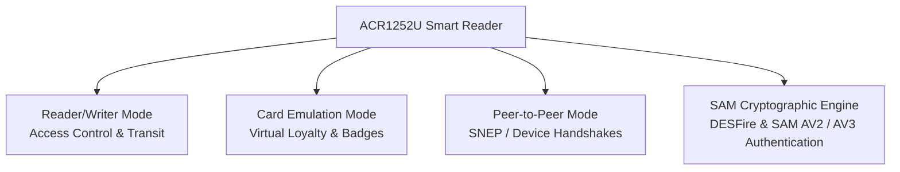

# ACR1252U — USB NFC Reader III (NFC Forum Certified) Complete Guide

> **Quick Summary**: The ACR1252U is the flagship workhorse of ACS's 2nd-generation NFC lineup, distinguished by official **NFC Forum Certification** and an integrated **SAM (Secure Access Module) slot**. Supporting all 3 NFC operating modes (Reader/Writer, Card Emulation, and Peer-to-Peer), it is the premier choice for production deployments requiring hardware-based key management and high cryptographic trust.

While the ACR122U serves as an experimental entry device, the ACR1252U is built for security-critical environments and commercial products where NFC Forum compliance and hardware SAM security are mandatory.

## Unboxing & Hardware Overview

- **Dimensions & Weight**: 98.0 × 65.0 × 12.8 mm, matte black ABS casing, 81 g.
- **Antenna**: Integrated 50 × 40 mm PCB antenna (operating distance up to 50 mm).
- **USB Interface Options**: Available in USB Type-A (`ACR1252U-M1`) and USB Type-C (`ACR1252U-MF`) configurations.
- **SAM Slot**: Standard ISO 7816 Class A SIM-sized slot for secure cryptographic key diversification.
- **Indicators**: Bi-color LED (Red/Green) and controllable buzzer.

## Specifications Overview

| Item | Specification |
|---|---|
| Generation | NFC Reader Series III |
| Supported Standards / Cards | ISO/IEC 18092 NFC, ISO 14443 Type A & B, MIFARE Classic®, MIFARE Ultralight®, MIFARE Plus®, MIFARE DESFire®, FeliCa, Topaz |
| Operating Frequency | 13.56 MHz |
| Read/Write Speed | 106 / 212 / **424** kbps |
| NFC Operating Modes | Reader/Writer Mode, Peer-to-Peer (P2P) Mode, Card Emulation Mode |
| SAM Slot | 1 × ISO 7816 Class A (5V) SIM-sized slot (T=0, T=1 protocols) |
| Host Interface | USB 2.0 Full Speed (12 Mbps), CCID compliant |
| Operating Distance | Up to 50 mm (depending on tag geometry) |
| Power Supply | USB bus-powered, 5V DC / max 200 mA |
| Dimensions / Weight | 98.0 × 65.0 × 12.8 mm / 81 g |
| Certifications | NFC Forum Certification Mark, ISO 14443, PC/SC, CCID, CE, FCC, RoHS, REACH, Microsoft WHQL |
| USB Vendor/Product ID | `072F:223B` (M1/MF standard mode) |
| OS Support | Windows, Linux, macOS, Android, Solaris |
| Official Documentation | [ACR1252U Product Page](https://www.acs.com.hk/en/products/342/acr1252u-usb-nfc-reader-iii-nfc-forum-certified/), [API Manual (PDF)](https://downloads.acs.com.hk/drivers/en/API-ACR1252U-1.15.pdf) |

## Comparison with ACR122U

| Capability | ACR122U | **ACR1252U** |
|---|---|---|
| NFC Forum Certified | ❌ No | **✅ Yes** |
| SAM Security Slot | ❌ No | **✅ Yes (ISO 7816 SIM slot)** |
| 3 NFC Modes (R/W, P2P, Emulation) | ⚠️ Partial / Firmware locked | **✅ Full support** |
| Native `libnfc` Driver | ✅ `acr122_usb` | ⚠️ Uses standard PC/SC stack |
| Flash Upgradable Firmware | ❌ Factory locked ROM | **✅ USB field firmware updates** |

## Application Architectures



## Installation & Setup (Linux + macOS)

Unlike the older ACR122U, the ACR1252U relies directly on the **standard PC/SC CCID architecture**.

### Step 1: Install PC/SC Packages (Debian / Ubuntu / Kali)

```bash
sudo apt update
sudo apt install -y pcscd pcsc-tools libpcsclite-dev libccid
```

### Step 2: Verify USB Enumeration

```bash
lsusb | grep -i "072f"
```

*Expected output:*
```text
Bus 001 Device 004: ID 072f:223b Advanced Card Systems, Ltd. ACR1252U 1S CL Reader
```

### Step 3: Run `pcsc_scan`

```bash
pcsc_scan
```

*Expected output:*
```text
Scanning present readers...
0: Advanced Card Systems Ltd. ACR1252 1S CL Reader [CCID Interface] 00 00
Waiting for the first reader...
```

## Quickstart: Python pyscard Example

```python
from smartcard.System import readers
from smartcard.util import toHexString

# Scan for connected PC/SC readers
r = readers()
print(f"Available Readers: {r}")

reader = r[0]
connection = reader.createConnection()
connection.connect()

# Query card UID: FF CA 00 00 00
GET_UID = [0xFF, 0xCA, 0x00, 0x00, 0x00]
data, sw1, sw2 = connection.transmit(GET_UID)

if sw1 == 0x90 and sw2 == 0x00:
    print(f"Detected Card UID: {toHexString(data)}")
else:
    print(f"Transmission failed: {sw1:02X} {sw2:02X}")
```

## Troubleshooting

### 1. Reader not listed in `pcsc_scan`
- **Cause**: The `pcscd` service is stopped or the generic `libccid` driver is missing.
- **Fix**: Run `sudo systemctl restart pcscd` and verify `libccid` is installed (`sudo apt install libccid`).

### 2. SAM card not detected
- **Cause**: Incorrect SAM orientation or unsupported voltage class.
- **Fix**: Ensure standard ISO 7816 Class A (5V) SIM-sized card is inserted with contact pads facing downward.

### 3. libnfc tools fail to connect
- **Cause**: The ACR1252U does not use the legacy `acr122_usb` raw protocol.
- **Fix**: Use standard PC/SC APIs (`pyscard`, OpenSC, or SpringCard PC/SC wrappers) instead of raw libnfc.

## Related Resources

- [ACS Overview](/acs/)
- [ACR122U Entry Guide](/acs/products/acr122u/)
- [ACR1552U 4th-Gen Guide](/acs/products/acr1552u/)
