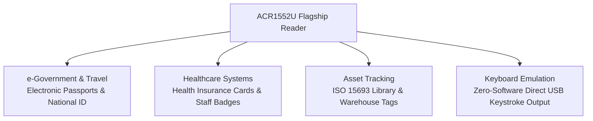

# ACR1552U — USB NFC Reader IV (4th Generation) Complete Guide

> **Quick Summary**: The ACR1552U is ACS's 4th-generation flagship multi-protocol USB reader. Delivering ultra-fast **848 kbps** data rates, extended **ISO 15693** vicinity tag support, built-in **Keyboard Emulation mode**, and a hardware **SAM slot**, it is the definitive enterprise solution for healthcare, government e-Passports, and multi-standard asset tracking.

If the ACR122U is the experimental playground and the ACR1252U is the certified NFC specialist, the ACR1552U is the ultimate versatile flagship supporting virtually all 13.56 MHz RFID standards.

## Unboxing & Hardware Overview

- **Dimensions & Weight**: 98.0 × 65.0 × 12.8 mm, white ABS casing, 79–89 g.
- **Antenna**: High-efficiency 50 × 40 mm internal antenna providing an industry-leading **operating range of up to 70 mm**.
- **Interface Variants**: Available in USB Type-A (`ACR1552U-M1`) and USB Type-C (`ACR1552U-MF`).
- **SAM Security Slot**: 1 × ISO 7816 Class A (5V) SIM-sized slot supporting up to 1,250 kbps.
- **Programmable Indicators**: Blue/Green bi-color LED and programmable audio buzzer.

## Specifications Overview

| Item | Specification |
|---|---|
| Generation | 4th Generation (USB NFC Reader IV) |
| Supported Protocols & Tags | **ISO 14443 Types A & B (Parts 1–4), ISO 15693, ISO/IEC 18092 NFC**, MIFARE®, FeliCa, SRI/SRIX, CTS, Innovatron, Picopass, Topaz |
| Operating Frequency | 13.56 MHz |
| Baud Rates | **106 / 212 / 424 / 848 kbps** (ISO 14443); 26 / 53 kbps (ISO 15693) |
| Operating Distance | Up to **70 mm** (depending on transponder geometry) |
| NFC Operating Modes | Smart Card Reader/Writer, **Keyboard Emulation**, Card Emulation |
| SAM Slot | 1 × ISO 7816 Class A (5V) SIM slot (T=0, T=1 protocols, 13.4–1,250 kbps) |
| Extended APDU | ✅ Supported (Up to 64 KB) |
| Host Interface | USB 2.0 Full Speed (12 Mbps), CCID compliant |
| Dimensions / Weight | 98.0 × 65.0 × 12.8 mm / 79–89 g |
| Certifications | ISO 14443, ISO 15693, PC/SC, CCID, CE, FCC, RoHS, REACH, Microsoft WHQL |
| OS Compatibility | Windows 10/11, Linux, macOS, Android, iOS / iPadOS 16+ |
| Official Documentation | [ACR1552U Product Page](https://www.acs.com.hk/en/products/575/acr1552u-usb-nfc-reader-iv/), [API Reference (PDF)](https://downloads.acs.com.hk/drivers/en/API-ACR1552U-1.02.pdf) |

## Comparison: ACR122U vs ACR1252U vs ACR1552U

| Feature | ACR122U | ACR1252U | **ACR1552U** |
|---|---|---|---|
| Max ISO 14443 Speed | 424 kbps | 424 kbps | **848 kbps** |
| Max Read Distance | 50 mm | 50 mm | **70 mm** |
| ISO 15693 Vicinity Support | ❌ | ❌ | **✅ Full Support** |
| Keyboard Emulation Mode | ❌ | ❌ | **✅ Built-in** |
| SAM Security Slot | ❌ | ✅ | **✅ High-speed SAM** |
| Extended APDU (64 KB) | ❌ | ⚠️ Partial | **✅ Native Support** |

:::note Why ISO 15693 Matters
ISO 15693 vicinity cards are widely deployed in library asset management, medical supply tracking, and industrial inventory tags. The ACR1552U allows one unified reader to process both standard access cards (ISO 14443) and inventory tags (ISO 15693).
:::

## Application Architectures



## Installation & Setup (Linux + macOS)

The ACR1552U communicates over standard USB CCID PC/SC protocols.

### Step 1: Install PC/SC Packages (Linux)

```bash
sudo apt update
sudo apt install -y pcscd pcsc-tools libpcsclite-dev libccid
```

### Step 2: Verify USB Enumeration

```bash
lsusb | grep -i "072f"
```

*Expected output:*
```text
Bus 001 Device 005: ID 072f:2300 Advanced Card Systems, Ltd. ACR1552U Reader
```

### Step 3: Run `pcsc_scan`

```bash
pcsc_scan
```

Presenting an ISO 15693 tag or ISO 14443 badge will display the ATR and protocol type in real time.

## Quickstart: Python pyscard Script

```python
from smartcard.System import readers
from smartcard.util import toHexString

r = readers()
if not r:
    print("No PC/SC readers found.")
    exit(1)

reader = r[0]
print(f"Using Reader: {reader}")

conn = reader.createConnection()
conn.connect()

# Query ISO 14443 UID
GET_UID = [0xFF, 0xCA, 0x00, 0x00, 0x00]
data, sw1, sw2 = conn.transmit(GET_UID)

if sw1 == 0x90 and sw2 == 0x00:
    print(f"Card Serial / UID: {toHexString(data)}")
else:
    print(f"Status: {sw1:02X} {sw2:02X}")
```

## Troubleshooting

### 1. ISO 15693 tags not responding to standard APDU
- **Cause**: ISO 15693 tags utilize distinct command structures from ISO 14443 Type A cards.
- **Fix**: Consult the ACS ACR1552U Reference Manual for specific ISO 15693 transparent command wrapper formats.

### 2. Keyboard Emulation not outputting keystrokes
- **Cause**: Reader is configured in standard PC/SC mode rather than HID Keyboard Emulation mode.
- **Fix**: Use the ACS Configuration Tool to enable Keyboard Emulation and configure desired delimiter characters (e.g., Enter or Tab).

### 3. SAM communication errors
- **Cause**: SAM card mismatch or improper seating.
- **Fix**: Ensure standard ISO 7816 Class A (5V) SIM form-factor SAM is properly inserted.

## Related Resources

- [ACS Overview](/acs/)
- [ACR122U Guide](/acs/products/acr122u/)
- [ACR1252U Guide](/acs/products/acr1252u/)
