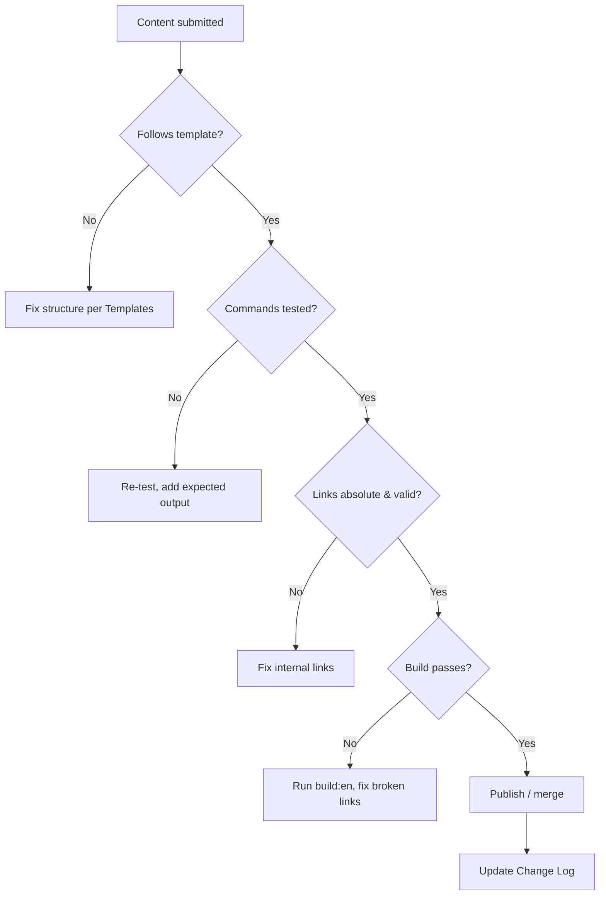

# Review Queue

The Review Queue is the triage workflow for any new, edited, or translated wiki content before it is considered done. It mirrors the `support-policy` decision flow.

## Workflow



## Checklist

Before a page is approved:

- [ ] Frontmatter `id` is unique across the whole wiki.
- [ ] Structure matches the matching template in `Templates`.
- [ ] At least one diagram on setup/guide/troubleshooting pages.
- [ ] Every ```bash command tested with expected output shown.
- [ ] No `TODO` / `TBD` placeholders.
- [ ] All internal links use absolute route paths.
- [ ] `npm run build:en` passes with zero broken links.
- [ ] Translated locales updated in the same change (see `Translation Glossary`).

## After Approval

Record the change in the [`Change Log`](/admin/change-log/).

If the change adds or renames a product, update the `Product Registry` and `Driver Registry` in the same commit.
