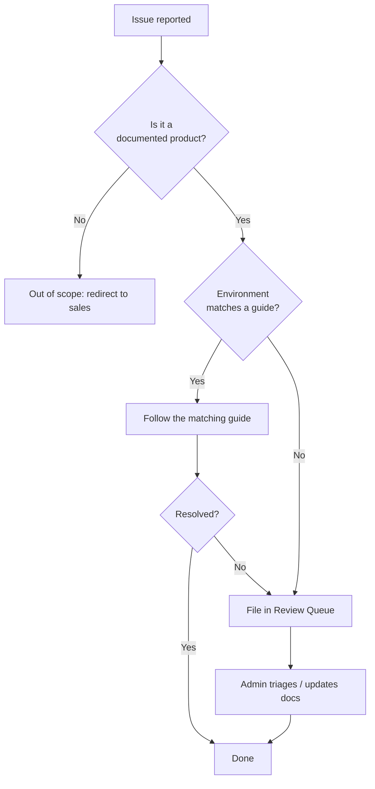

# 支持政策

本页面说明 Yupitek Wiki 涵盖哪些内容、哪些内容不在支持范围内，以及请求如何被分流处理。

## 本维基支持什么

本维基是我们销售的五个产品系列的**技术参考**：

- **ALFA Network** — Linux/Wi-Fi driver（驱动程序）设置、monitor mode（监听模式）、硬件集成。
- **Hak5** — 渗透测试工具的设置、固件和使用。
- **Flipper Zero** — 固件、移动应用和配件。
- **SDRLAB** — 软件无线电设置和 Flipper 扩展模块。
- **ACS** — 智能卡读卡器驱动程序和 NFC 使用。

内容面向**学生和初学者**编写：清晰、分步，包含可用的命令和预期输出。

## 支持级别

| 级别 | 涵盖内容 | 示例 |
|-------|----------------|---------|
| **已记录** | 本维基中的指南已涵盖 | 安装 `rtl8812au` DKMS 驱动程序 |
| **尽力而为** | 合理预期可用，但取决于环境 | 在特殊硬件上使用 Linux |
| **不在范围内** | Yupitek 支持不涵盖 | 第三方固件分支、不受支持的内核 |

## 不在范围内

以下内容**不**在本维基的支持范围内：

- 由制造商未发布的第三方固件分支引起的问题（例如非官方的 Flipper 构建）。
- 内核版本低于各芯片组指南中列出的版本的驱动程序。
- 有缺陷的硬件 — 请联系 [Yupitek 销售](https://www.yupitek.com) 进行 RMA。
- 我们不再销售的产品（当前库存请参阅 产品注册表）。

## 请求如何被分流处理

## 报告本维基的问题

如果某个指南有误、缺少步骤，或某个命令不再有效，请告诉我们。问题会在 审查队列 中跟踪，修复会记录在 [变更日志](/admin/change-log/) 中。

请记住黄金法则：在对生产环境或评估目标运行命令之前，务必先在测试环境中验证。