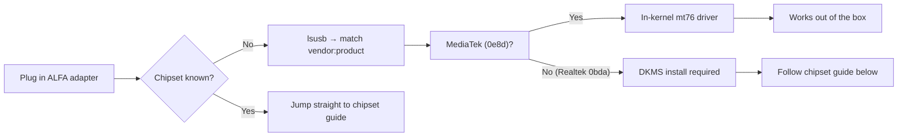

# ALFA 驱动指南——总览

> **一句话定位（One-liner）**：Linux 上的每一款 ALFA 无线网卡适配器都由**七种芯片组**之一驱动——三种 MediaTek 芯片组使用**内核内置**驱动，开箱即用；四种 Realtek 芯片组需要**树外 DKMS** 构建。在下面找到你的芯片组并跳到对应指南。

## 芯片组地图

| 芯片组 | 网卡适配器 | 驱动绑定 | 内核内置？ | 指南 |
|---------|----------|----------------|------------|-------|
| MT7612U | AWUS036ACM | `mt76x2u` | ✅ 内核内置 | [MT7612U 指南](/alfa-network/drivers/mt7612u/) |
| MT7610U | AWUS036ACHM | `mt76x0u` | ✅ 内核内置 | [MT7610U 指南](/alfa-network/drivers/mt7610u/) |
| MT7921AUN | AWUS036AXM、AWUS036AXML | `mt7921u` | ✅ 内核内置 | [MT7921AUN 指南](/alfa-network/drivers/mt7921aun/) |
| RTL8812AU | AWUS036ACH | 树外 / DKMS | ❌ 非内核内置 | [RTL8812AU 指南](/alfa-network/drivers/rtl8812au/) |
| RTL8811AU | AWUS036ACS | 树外 / DKMS | ❌ 非内核内置 | [RTL8811AU 指南](/alfa-network/drivers/rtl8811au/) |
| RTL8832BU | AWUS036AX、AWUS036AXER | 树外 / DKMS | ❌ 非内核内置 | [RTL8832BU 指南](/alfa-network/drivers/rtl8832bu/) |
| RTL8821CU | AWUS036EACS | 树外 / DKMS | ❌ 非内核内置 | [RTL8821CU 指南](/alfa-network/drivers/rtl8821cu/) |

## 如何选择

1. **识别芯片组**——运行 `lsusb` 并把 `vendor:product` 对与你的网卡适配器规格表匹配。
2. **MediaTek 芯片组？** 你完成了——驱动在内核里。直接去对应指南，用 `dmesg` / `iw dev` 确认并启用监听模式。
3. **Realtek 芯片组？** 按照对应指南构建 DKMS 模块。记住：内核更新后需要 `sudo dkms autoinstall`。

完整的系统级教程在 [Linux 设置指南](/alfa-network/linux-setup-ubuntu/)和[兼容性矩阵](/alfa-network/linux-compatibility-matrix/)中。