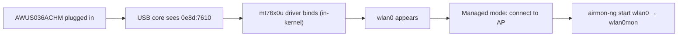

# MT7610U 驱动指南（AWUS036ACHM）

> **一句话定位（One-liner）**：**MediaTek MT7610U** 是 **AWUS036ACHM** 内部的 1T1R（单流）双频芯片组——一款预算友好的 AC433 网卡适配器，其 `mt76x0u` 驱动**自 4.19 起就在 Linux 内核中**。和它的大哥 MT7612U 一样，在任何现代 Linux 上即插即用。

## 概念：「小弟弟」芯片组

MT7612U 是 2×2 无线电，而 MT7610U 是 **1×1**——一个空间流，所以 5 GHz 上最高 433 Mbps 而不是 867。这正是 AWUS036ACHM 的 AC433 规格。速度上的损失换来了简单和价格：它是仍能给你**内核内置驱动 + 双频 + 可用的监听模式**的最便宜 ALFA 网卡适配器。

驱动位于同一个主线 `mt76` 家族（`drivers/net/wireless/mediatek/mt76/mt76x0/`），所以体验与 MT7612U 完全相同：

- 插上 → 接口出现。无需安装。
- 无 DKMS → 内核更新时无需维护任何东西。
- 通过标准 `mac80211` 工具实现监听模式 + 注入。



## 前置需求

- [ ] 内核 **4.19 或更新**的 Linux
- [ ] `sudo` 权限
- [ ] AWUS036ACHM（或任意 MT7610U 适配器）

## 第 1 步：验证驱动

```bash
lsusb | grep -i mediatek
lsmod | grep mt76x0
```

**预期输出**：

```text
Bus 001 Device 005: ID 0e8d:7610 MediaTek Inc. MT7610U
mt76x0u                20480  0
mt76x02_common         49152  2 mt76x0u
mt76                   94208  2 mt76x0u,mt76x02_common
```

如果 `lsmod` 为空但 `lsusb` 能看到设备：`sudo modprobe mt76x0u`。

## 第 2 步：确认接口

```bash
iw dev
```

**预期输出**：

```text
phy#0
	Interface wlan0
		ifindex 3
		addr 00:c0:ca:xx:xx:xx
		type managed
```

## 第 3 步：连接

```bash
nmcli device wifi connect "MySSID" password "my-passphrase"
```

**预期输出**：`Device 'wlan0' successfully activated with 'MySSID'.`

> 在相同距离下，吞吐量大约只有 AWUS036ACM 的**一半**——这就是 1×1 无线电。对于课堂练习、记笔记和轻度捕获，完全够用。

## 第 4 步：监听模式

```bash
sudo ip link set wlan0 down
sudo iw wlan0 set monitor none
sudo ip link set wlan0 up
iw dev
```

**预期输出**：`type monitor`。或使用 Aircrack-ng 的辅助工具：

```bash
sudo airmon-ng start wlan0
```

注入检查：

```bash
sudo aireplay-ng --test wlan0mon
```

**预期输出**：`30/30: 100%` 和 `Injection is working!`

## 第 5 步：恢复正常

```bash
sudo airmon-ng stop wlan0mon
sudo systemctl restart NetworkManager
```

## 故障排查

| 症状 | 原因 | 修复 |
|---|---|---|
| 不在 `lsusb` 中 | 供电 / 线缆 | 换端口、带供电的集线器——[故障排查索引](/alfa-network/troubleshooting/) |
| 没有接口 | 驱动未加载 | `sudo modprobe mt76x0u`；检查 `dmesg \| grep mt76` |
| 5 GHz 吞吐量卡在 ~150 Mbps | 这就是 1×1 硬件极限 | 不是 bug——AC433 等级意味着 ~300–400 Mbps 链路、~150–250 实际值 |
| 监听模式被拒绝 | 内核 < 4.19 | 升级内核 / 操作系统 |
| 注入测试失败 | 信道无信号 / 射频区域 | `sudo iw wlan0mon set channel 6`，在接入点附近测试 |

## 参考

- [AWUS036ACHM 产品页面](/alfa-network/products/awus036achm/)
- [Ubuntu 设置指南](/alfa-network/linux-setup-ubuntu/)和 [Kali 设置指南](/alfa-network/linux-setup-kali/)
- [兼容性矩阵](/alfa-network/linux-compatibility-matrix/)
- 主线驱动源码：Linux 内核树中的 `drivers/net/wireless/mediatek/mt76/mt76x0/`