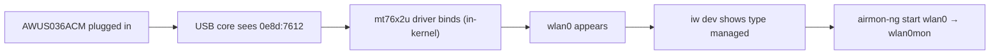

# MT7612U 驱动指南（AWUS036ACM）

> **一句话定位（One-liner）**：**MediaTek MT7612U** 是 **AWUS036ACM** 内部的芯片组——它的 `mt76x2u` 驱动**自 Linux 内核 4.19 起内置**。仅此一点就让 ACM 成为 Linux 上摩擦最小的 ALFA 网卡适配器：无需安装、无需 DKMS、无需维护。

## 概念：「内核内置」对 MT7612U 意味着什么

MT7612U 是一款 **2T2R**（2 发 / 2 收）双频 802.11ac 无线电——即 AC1200 规格中的「300 + 867 Mbps」。由于 MediaTek 把驱动上游进了主线内核（`drivers/net/wireless/mediatek/mt76/`），每个 Linux 发行版都预编译了它。

对学生来说，实际影响巨大：

- **Ubuntu / Kali / Debian / Fedora**：插上 → `wlan0` 就存在。零命令。
- **无 DKMS**：内核更新时无需重建任何东西。网卡适配器不会像 Realtek DKMS 模块那样「升级后坏掉」。
- **监听模式 + 数据包注入**通过标准 `mac80211` 接口工作——无需特殊工具。



## 前置需求

- [ ] 内核 **4.19 或更新**的 Linux（`uname -r`——Ubuntu 20.04+ / 任意较新 Kali 均可）
- [ ] `sudo` 权限
- [ ] AWUS036ACM（或任意 MT7612U 适配器）

## 第 1 步：验证驱动已加载

插上网卡适配器并检查：

```bash
lsusb | grep -i mediatek
lsmod | grep mt76x2u
```

**预期输出**：

```text
Bus 001 Device 004: ID 0e8d:7612 MediaTek Inc. MT7612U 802.11a/b/g/n/ac 2T2R Wireless Adapter
mt76x2u                24576  0
mt76x2_common          36864  1 mt76x2u
mt76                   94208  2 mt76x2u,mt76x2_common
```

`mt76x2u` 行带有非零引用计数，说明驱动认领了你的网卡适配器。（如果 `lsmod` 什么都没有但 `lsusb` 能看到设备，说明驱动是按需加载的内核模块——运行 `sudo modprobe mt76x2u`。）

## 第 2 步：确认接口

```bash
iw dev
```

**预期输出**：

```text
phy#0
	Interface wlan0
		ifindex 3
		addr 00:c0:ca:xx:xx:xx
		type managed
```

> **你可能想知道**——*「为什么我的 MAC 是 00:c0:ca:...？」* 因为 `00:c0:ca` 是 **ALFA MAC OUI**——每款 ALFA 网卡适配器都以这三个字节开头。在满是适配器的实验室里识别设备时很方便。

## 第 3 步：连接（managed 模式）

```bash
nmcli device wifi connect "MySSID" password "my-passphrase"
```

**预期输出**：`Device 'wlan0' successfully activated with 'MySSID'.`

## 第 4 步：监听模式（有趣的部分）

```bash
sudo ip link set wlan0 down
sudo iw wlan0 set monitor none
sudo ip link set wlan0 up
iw dev
```

**预期输出**：接口行现在显示 `type monitor`。或者使用 Aircrack-ng 辅助工具：

```bash
sudo airmon-ng start wlan0
```

**预期输出**：

```text
PHY	Interface	Driver		Chipset
phy0	wlan0		mt76x2u		MediaTek Inc. MT7612U
		(mac80211 monitor mode vif enabled for [phy0]wlan0 on [phy0]wlan0mon)
```

注入自测（广播——在任何信道上都安全）：

```bash
sudo aireplay-ng --test wlan0mon
```

**预期输出**：`30/30: 100%` 和 `Injection is working!`

## 第 5 步：把它关回去

```bash
sudo airmon-ng stop wlan0mon
sudo systemctl restart NetworkManager
```

## 故障排查

| 症状 | 原因 | 修复 |
|---|---|---|
| `lsusb` 什么都没有 | 供电 / 线缆问题 | 换一个端口、带供电的集线器、另一根线缆——参见[故障排查索引](/alfa-network/troubleshooting/) |
| `lsusb` 正常，没有 `wlan0` | 驱动未加载（非常罕见） | `sudo modprobe mt76x2u`；检查 `dmesg \| grep mt76` |
| `airmon-ng` 报告「monitor mode not supported」 | 内核低于 4.19 | 升级内核 / 操作系统 |
| 监听模式正常但注入失败 | 信道错误 / 无射频信号区域 | `sudo iw wlan0mon set channel 6`；在接入点附近测试 |
| 挂起/恢复后 WLAN 消失 | 某些笔记本上已知的 USB 怪癖 | 恢复后重新插拔网卡适配器 |

## 参考

- [AWUS036ACM 产品页面](/alfa-network/products/awus036acm/)
- [Ubuntu 设置指南](/alfa-network/linux-setup-ubuntu/)和 [Kali 设置指南](/alfa-network/linux-setup-kali/)
- [兼容性矩阵](/alfa-network/linux-compatibility-matrix/)
- 主线驱动源码：Linux 内核树中的 `drivers/net/wireless/mediatek/mt76/mt76x2/`