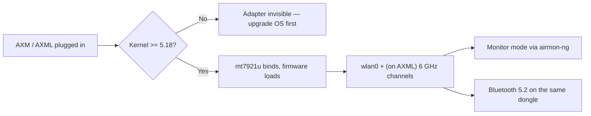

# MT7921AUN 驱动指南（AWUS036AXM / AWUS036AXML）

> **一句话定位（One-liner）**：**MediaTek MT7921AUN** 驱动 **AWUS036AXM**（Wi-Fi 6，AX3000）和 **AWUS036AXML**（Wi-Fi 6E，带 6 GHz 频段的 AXE3000）。它的 `mt7921u` 驱动**自内核 5.18 起进入主线**——是备受喜爱的 MT7612U 的现代继任者，也是本产品线在 Linux 上通往 6 GHz 的唯一路径。

## 概念：MT7921AUN 给你带来什么

这是 ALFA 产品线中 MediaTek 最新的无线电，一款 **2×2:2 802.11ax** 设计，同一适配器上还包含**蓝牙 5.2**。对 Linux 用户有三件事很重要：

1. **内核内置驱动**（`drivers/net/wireless/mediatek/mt76/mt7921/`），自 **Linux 5.18** 起——无需 DKMS、无需编译。
2. **Wi-Fi 6E**：AXML 变体打开 **6 GHz 频段**（5 GHz 以上的信道 1–233），这是目前可用频谱中拥塞最少的部分。
3. **需要固件 blob**——驱动从 `linux-firmware` 加载 `mt7921` 固件，所以请保持该软件包更新。

主要注意事项：由于驱动需要 **5.18+ 内核**，较旧的操作系统版本看不到这款网卡适配器。Ubuntu 22.04+ 和较新的 Kali 没问题；Ubuntu 20.04 不行。



## 前置需求

- [ ] 内核 **5.18 或更新**的 Linux（`uname -r`）
- [ ] 已安装且版本较新的 `linux-firmware` 软件包
- [ ] `sudo` 权限
- [ ] AWUS036AXM 或 AWUS036AXML

## 第 1 步：内核检查

```bash
uname -r
```

**预期输出**（示例）：

```text
6.8.0-51-generic        # Ubuntu 24.04 — OK
6.1.0-kali9-amd64       # Kali — OK
5.15.0-91-generic       # Ubuntu 22.04 base — TOO OLD for mt7921u
```

在 5.15 或更旧版本上：`sudo apt update && sudo apt upgrade`（或在 Ubuntu 22.04 上安装 HWE 内核）。旧内核上驱动不存在——这是硬性要求，不是配置细节。

## 第 2 步：验证驱动和固件

插上网卡适配器：

```bash
lsusb | grep -i mediatek
lsmod | grep mt7921u
dmesg | grep -i mt7921
```

**预期输出**：

```text
Bus 001 Device 006: ID 0e8d:7961 MediaTek Corp. MT7921U
mt7921u                65536  0
[   12.345] mt7921u: probe with 0e8d:7961
[   12.456] mt7921e: HW/SW Version: 0x22010000, Build Time: 20231120163911a
```

没有 `dmesg` 行但 `lsusb` 显示设备？更新固件：

```bash
sudo apt install linux-firmware
```

然后重新插拔网卡适配器。

## 第 3 步：确认接口和频段

```bash
iw dev
iwlist wlan0 freq | grep -E "^          Channel" | sort -u | tail -5
```

**预期输出**：一个接口行；对于 AXML，频率列表应包含 **6 GHz 信道**（「6 GHz band」下的 `Channel 1 ... Channel 233`）。如果 AXML 上只看到 2.4/5 GHz 条目，可能是你的法规域隐藏了 6 GHz——`sudo iw reg set TW`（使用你的国家代码）并让接口 down/up。

## 第 4 步：连接

```bash
nmcli device wifi connect "MySSID" password "my-passphrase"
```

**预期输出**：`Device 'wlan0' successfully activated with 'MySSID'.`

## 第 5 步：监听模式

与其他内核内置芯片组相同的标准工作流：

```bash
sudo airmon-ng start wlan0
sudo aireplay-ng --test wlan0mon
```

**预期输出**：创建 `wlan0mon`；注入测试报告 `30/30: 100%`。

> **你可能想知道**——*「监听模式在 6 GHz 上能用吗？」* 在 AXML 上，使用现代内核和范围内支持 6 GHz 的接入点，6 GHz 频段支持监听模式。早期内核有怪癖；如果 6 GHz 上捕获不到任何东西，先在 5 GHz 上测试，把驱动问题与环境问题区分开。

## 第 6 步：蓝牙

AXM/AXML 在同一 USB 设备上暴露 BT 5.2。配对：

```bash
bluetoothctl
power on
scan on
pair <MAC>
```

**预期输出**：你的设备显示 `Pairing successful`。如果 `bluetoothctl` 什么都看不到，加载蓝牙协议栈模块：`sudo modprobe btusb` 并重试。

## 故障排查

| 症状 | 原因 | 修复 |
|---|---|---|
| `lsusb` 什么都没有 | 供电（AXML 耗电更大）/ 线缆 | 带供电的集线器；带数据线的 USB-C 线缆 |
| `lsusb` 正常，没有 `wlan0` | 内核 < 5.18，或固件缺失 | 升级内核；`sudo apt install linux-firmware`；重启 |
| `dmesg` 显示固件加载失败 | 固件 blob 过旧 | 更新 `linux-firmware`，拔插重试 |
| 6 GHz 信道缺失（AXML） | 法规域未设置 | `sudo iw reg set <CC>`；让接口 bounce |
| 找不到 BT 设备 | `btusb` 未加载 | `sudo modprobe btusb` |
| 监听模式在 2.4/5 GHz 正常但 6 GHz 不行 | 早期内核怪癖或没有 6 GHz 接入点 | 在 5 GHz 重测；更新内核；使用 6 GHz 接入点 |

## 参考

- [AWUS036AXM 产品页面](/alfa-network/products/awus036axm/)和 [AWUS036AXML 产品页面](/alfa-network/products/awus036axml/)
- [Ubuntu 设置指南](/alfa-network/linux-setup-ubuntu/)和 [Kali 设置指南](/alfa-network/linux-setup-kali/)
- [兼容性矩阵](/alfa-network/linux-compatibility-matrix/)
- 主线驱动源码：Linux 内核树中的 `drivers/net/wireless/mediatek/mt76/mt7921/`
- [linux-firmware](https://git.kernel.org/pub/scm/linux/kernel/git/firmware/linux-firmware.git/)——MT7921 的固件 blob