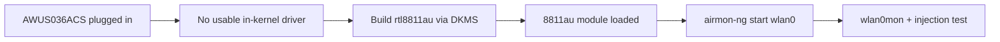

# RTL8811AU 驱动指南（AWUS036ACS）

> **一句话定位（One-liner）**：**Realtek RTL8811AU** 是 55 mm **AWUS036ACS** 内部的 1×1 AC433 芯片组——口袋大小的监听模式伴侣。和它的大哥 RTL8812AU 一样，需要通过 DKMS 使用社区 `rtl8811au` 驱动，但构建过程完全相同。

## 概念：同一家族，单流

RTL8811AU 本质上是 RTL8812AU 家族的 1×1 变体：一个空间流，5 GHz 上最高 433 Mbps，功耗更低，板卡更小。ALFA 把它装进小巧的 ACS 机身，配两根 5 dBi 外置天线——你得到经典 ALFA 渗透测试行为，却装在一个能藏进笔袋的尺寸里。

驱动方面，与 RTL8812AU 的故事没有区别：**没有带监听支持的内核内置驱动**，所以我们使用社区 `rtl8811au` DKMS 驱动。注意该驱动也覆盖 RTL8821AU 变体，所以如果你的 `dkms status` 在类似的适配器上显示相同的模块名，不要惊慌。



## 前置需求

- [ ] Linux（Ubuntu 20.04+ / Kali / Debian）
- [ ] `sudo apt install -y build-essential dkms git`
- [ ] `sudo` 权限
- [ ] AWUS036ACS

## 第 1 步：克隆并构建

```bash
cd /opt
sudo git clone https://github.com/aircrack-ng/rtl8811au.git
cd rtl8811au
sudo make dkms_install
```

**预期输出**：

```text
DKMS: install completed.
```

## 第 2 步：加载并验证

```bash
sudo modprobe 8811au
iw dev
```

**预期输出**：一个 `Interface wlan0`（或 `wlan1`）行。如果网卡适配器只在重新插拔后才出现，把模块加入自动加载：

```bash
echo 8811au | sudo tee /etc/modules-load.d/alfa.conf
```

## 第 3 步：监听模式 + 注入

```bash
sudo airmon-ng check kill
sudo airmon-ng start wlan0
sudo aireplay-ng --test wlan0mon
```

**预期输出**：

```text
PHY	Interface	Driver		Chipset
phy0	wlan0		8811au		Realtek Semiconductor Corp. RTL8811AU
...
12:34:56  Injection is working!
12:34:56  30/30:  100%
```

## 第 4 步：恢复正常

```bash
sudo airmon-ng stop wlan0mon
sudo systemctl restart NetworkManager
```

## 故障排查

| 症状 | 原因 | 修复 |
|---|---|---|
| DKMS 构建失败 | 缺少头文件 / 内核太新 | `sudo apt install linux-headers-$(uname -r)`；`sudo git pull && sudo make dkms_install` |
| 接口只能在 managed 模式 | 内核桩模块 `rtl8811au` 抢占了它 | `echo "blacklist rtl8811au" \| sudo tee /etc/modprobe.d/alfa-8811au.conf`；重启 |
| 注入 0/30 | 空信道 | `sudo iw wlan0mon set channel 6`；在接入点附近测试 |
| 吞吐量低于预期 | 1×1 无线电（AC433）——硬件极限 | 不是 bug；5 GHz 上实际值约 150–250 Mbps |
| 重启后检测不到 | 模块未自动加载 | 把 `8811au` 加入 `/etc/modules-load.d/alfa.conf` |

## 参考

- [AWUS036ACS 产品页面](/alfa-network/products/awus036acs/)
- [Kali 设置指南](/alfa-network/linux-setup-kali/)
- [Ubuntu 设置指南](/alfa-network/linux-setup-ubuntu/)
- [故障排查索引](/alfa-network/troubleshooting/)
- 驱动仓库：[aircrack-ng/rtl8811au](https://github.com/aircrack-ng/rtl8811au)