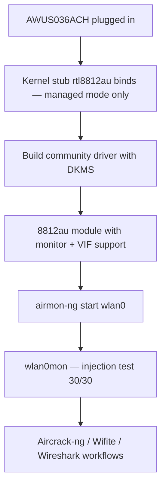

# RTL8812AU 驱动指南（AWUS036ACH）

> **一句话定位（One-liner）**：**Realtek RTL8812AU** 是 **AWUS036ACH** 内部传奇的 2×2 双频芯片组——你看过的每个 Kali 教程里都有的那款网卡适配器。它**不在 Linux 内核中**，所以你需要用 DKMS 构建一次 `rtl8812au` 驱动，之后它就能扛过每一次内核更新。

## 概念：最著名的 Wi-Fi 黑客芯片组

RTL8812AU 以高功率（500 mW）无线电和两根外置天线驱动 AC1200 的 AWUS036ACH。它的名声来自 **aircrack-ng 社区**：多年的渗透测试工作把树外驱动打磨得正好满足 Kali 需要的两件事——**监听模式**和**数据包注入**。

为什么它不在内核里？Realtek 从未上游过一个干净的驱动；内核保留了一个没有监听支持的桩模块（`staging/` 中的 `rtl8812au`）。社区驱动（`aircrack-ng/rtl8812au`）取代了它。代价是**你必须构建一次**——之后 DKMS 系统会在每次内核更新时自动重新编译，所以「一次性构建」真的就是一次。



## 前置需求

- [ ] 任意较新的 Linux（Ubuntu 20.04+ / Kali / Debian）
- [ ] 构建工具 + 网络：`sudo apt install -y build-essential dkms git`
- [ ] `sudo` 权限
- [ ] AWUS036ACH

## 第 1 步：移除（无用的）内核桩模块

某些发行版自带一个 Realtek 桩驱动，会抢占网卡适配器并拒绝监听模式。先卸载它：

```bash
sudo modprobe -r rtl8812au 2>/dev/null
```

（如果命令报错「not found」，很好——没有桩模块。`2>/dev/null` 隐藏了噪音。）

## 第 2 步：用 DKMS 构建社区驱动

```bash
cd /opt
sudo git clone https://github.com/aircrack-ng/rtl8812au.git
cd rtl8812au
sudo make dkms_install
```

**预期输出**：

```text
Kernel preparation unnecessary for this kernel.  Skipping...
...
DKMS: install completed.
```

验证模块已在 DKMS 注册：

```bash
dkms status
```

**预期输出**：

```text
rtl8812au/5.6.4.2, 6.8.0-51-generic, aarch64: installed
```

## 第 3 步：加载它

```bash
sudo modprobe 8812au
iw dev
```

**预期输出**：出现 `Interface wlan0`（或 `wlan1`）。如果重启后桩模块又加载了，把它加入黑名单：

```bash
echo "blacklist rtl8812au" | sudo tee /etc/modprobe.d/alfa-8812au.conf
```

并把真正的模块加入自动加载：

```bash
echo 8812au | sudo tee /etc/modules-load.d/alfa.conf
```

## 第 4 步：监听模式 + 注入

```bash
sudo airmon-ng check kill
sudo airmon-ng start wlan0
sudo aireplay-ng --test wlan0mon
```

**预期输出**：

```text
PHY	Interface	Driver		Chipset
phy0	wlan0		8812au		Realtek Semiconductor Corp. RTL8812AU
...
12:34:56  Injection is working!
12:34:56  30/30:  100%
```

那行 `30/30` 就是 AWUS036ACH 在做它最出名的事。

## 第 5 步：回到 managed 模式

```bash
sudo airmon-ng stop wlan0mon
sudo systemctl restart NetworkManager
```

## 故障排查

| 症状 | 原因 | 修复 |
|---|---|---|
| `make dkms_install` 失败并提示 "No rule to make target" | 仓库快照比你的新内核旧 | 再次 `sudo git pull && sudo make dkms_install` |
| 构建失败：缺少头文件 | 未安装头文件 | `sudo apt install linux-headers-$(uname -r)` |
| 网卡适配器只能在 managed 模式 | 内核桩模块先抢占了它 | 黑名单 `rtl8812au`（第 3 步）并重启 |
| 注入 `0/30` | 信道没有接入点 / 驱动怪癖 | `sudo iw wlan0mon set channel 6`；`git pull` 驱动；重测 |
| 重启后网卡适配器消失 | 模块未自动加载 | `echo 8812au \| sudo tee /etc/modules-load.d/alfa.conf` |
| 升级后 `dkms status` 显示 Error | 重建静默失败 | `sudo dkms autoinstall` |

## 参考

- [AWUS036ACH 产品页面](/alfa-network/products/awus036ach/)
- [Kali 设置指南](/alfa-network/linux-setup-kali/)——完整的监听/注入工作流
- [Ubuntu 设置指南](/alfa-network/linux-setup-ubuntu/)
- [故障排查索引](/alfa-network/troubleshooting/)
- 驱动仓库：[aircrack-ng/rtl8812au](https://github.com/aircrack-ng/rtl8812au)