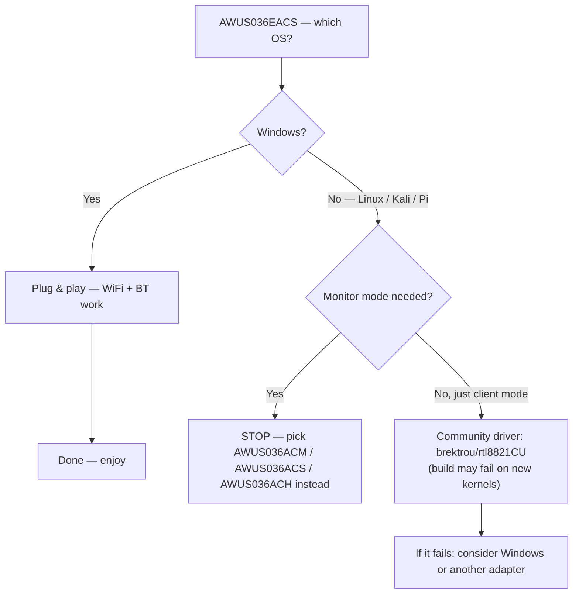

# RTL8821CU 驱动指南（AWUS036EACS）

> **一句话定位（One-liner）**：**Realtek RTL8821CU** 是纳米 **AWUS036EACS** 内部的 WiFi 5 + 蓝牙 4.2 组合芯片组。这里是诚实版本：在 **Windows 上它即插即用**，在 **Linux 上驱动情况很糟糕**，监听模式 / 数据包注入**不可靠**。如果你的项目需要 Linux 监听模式，请改选 [AWUS036ACM](/alfa-network/products/awus036acm/) 或 [AWUS036ACS](/alfa-network/products/awus036acs/)。

## 概念：Windows 优先的芯片组

RTL8821CU 面向的买家与 ALFA 产品线其他产品截然不同：想要**一个微型适配器里同时有 WiFi + 蓝牙**、在 Windows 上零驱动烦恼的台式机/笔记本用户。它是 AC600 等级（150 + 433 Mbps），带集成 2 dBi 天线，没有外置 RP-SMA 接口。

Linux 的故事才是尴尬的部分。内核**没有 RTL8821CU 的上游驱动**，社区驱动的情况也不稳定：

- 最知名的仓库 [`brektrou/rtl8821CU`](https://github.com/brektrou/rtl8821CU)（覆盖 RTL8811CU/RTL8821CU）可以针对较旧内核构建，但**在新内核上经常坏**——包括现代发行版上的内核 6.x。
- 已报告的问题包括网卡适配器不稳定、某些硬件上系统冻结，以及**监听模式不可靠 / 无法注入**。
- 同一芯片组的蓝牙需要单独的驱动路径（`rtl_bt` 固件），同样滞后。

我们不会假装不是这样：对于 Linux，这是用错了工具。



## 前置需求（给勇于尝试的 Linux 用户）

- [ ] 内核 **≤ 5.x** 的 Linux，构建成功率最高（内核 6.x 常常失败）
- [ ] `sudo apt install -y build-essential dkms git`
- [ ] 耐心——这是实验性领域

## 第 1 步：尝试社区驱动

```bash
cd /opt
sudo git clone https://github.com/brektrou/rtl8821CU.git
cd rtl8821CU
sudo make dkms_install
```

**可能的结果**：

```text
DKMS: install completed.        # 🎉 it worked (older kernels)
# or
make: *** [Makefile:...] Error 1  # 😓 build failed (new kernels)
```

如果构建成功，加载并检查：

```bash
sudo modprobe 8821cu
iw dev
```

**预期输出（成功情况）**：一个 `Interface wlan0` 行。

## 第 2 步：现实检验——连接，然后测试监听模式

```bash
nmcli device wifi connect "MySSID" password "my-passphrase"
sudo airmon-ng start wlan0
sudo aireplay-ng --test wlan0mon
```

**预期输出**：managed 模式连接通常能用。注入测试就是赌博——从 `30/30`（罕见）到 `Failed`（常见）都有可能。如果失败，这不是可修复的配置问题；这是驱动的已知局限。

## 推荐路径

| 你的目标 | 推荐网卡适配器 |
|---|---|
| Kali / 监听模式 / 数据包注入 | [AWUS036ACM](/alfa-network/products/awus036acm/)（内核内置、便宜）或 [AWUS036ACH](/alfa-network/products/awus036ach/)（经典高功率） |
| 预算级口袋监听网卡适配器 | [AWUS036ACS](/alfa-network/products/awus036acs/) |
| Windows 桌面 WiFi + BT 组合 | **AWUS036EACS——就留在这里** |

## 故障排查

| 症状 | 原因 | 修复 |
|---|---|---|
| `make dkms_install` 在内核 6.x 上失败 | 驱动未针对新内核维护 | 使用较旧内核 / 发行版，或更换网卡适配器 |
| 网卡适配器不稳定、随机断连 | 已知的 RTL8821CU Linux 怪癖 | Windows 才是该芯片组受支持的环境 |
| 监听模式「能用」但注入失败 | 驱动局限 | 不要依赖它——使用内核内置芯片组网卡适配器 |
| 蓝牙缺失 | `rtl_bt` 固件未加载 | `sudo apt install linux-firmware`；仍然不稳定——做好最坏打算 |
| 在 Windows 上一切正常 | — | 这正是设计意图——在那里享受它 |

## 参考

- [AWUS036EACS 产品页面](/alfa-network/products/awus036eacs/)
- [网卡适配器对比](/alfa-network/wifi-adapter-comparison/)——找一款 Linux 友好的替代品
- [兼容性矩阵](/alfa-network/linux-compatibility-matrix/)
- [故障排查索引](/alfa-network/troubleshooting/)
- 社区驱动：[brektrou/rtl8821CU](https://github.com/brektrou/rtl8821CU)