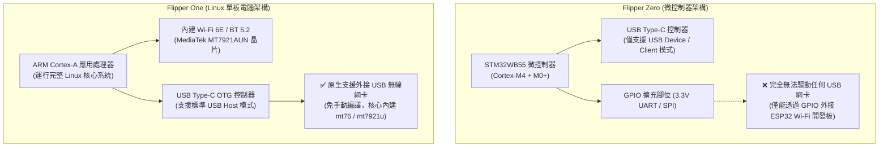

# Flipper One × ALFA Network 相容性與選型指南

> **技術摘要**：Flipper One 採用 ARM Cortex-A 應用處理器並運行完整 Linux 作業系統，其內建無線晶片即為 **MediaTek MT7921AUN**（與 **ALFA AWUS036AXML** 核心完全同源）。本文深入探討 Flipper One 內建 Wi-Fi 6E 與外接高功率 ALFA 網卡的選型架構，並徹底釐清 **Flipper Zero（無 USB Host）無法外接網卡** 的硬件架構差異。

---

## 1. Flipper Zero vs Flipper One：架構本質差異

社群常見的誤解是「能否透過 USB-C 轉接頭將 ALFA 網卡插在 Flipper Zero 上？」。答案是**硬件層面完全不可能**：



---

## 2. 內建 MT7921AUN vs 外接 ALFA 網卡選型矩陣

Flipper One 雖然已內建 MT7921AUN 晶片，但其受限於隨身設備的體積與天線尺寸。搭配外接 ALFA 網卡可實現多網卡並行與遠距射頻穿透：

| 評估維度 | Flipper One 內建射頻 | 外接 ALFA AWUS036AXML | 外接 ALFA AWUS036ACM |
|---|---|---|---|
| **晶片型號** | MediaTek MT7921AUN | MediaTek MT7921AUN | MediaTek MT7612U |
| **支援協定** | Wi-Fi 6E (802.11ax) | Wi-Fi 6E (802.11ax) | Wi-Fi 5 (802.11ac) |
| **支援頻段** | 2.4 GHz / 5 GHz / 6 GHz | 2.4 GHz / 5 GHz / 6 GHz | 2.4 GHz / 5 GHz |
| **天線型式** | 內部微型 PCB 天線 | 2× 5dBi RP-SMA 外接天線 | 2× 5dBi RP-SMA 外接天線 |
| **發射功率** | 標準手持限制 (~14-16 dBm) | 高功率放大器 (~20-23 dBm) | 高功率放大器 (~20-23 dBm) |
| **Linux 驅動** | `mt7921u` (In-kernel) | `mt7921u` (In-kernel) | `mt76x2u` (In-kernel) |
| **定位評比** | 日常隨身便攜掃描 | 🏆 **Top Pick**：Wi-Fi 6E 全頻段遠距深度監聽 | 🥈 **Best Value**：極度穩定之 5GHz 封包注入 |

---

## 3. Linux 終端檢測與雙網卡並行配置

將 ALFA AWUS036AXML 透過 Type-C OTG 轉接線插入 Flipper One：

```bash
# 1. 檢視 USB 匯流排辨識
lsusb

# 輸出：
# Bus 001 Device 002: ID 0e8d:7961 MediaTek Inc. Wireless_Device

# 2. 檢視無線實體射頻 (PHY) 能力
iw phy

# 輸出將包含三頻段完整頻寬支援：
# Band 1: 2.4 GHz (20/40 MHz)
# Band 2: 5 GHz (20/40/80/160 MHz)
# Band 4: 6 GHz (20/40/80/160 MHz HE channels)

# 3. 建立雙網卡工作架構 (內建連網 + 外接監聽)
# 內建網卡 wlan0 保持连接至熱點 (SSH / Web 存取)
# 外接 ALFA 網卡 wlan1 開啟 Monitor 模式：
sudo iw dev wlan1 interface add mon0 type monitor
sudo ip link set mon0 up
```

---

## 4. 最新開發進度與誠實限制聲明

1. **6GHz 頻段支援現況**：截至目前開發版本，6GHz (Wi-Fi 6E) 頻段已可在 Linux 主線核心正常掃描與關聯，但部分開源封包注入（Frame Injection）工具對 6GHz 規範尚未完全成熟。
2. **雙頻併發監聽**：Flipper One 內建射頻可作為管理连接（如 SSH/Web），外接 ALFA 網卡可專職進行單一頻道監聽，是極佳的雙網卡組合。
