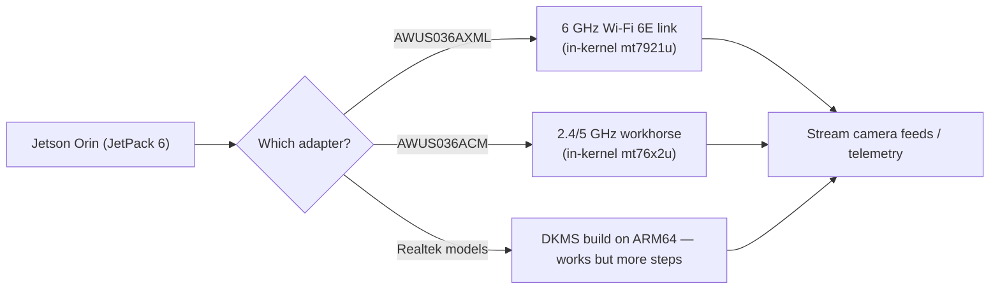

# ALFA 网卡适配器在 NVIDIA Jetson 上（Orin Nano / NX）

> **一句话定位（One-liner）**：你的 Jetson 是视觉计算机，不是路由器——所以它内置的 Wi-Fi 通常又弱又是单频。ALFA 网卡适配器解决这个问题：**插上 AWUS036AXML 获得 6 GHz Wi-Fi 6E 流传输**，或使用任意内核内置 ALFA 获得可靠的机器人遥测，甚至监听模式。

## 概念：为什么 Jetson 需要外置网卡适配器

Jetson Orin Nano/NX 板卡（及其载板）出厂自带一个普通的集成 Wi-Fi 无线电，做 `apt update` 还行，别的就不行了。机器人和计算机视觉项目需要更多：

- **6 GHz（Wi-Fi 6E）**：Orin 载板无线电只有 2.4/5 GHz。6 GHz 频段是空旷、低延迟的频谱——非常适合流传输相机画面或点云，而不用和实验室的 2.4 GHz 噪音搏斗。
- **稳定的高吞吐链路**：AWUS036AXML（MT7921AUN）是 ALFA 产品线中唯一支持 6 GHz 的网卡适配器，其驱动自 5.18 起内置于内核。
- **监听模式**（用于无线研究/实验）：通过正常的 `mac80211` 路径在内核内置芯片组上可用。

关键在于**内核**。Jetson 运行 NVIDIA 的 L4T 内核，而不是 Ubuntu 原版内核：

| JetPack | L4T 内核 | `mt7921u`（AXM/AXML） | `mt76x2u`（ACM/ACHM） |
|---|---|---|---|
| JetPack 5.x | 5.10 | ❌ 太旧 | ✅ |
| JetPack 6.x | 6.6 | ✅ | ✅ |

**规则**：MT7921AUN 网卡适配器需要 **JetPack 6**；经典 AWUS036ACM 两者都支持。



## 前置需求

- [ ] 已安装 JetPack 的 Jetson Orin Nano 或 Orin NX
- [ ] 网络（首次设置推荐以太网）
- [ ] ALFA 网卡适配器——要 6 GHz，选 [AWUS036AXML](/alfa-network/products/awus036axml/)

## 第 1 步：检查你的 JetPack / 内核

```bash
uname -r
dpkg -l | grep nvidia-l4t-core | head -1
```

**预期输出**：

```text
6.6.0-tegra            # JetPack 6 — mt7921u available
# or
5.10.104-tegra          # JetPack 5 — only MT7612U-class chipsets
```

## 第 2 步：内核内置路径（MediaTek——推荐）

插上网卡适配器，然后：

```bash
lsusb | grep -i mediatek
iw dev
```

**预期输出**：

```text
Bus 001 Device 002: ID 0e8d:7961 MediaTek Corp. MT7921U
phy#0
	Interface wlan0
		ifindex 3
		type managed
```

在 JetPack 6 上使用 AXML 时，验证 6 GHz 信道可见：

```bash
iwlist wlan0 freq | grep -E "6 GHz|Channel 1|Channel 233" | head
```

如果什么都没有，设置法规域：`sudo iw reg set TW`（你的国家），然后 `sudo ip link set wlan0 down && up`。

## 第 3 步：连接并流传输

```bash
nmcli device wifi connect "MySSID" password "my-passphrase"
```

**预期输出**：`Device 'wlan0' successfully activated with 'MySSID'.`

然后通过链路推送相机流（6 GHz 频段上的 GStreamer 示例）：

```bash
gst-launch-1.0 v4l2src device=/dev/video0 ! videoconvert ! \
    x264enc tune=zerolatency bitrate=8000 ! rtph264pay ! \
    udpsink host=192.168.1.50 port=5000
```

**预期输出**：低延迟的持续流传输——这正是 6 GHz 频段的用武之地。（把接收端 IP 换成你的地面站地址。）

## 第 4 步：Realtek 型号（ARM64 上的 DKMS）

DKMS 构建在 aarch64 上可用，但 Nano 上的编译时间更慢。使用与桌面 Linux 相同的仓库：

```bash
sudo apt install -y build-essential dkms git
cd /opt
sudo git clone https://github.com/aircrack-ng/rtl8812au.git
cd rtl8812au && sudo make dkms_install
```

**预期输出**：`DKMS: install completed.`（在 Nano 上给它几分钟。）

## 第 5 步：监听模式（研究 / 实验）

```bash
sudo airmon-ng start wlan0
sudo aireplay-ng --test wlan0mon
```

**预期输出**：`wlan0mon` 启动；内核内置芯片组上注入 `30/30: 100%`。

> ⚠️ 记住 Jetson 特有的供电问题：Orin Nano 的 USB 端口可能供电受限。高功率网卡适配器满载时，**带供电的 USB 集线器**是你的好朋友。同时注意 Jetson 的 `nvpmodel` 电源模式——降频模式会降低 USB 稳定性。

## 故障排查

| 症状 | 原因 | 修复 |
|---|---|---|
| AXML 在 JetPack 5 上不可见 | 内核 5.10 缺少 `mt7921u` | 升级到 JetPack 6（L4T 内核 6.6） |
| 6 GHz 信道缺失 | 法规域未设置 | `sudo iw reg set <CC>`；让接口 bounce |
| 相机负载下网卡适配器掉线 | USB 供电限制 | 带供电的集线器；提高 `nvpmodel` 模式 |
| DKMS 构建慢/失败 | ARM64 编译 + 缺少头文件 | 为 L4T 内核安装头文件：`sudo apt install linux-headers-$(uname -r)` |
| 监听模式不可用 | 桩模块驱动冲突（Realtek） | 使用 aircrack-ng 仓库（第 4 步） |

## 参考

- [AWUS036AXML 产品页面](/alfa-network/products/awus036axml/)——6 GHz 之选
- [AWUS036ACM 产品页面](/alfa-network/products/awus036acm/)——全能选手
- [Ubuntu 设置指南](/alfa-network/linux-setup-ubuntu/)——JetPack 底层就是 Ubuntu
- [Kali 设置指南](/alfa-network/linux-setup-kali/)——监听模式细节
- [Raspberry Pi 指南](/alfa-network/hardware/raspberry-pi/)——更轻量的嵌入式兄弟
- [NVIDIA Jetson 文档](https://docs.nvidia.com/jetson/)