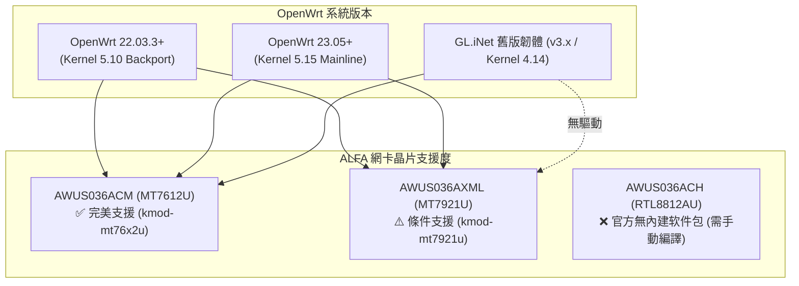

# OpenWrt 路由器 × ALFA Network 配置與限制指南

> **技術摘要**：在 OpenWrt 嵌入式路由器（如 GL.iNet、x86 軟路由、Raspberry Pi 路由）上擴充 USB 無線網卡，能作為第二組獨立 WAN（WISP 無線中繼）、熱點 AP 或無線安全監聽節點。**ALFA AWUS036AXML**（MT7921U）自 OpenWrt 22.03.3（Kernel 5.10 backport）與 23.05（Kernel 5.15）起可透過软件包庫直接安裝；**AWUS036ACM**（MT7612U）則全線內建原生支援。本文提供完整配置流程，並深度揭露 **上游 GitHub Issue #839（Active Monitor 當機）** 之限制與應對方法。

---

## 1. 系統版本與 ALFA 晶片相容性矩陣



| ALFA 型號 | 核心晶片 | OpenWrt 22.03.3+ | OpenWrt 23.05+ | 必要安裝核心软件包 |
|---|---|---|---|---|
| **AWUS036ACM** | MediaTek MT7612U | ✅ 完美支援 | ✅ 完美支援 | `kmod-mt76x2u` `mt76-firmware` |
| **AWUS036AXML** | MediaTek MT7921AUN | ✅ 支援（有已知 Bug） | ✅ 支援（有已知 Bug） | `kmod-mt7921u` |
| **AWUS036ACHM** | MediaTek MT7610U | ✅ 完美支援 | ✅ 完美支援 | `kmod-mt76x0u` |
| **AWUS036ACH** | Realtek RTL8812AU | ❌ 官方庫無提供 | ❌ 官方庫無提供 | 需自行用 SDK 編譯 out-of-tree 模块 |

---

## 2. OpenWrt 软件包安裝與指令操作

透過 SSH 登入路由器終端，依序執行下列步驟：

```bash
# 1. 更新 OpenWrt 软件包庫索引
opkg update

# 2. 依據您使用的 ALFA 網卡安裝對應驅動模块
# 若使用 AWUS036AXML (Wi-Fi 6/6E)：
opkg install kmod-mt7921u kmod-mt76-core wireless-tools usbutils

# 若使用 AWUS036ACM (802.11ac)：
opkg install kmod-mt76x2u kmod-mt76-core wireless-tools usbutils

# 3. 重新偵測無線硬件並生成默认配置
wifi config >> /etc/config/wireless

# 4. 重啟网络服務
/etc/init.d/network restart
```

---

## 3. 重要上游已知限制與 Bug 揭露（誠實工程報告）

### ⚠️ 已知 Bug 1：AWUS036AXML Active Monitor Mode 驅動崩潰 (Issue #839)
- **現象**：在 OpenWrt 上對 AWUS036AXML（`mt7921u`）啟用主動監聽與注入（如 `aireplay-ng --deauth`）時，核心驅動會在數秒內鎖死，日誌出現 `mt7921u: failed to send tx packet`，網卡直接離線。
- **根因**：上游 `openwrt/mt76` 專案已知 issue #839，係因 5.10/5.15 核心在處理 USB DMA 多緩衝區釋放時的併發鎖定異常。
- **工程因應對策**：
  1. 若需求為 **純封包擷取 / Passive Sniffing**（如 Kismet / tcpdump），可正常運作。
  2. 若需求為 **高強度封包注入 / Penetration Testing**，強烈建議選用 **ALFA AWUS036ACM**（`mt76x2u`），該驅動經多年驗證無此問題。

### ⚠️ 已知限制 2：6GHz 頻段支援狀態
OpenWrt 現行穩定版 (23.05) 之 LuCI 網頁管理接口對 6GHz (HE/EHT 頻寬) 尚未完全支援，AWUS036AXML 在 OpenWrt 下主要作為 2.4GHz 與 5GHz 高效能無線射頻運作。
