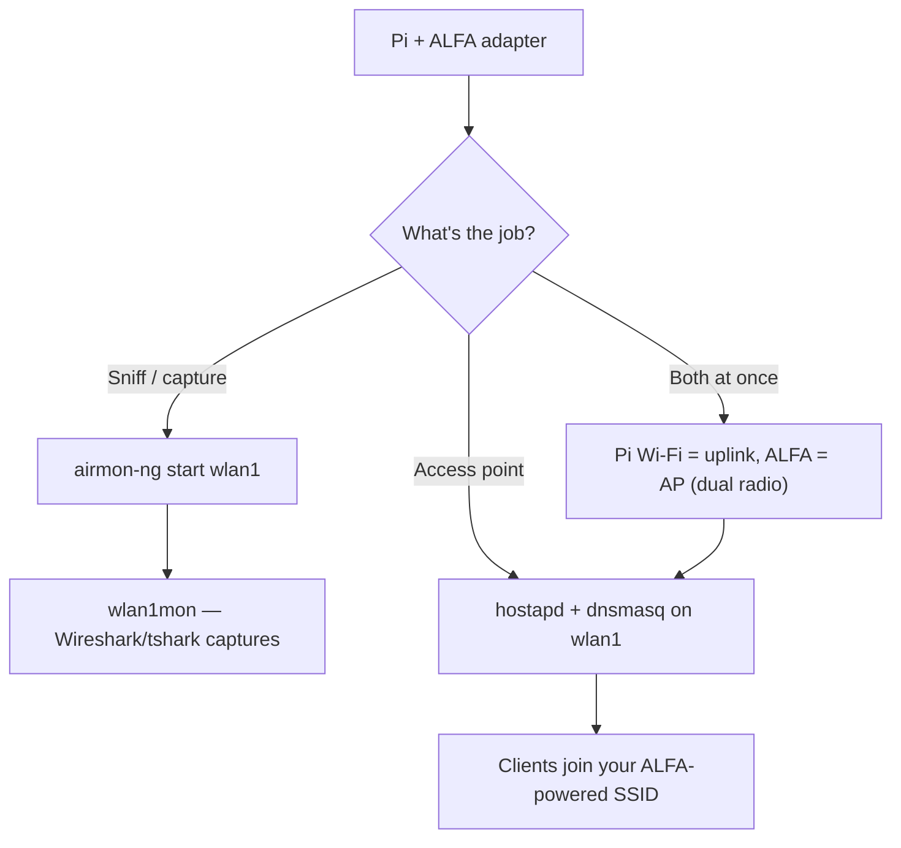

# ALFA 网卡适配器在 Raspberry Pi 上（3 / 4 / 5）

> **一句话定位（One-liner）**：Raspberry Pi + ALFA 网卡适配器是经典的预算实验站：用内核内置芯片组的 ALFA **捕获流量**，或把 Pi 变成**hostapd 接入点**，覆盖范围是 Pi 内置无线电做梦都达不到的。

## 概念：为什么 Pi 是完美的 ALFA 宿主

Pi 的集成 Wi-Fi 是单天线且很弱——做 SSH 还行，嗅探或给整个房间提供 Wi-Fi 就没用了。外置 ALFA 网卡适配器改变了局面：

- **监听模式实验站**：内核内置芯片组（MT7612U 等）给你一个无头捕获装置，用于 Wireshark 课程作业——插上、`airmon-ng start`、完成。
- **接入点（hostapd）**：带外置天线的 AWUS036ACM/ACH 把 Pi 变成真正的接入点，覆盖范围远超内置无线电。
- **双无线电技巧**：Pi 内置 = 客户端上行，ALFA = 接入点下行。一个 Pi，两个网络。

各板卡的硬件说明：

| 板卡 | USB | 说明 |
|---|---|---|
| Pi 3 | USB 2.0 | 支持的最旧板卡；AC433 等级或内核内置网卡适配器没问题 |
| Pi 4 | USB 2.0（共享总线） | 最受欢迎的选择——高功率网卡适配器加一个带供电的集线器 |
| Pi 5 | USB 3.0 + PCIe | 最快的 USB；最适合 AC1200/AX1800 吞吐量 |

> ⚠️ **供电是 Pi 的头号故障模式**。Pi 3/4 共享一条 USB 2.0 总线；一个 500 mW 的 ALFA 加上键盘再加上其他设备，可能让总线欠压。任何高于 AWUS036ACS 的网卡适配器，都请预算一个**带供电的 USB 集线器**。



## 前置需求

- [ ] 运行 Raspberry Pi OS（推荐 64 位）的 Raspberry Pi 3/4/5
- [ ] 已完成 `sudo apt update && sudo apt upgrade`
- [ ] ALFA 网卡适配器——监听模式强烈推荐[内核内置芯片组](/alfa-network/linux-compatibility-matrix/)
- [ ] 使用高功率网卡适配器时准备带供电的 USB 集线器

## 第 1 步：识别网卡适配器

插上并列出接口——ALFA 会是*新的*那个：

```bash
lsusb
iw dev
```

**预期输出**：你的网卡适配器出现在 `lsusb` 中，接口类似 `wlan1`（Pi 的内置无线电通常是 `wlan0`）。如果 ALFA 是 Realtek，先安装它的 DKMS 驱动——参见 [Ubuntu 指南](/alfa-network/linux-setup-ubuntu/)，在 Pi OS 上步骤完全相同。

## 第 2 步：监听模式实验站

```bash
sudo airmon-ng start wlan1
iwconfig wlan1mon
```

**预期输出**：`wlan1mon  IEEE 802.11  Mode:Monitor`。

捕获到文件供后续分析：

```bash
sudo tcpdump -i wlan1mon -w lab-capture.pcap
```

**预期输出**：`listening on wlan1mon`——让它运行，Ctrl-C 停止，然后在笔记本上用 Wireshark 打开 `lab-capture.pcap`。

## 第 3 步：把 Pi 变成接入点（hostapd）

安装两个软件组件：

```bash
sudo apt install -y hostapd dnsmasq
```

把 ALFA 接口设为静态地址：

```bash
echo -e "interface wlan1\nstatic ip_address=192.168.4.1/24\nnohook wpa_supplicant" | \
    sudo tee -a /etc/dhcpcd.conf
```

创建 hostapd 配置（2.4 GHz，20 dBm）：

```bash
sudo tee /etc/hostapd/hostapd.conf > /dev/null <<'EOF'
interface=wlan1
driver=nl80211
ssid=alfa-lab
hw_mode=g
channel=6
wmm_enabled=1
auth_algs=1
wpa=2
wpa_passphrase=ChangeMe123
wpa_key_mgmt=WPA-PSK
rsn_pairwise=CCMP
EOF
```

让 hostapd 指向它的配置并启动一切：

```bash
echo 'DAEMON_CONF="/etc/hostapd/hostapd.conf"' | sudo tee -a /etc/default/hostapd
sudo systemctl restart dhcpcd dnsmasq hostapd
sudo systemctl status hostapd --no-pager | head -10
```

**预期输出**：`Active: active (running)`，客户端现在可以加入 **alfa-lab**。

## 第 4 步：双无线电技巧（可选但很酷）

保留 Pi 自己的 Wi-Fi 作为 SSH/管理上行，让 ALFA 纯粹充当接入点：

```bash
sudo systemctl stop wpa_supplicant@wlan1 2>/dev/null   # make sure ALFA is not fighting for a client link
sudo iw dev wlan1 set 4addr off
sudo systemctl restart hostapd
```

现在 `wlan0` 连接互联网，`wlan1` 服务实验网络。一个 Pi，两个网络。

## 故障排查

| 症状 | 原因 | 修复 |
|---|---|---|
| 网卡适配器在笔记本上正常，在 Pi 上死机 | USB 供电限制 | 带供电的 USB 集线器；使用 Pi 官方电源；降低 `txpower` |
| `airmon-ng` 提示 "No such device" | 接口名错误 | 先 `iw dev`——Pi 内置通常是 `wlan0`，ALFA 是 `wlan1` |
| hostapd 失败并提示 `nl80211: Could not configure driver mode` | 驱动缺少 AP 模式，或接口忙 | 使用内核内置芯片组（mt76 = 扎实的 AP 支持）；先 `sudo airmon-ng stop wlan1mon` |
| 客户端能连接但没有互联网 | 未配置 DHCP/NAT | 启用 NAT：`sudo iptables -t nat -A POSTROUTING -o wlan0 -j MASQUERADE` + `sysctl net.ipv4.ip_forward=1` |
| Pi 3/4 上吞吐量受限 | 共享 USB 2.0 总线 | 板卡固有特性；Pi 5（USB 3.0）是升级路径 |

## 参考

- [AWUS036ACM 产品页面](/alfa-network/products/awus036acm/)——Pi 的最佳搭档
- [Ubuntu 设置指南](/alfa-network/linux-setup-ubuntu/)——驱动安装（Pi OS 上步骤相同）
- [Kali 设置指南](/alfa-network/linux-setup-kali/)——监听模式工作流
- [Jetson 指南](/alfa-network/hardware/jetson/)——更大的嵌入式兄弟
- [hostapd 文档](https://w1.fi/hostapd/)——官方接入点守护进程文档