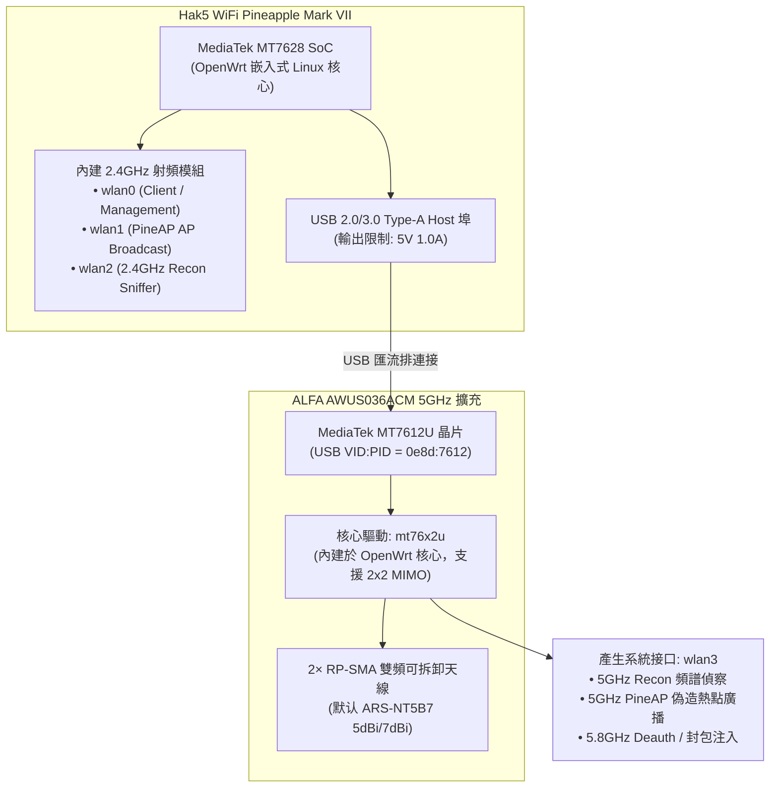

# Hak5 WiFi Pineapple × ALFA Network 整合指南

> **技術摘要**：Hak5 官方文件（[docs.hak5.org](https://docs.hak5.org/wifi-pineapple/faq/compatible-802.11ac-adapters/)）明確指定 **MediaTek MT7612U** 晶片為 WiFi Pineapple Mark VII 唯一保證在所有滲透情境下穩定運作的 802.11ac 外接模組。**ALFA AWUS036ACM** 與 Hak5 原廠配件 MK7AC 採用相同核心晶片，但具備更高的外接天線增益與散熱能力，是進行 5GHz 頻段 Recon 與 PineAP 注入的黃金標準配備。

---

## 1. 硬件拓撲與運作原理

WiFi Pineapple Mark VII 內建兩組 2.4GHz 射頻模組（`wlan0` 用於 AP Client / 管理，`wlan1` / `wlan2` 用於 PineAP 廣播與 Recon 偵察）。若要涵蓋企業級 5GHz (802.11a/n/ac) 頻段，必須透過 USB 2.0/3.0 Host 埠擴充外接網卡。



### 為什麼 Hak5 官方指名 MT7612U？
在 OpenWrt 嵌入式架構下，Realtek 系列晶片（如 RTL8812AU / RTL8814AU）依賴 Out-of-tree 驅動，在 Pineapple 高併發封包注入與多 SSID 廣播時極易引發 Kernel Panic 或系統無預警重開機。MediaTek `mt76x2u` 驅動直接編譯於 OpenWrt 核心中，記憶體回收機制健全，是唯一通過 Hak5 官方壓力測試的 802.11ac 晶片。

---

## 2. 規格與型號比對矩陣

| 評估項目 | Hak5 原廠 MK7AC 擴充卡 | ALFA AWUS036ACM | 工程選型建議 |
|---|---|---|---|
| **核心晶片** | MediaTek MT7612U | MediaTek MT7612U | 兩者核心驅動完全同源（`mt76x2u`） |
| **USB VID:PID** | `0e8d:7612` | `0e8d:7612` | 系統辨識與韌體相容性 100% 一致 |
| **支援協定** | 802.11a/b/g/n/ac | 802.11a/b/g/n/ac | 2.4 GHz (300Mbps) + 5 GHz (867Mbps) |
| **天線接頭** | 2× 內部微型 PCB / 小型固定天線 | 2× 標準 RP-SMA 母頭 | **ALFA 大勝**：可隨情境更換指向平板天線 |
| **散熱結構** | 封閉式塑膠外殼（無散熱片） | 兩側導流散熱孔 + 金屬屏蔽罩 | **ALFA 大勝**：長時間滿載發射不易熱衰竭 |
| **供電需求** | 5V / 500mA ~ 800mA | 5V / 600mA ~ 900mA | 均需確保 Pineapple 主機供電充足 |

---

## 3. 連接與辨識實作步驟

### Step 1: 硬件連接與供電確認
1. 將 ALFA AWUS036ACM 連接至 WiFi Pineapple Mark VII 主機側邊或頂部的 **USB Host** 埠。
2. **重要供電鐵律**：WiFi Pineapple Mark VII 本體功耗約 3W~5W，加上 AWUS036ACM 在 5GHz 滿載發射時瞬間電流達 900mA (4.5W)，整機總功耗可達 9.5W。
   - ❌ **嚴禁**：使用笔记本电脑弱電 USB 埠（僅 500mA）或低品質 5V/1A 豆腐頭供電。
   - ✅ **推薦**：使用支援 5V/3A (15W) 或 QC/PD 協定的專用电源适配器 / 充电宝。

### Step 2: SSH 終端檢測與接口驗證
透過 SSH 连接進入 WiFi Pineapple 控制台（默认 IP `172.16.42.1`）：

```bash
# 1. 檢視 USB 匯流排裝置清單
lsusb

# 預期輸出：
# Bus 001 Device 003: ID 0e8d:7612 MediaTek Inc. MT7612U 802.11a/b/g/n/ac Wireless Adapter

# 2. 檢視核心 dmesg 載入日誌
dmesg | grep -E "mt76|wlan"

# 預期輸出包含：
# mt76x2u 1-1:1.0: ASIC revision: 76120011 mac 00110000
# mt76x2u 1-1:1.0: firmware: mt7662u.bin loaded
# ieee80211phy3: mt76x2u registered as wlan3

# 3. 檢查無線接口狀態
iw dev
```

### Step 3: Web UI 配置 5GHz Recon 與 PineAP
1. 開啟瀏覽器訪問 `http://172.16.42.1:1471` 登入 Pineapple Web UI。
2. 進入 **Recon** 模組：
   - 接口選擇下拉選單將自動出現 `wlan3 (5GHz)`。
   - 勾選 **2.4 GHz + 5 GHz** 雙頻掃描，設定週期為 `Continuous` 或 `1 min`。
   - 點擊 **Start Scan**，系統將同時掃描 5GHz 頻道（36~165）之 AP 與连接 Client。
3. 進入 **PineAP** 模組：
   - 在 **PineAP Settings** 中，可將 5GHz 廣播指派至 `wlan3`，實現 2.4GHz (`wlan1`) 與 5GHz (`wlan3`) 雙頻同時 Rogue AP 廣播。

---

## 4. 實戰天線搭配建議

- **全向廣域覆蓋（常規行動走動測試）**：
  - 搭配 2 支 **ALFA ARS-NT5B7** 雙頻 5dBi/7dBi 全向天線，水平 360 度收訊均勻，適合會議室與走廊巡檢。
- **長距離定向稽核（定點穿牆鎖定測試）**：
  - 搭配 2 片 **ALFA APA-M25** 雙頻 8dBi/10dBi 指向性平板天線（指向角約 60 度），可有效過濾背後雜訊，對準目標樓層或特定辦公區域進行精準封包擷取。

---

## 5. 常見問題與疑難排解 (Troubleshooting)

### Q1: 插入 AWUS036ACM 後，Pineapple 燈號突然熄滅並自動重開機？
- **故障根因**：USB 瞬間壓降。插入高功率網卡瞬間電容充電與射頻初始化電流超過供電端負荷。
- **解決方案**：
  1. 先將 AWUS036ACM 插上 Pineapple，再接通 Pineapple 主電源開機。
  2. 更換輸出能力達 5V/3A 以上的優質電源供應器。

### Q2: 接口卡在 `wlan2` 衝突，Web UI 看不到 5GHz？
- **故障根因**：若先前曾插過其他 USB 網卡，系統 `/etc/config/wireless` 暫存設定檔殘留衝突。
- **解決方案**：透過 SSH 執行下列指令重置無線設定：
  ```bash
  rm -f /etc/config/wireless
  wifi config
  /etc/init.d/network restart
  ```
