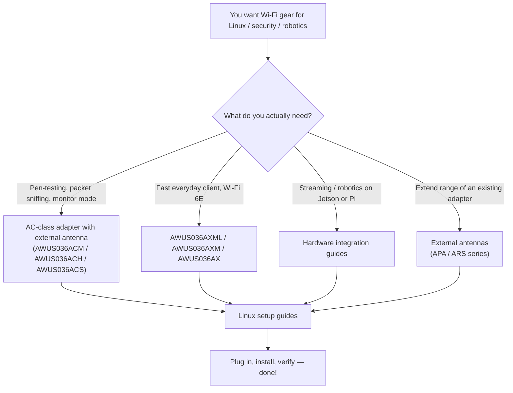

---

id: alfa-index
title: ALFA Network
sidebar_position: 1
description: ALFA Network 无线网卡、天线、Linux 驱动程序、Kali/NetHunter 设置指南、硬件集成与兼容性矩阵。
tags: [alfa, wifi, kali, 监听模式, 网卡适配器, 天线]
keywords: [ALFA Network, AWUS036ACM, AWUS036AXML, 无线网卡, 监听模式, Kali Linux]
slug: /alfa-network/
---

# ALFA Network

> **一句话定位（One-liner）**：ALFA Network 制造渗透测试人员、无人机飞手和机器人实验室争相使用的外置 Wi-Fi adapter（无线网卡）与天线——因为它们兼具**高增益无线电**、**外置天线接口**，以及（学生最爱的一点）**扎实的 Linux 支持**。

如果你看过任何 Kali Linux 教程，里面有人把一根黑色小棒插进 USB 端口、把接口切换到 monitor mode（监听模式）然后开始嗅探数据包，那根小棒几乎肯定是 ALFA。十多年来，这个品牌一直是安全社区的首选——从传奇的 **AWUS036ACH** 到全新的 **Wi-Fi 6E AWUS036AXML**。

本 wiki 是你一步步的伙伴：我们销售的每一款网卡适配器和天线、每一款芯片组 driver（驱动程序）、每一个「为什么我的网卡不显示」的答案，以及 Jetson、Raspberry Pi 和 Unitree 机器人的硬件集成指南。

## 本部分包含什么

| 页面 | 你将获得 |
|---|---|
| [无线网卡对比](/alfa-network/wifi-adapter-comparison/) | 每一款 USB 网卡适配器并排对比：芯片组、速度等级、频段、监听模式支持——以及按使用场景的「哪款适合你」 |
| [Linux 兼容性矩阵](/alfa-network/linux-compatibility-matrix/) | 哪款网卡适配器在 Kali Linux、Ubuntu 和 NetHunter/Android 上开箱即用 |
| [Ubuntu 设置指南](/alfa-network/linux-setup-ubuntu/) | 逐步说明：内核内置芯片组（即插即用）与 Realtek 芯片的 DKMS 构建 |
| [Kali Linux 设置指南](/alfa-network/linux-setup-kali/) | dkms 构建、监听模式、数据包注入——完整的渗透测试工作流 |
| [NetHunter（Android）设置指南](/alfa-network/linux-setup-nethunter/) | 把 Android 手机 + OTG 变成移动审计装备 |
| [故障排查索引](/alfa-network/troubleshooting/) | 每个常见 ALFA 问题的症状 → 诊断 → 根本原因 → 修复 |
| [驱动程序](/alfa-network/drivers/mt7612u/) | 以芯片组为核心的指南：MT7612U、MT7610U、MT7921AUN、RTL8812AU、RTL8811AU、RTL8832BU、RTL8821CU |
| [硬件集成](/alfa-network/hardware/jetson/) | NVIDIA Jetson、Raspberry Pi、Unitree 机器人 |
| [产品](/alfa-network/products/awus036acm/) | 每一款网卡适配器和天线的完整规格表与分产品指南 |

## 如何选择网卡适配器（5 分钟速成课）

选择网卡适配器实际上是在选择**芯片组**，因为芯片组决定了：

1. **你需要哪款驱动程序**——以及它是内置于 Linux 内核（即插即用）还是需要 DKMS 构建。
2. **监听模式 + 数据包注入是否可用**——这是 Kali / Wireshark / Aircrack-ng 工作的核心需求。
3. **网卡适配器有多快、能覆盖多远**。

下面是简化版地图——详情见[对比页面](/alfa-network/wifi-adapter-comparison/)：

| 芯片组 | 网卡适配器 | 内核内置驱动？ | 监听模式？ | 最适合 |
|---|---|---|---|---|
| **MT7612U** | AWUS036ACM | ✅（自内核 4.19 起） | ✅ 优秀 | Kali 的经典全能选手 |
| **MT7610U** | AWUS036ACHM | ✅（自内核 4.19 起） | ✅ 良好 | 预算级双频监听模式 |
| **MT7921AUN** | AWUS036AXM / AWUS036AXML | ✅（自内核 5.18 起） | ✅ 良好 | Wi-Fi 6 / 6E 速度 + 蓝牙组合 |
| **RTL8812AU** | AWUS036ACH | ❌ DKMS | ✅ 优秀 | 高功率经典款，社区庞大 |
| **RTL8811AU** | AWUS036ACS | ❌ DKMS | ✅ 良好 | 口袋级监听网卡适配器 |
| **RTL8832BU** | AWUS036AX / AWUS036AXER | ❌ DKMS | ✅ 良好 | 支持 WPA3 的 Wi-Fi 6 |
| **RTL8821CU** | AWUS036EACS | ❌ 不稳定 | ❌ 不可靠 | **仅限 Windows**——WiFi + 蓝牙组合 |

> **你可能想知道**——*「什么是 DKMS？」* 它是一个系统，会在你的 Linux 内核每次更新时自动重新构建第三方驱动程序。RTL8812AU 这类 Realtek 芯片不在内核中，所以 DKMS 让它们在历次更新中保持可用。我们在 [Ubuntu 指南](/alfa-network/linux-setup-ubuntu/) 中逐步讲解。

## 快速入门

如果这是你的第一款 ALFA 网卡适配器，推荐路径是：

1. 阅读[对比](/alfa-network/wifi-adapter-comparison/)并挑选你的网卡适配器。
2. 在[兼容性矩阵](/alfa-network/linux-compatibility-matrix/)中核对你的操作系统。
3. 按照 [Ubuntu](/alfa-network/linux-setup-ubuntu/) 或 [Kali](/alfa-network/linux-setup-kali/) 指南操作。
4. 遇到异常？前往[故障排查索引](/alfa-network/troubleshooting/)。

祝你嗅探愉快——并记住：永远只在你拥有或已获书面授权测试的网络上进行测试。