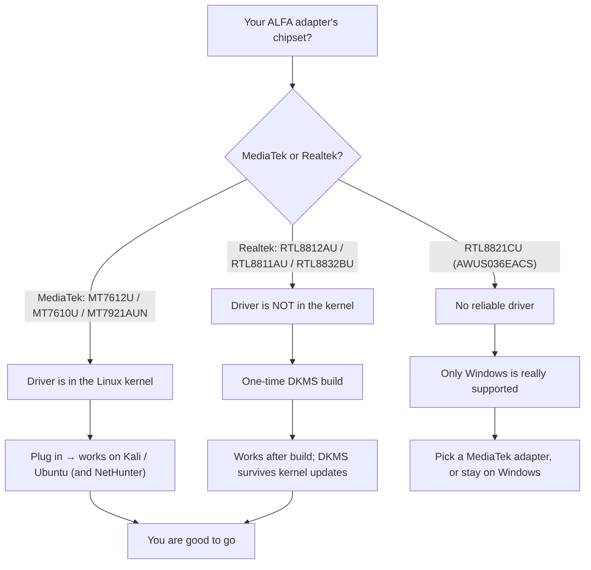

# ALFA Linux 兼容性矩阵

> **结论先行（Bottom line）**：在现代 Linux 上，**基于 MediaTek 的网卡适配器**（AWUS036ACM、AWUS036ACHM、AWUS036AXM、AWUS036AXML）开箱即用，因为它们的驱动程序随内核一起发布。**基于 Realtek 的网卡适配器**（AWUS036ACH、AWUS036ACS、AWUS036AX、AWUS036AXER）需要一次 DKMS 驱动构建——5 分钟、一次性工作。**AWUS036EACS 是例外：不要指望它在任何 Linux 上表现良好**。




## 矩阵

图例：✅ 开箱即用 · 🔧 安装 DKMS 后可用 · ⚠️ 部分可用 / 不稳定 · ❌ 不推荐

| 网卡适配器 | 芯片组 | 驱动 | 内核内置？ | Kali Linux | Ubuntu | NetHunter / Android |
|---|---|---|---|---|---|---|
| AWUS036ACM | MT7612U | `mt76x2u` | ✅ 自 4.19 起 | ✅ | ✅ | ✅ |
| AWUS036ACHM | MT7610U | `mt76x0u` | ✅ 自 4.19 起 | ✅ | ✅ | ✅ |
| AWUS036AXM | MT7921AUN | `mt7921u` | ✅ 自 5.18 起 | ✅ | ✅ | ✅ |
| AWUS036AXML | MT7921AUN | `mt7921u` | ✅ 自 5.18 起 | ✅ | ✅ | ✅ |
| AWUS036ACH | RTL8812AU | `rtl8812au-dkms` | ❌ | 🔧 | 🔧 | 🔧 |
| AWUS036ACS | RTL8811AU | `rtl8811au`（DKMS） | ❌ | 🔧 | 🔧 | 🔧 |
| AWUS036AX | RTL8832BU | `rtl88x2bu`（DKMS） | ❌ | 🔧 | 🔧 | ⚠️ |
| AWUS036AXER | RTL8832BU | `rtl88x2bu`（DKMS） | ❌ | 🔧 | 🔧 | ⚠️ |
| AWUS036EACS | RTL8821CU | —（无可靠驱动） | ❌ | ❌ | ❌ | ❌ |

## 「内核内置」对你意味着什么

当芯片组的驱动程序位于 Linux 内核中时，你的操作系统会预装它。插上网卡适配器，`dmesg` 会显示它被驱动程序认领——无需编译、无需 DKMS、不会因内核更新而损坏。这是本页 MediaTek 与 Realtek 网卡适配器之间最大的可靠性差异。

对于 Realtek 型号，[Kali 指南](/alfa-network/linux-setup-kali/)和 [Ubuntu 指南](/alfa-network/linux-setup-ubuntu/)会带你完成 DKMS 构建。DKMS 会在每次内核更新后自动重建驱动程序，所以「更新后停止工作」不应该发生——如果发生了，请查看[故障排查索引](/alfa-network/troubleshooting/)。

## 各操作系统说明

### Kali Linux

除 EACS 外一切都能用，但有一个注意事项：Kali（滚动发行版）的内核可能比某些 DKMS 驱动支持的版本更新。如果在全新 Kali 上 DKMS 构建失败，请使用 **aircrack-ng** 维护的驱动仓库（`aircrack-ng/rtl8812au`、`aircrack-ng/rtl88x2bu`），它们会积极跟进新内核。完整教程：[Kali 设置指南](/alfa-network/linux-setup-kali/)。

### Ubuntu（LTS）

Ubuntu LTS 内核较旧且极其稳定，所以 DKMS 构建基本不会出问题。内核内置型号在 20.04+ 上零配置即可使用（MT7921AUN 需要 **22.04+**，因为 `mt7921u` 在内核 5.18 才落地）。完整教程：[Ubuntu 设置指南](/alfa-network/linux-setup-ubuntu/)。

### NetHunter / Android

在已 root 的手机上通过 OTG 运行 NetHunter 是最苛刻的环境：Android 内核因手机而异，所以只有**内核内置芯片组**才可靠（MT7612U、MT7610U、MT7921AUN）。Realtek DKMS 驱动需要在 NetHunter chroot 内有匹配的工具链，而且常常在手机原厂内核上失败——请谨慎操作，参见 [NetHunter 指南](/alfa-network/linux-setup-nethunter/)。

## 如何检查你的内核

不确定你用的是哪个内核？运行：

```bash
uname -r
```

**预期输出**（示例）：

```text
6.8.0-51-generic        # Ubuntu 24.04
6.1.0-kali9-amd64       # Kali rolling
5.15.0-91-generic       # Ubuntu 22.04 — mt7921u NOT present, needs 22.04+ kernel
```

如果你的 MediaTek 型号内核是 **5.18 或更新**，就没问题。如果更旧，先升级操作系统——驱动程序不会凭空出现。

下一步：按照你的操作系统选择 [Ubuntu](/alfa-network/linux-setup-ubuntu/) 或 [Kali](/alfa-network/linux-setup-kali/) 指南，或跳到[芯片组驱动页面](/alfa-network/drivers/mt7612u/)深入了解。